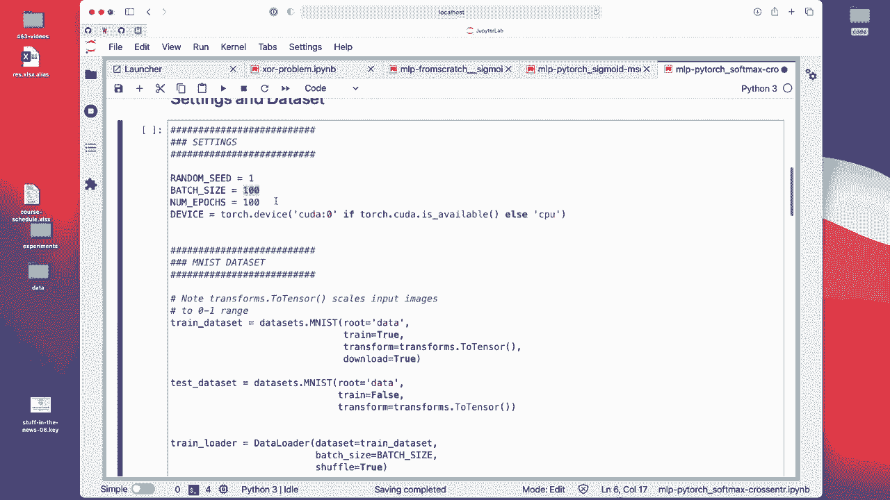
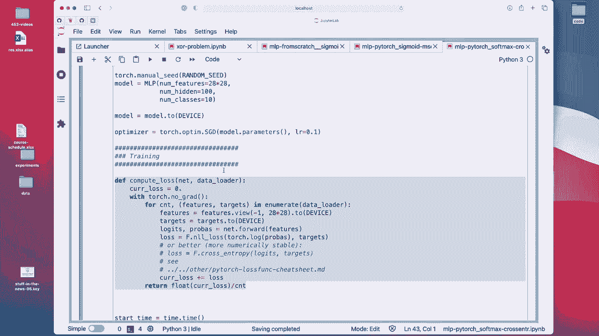
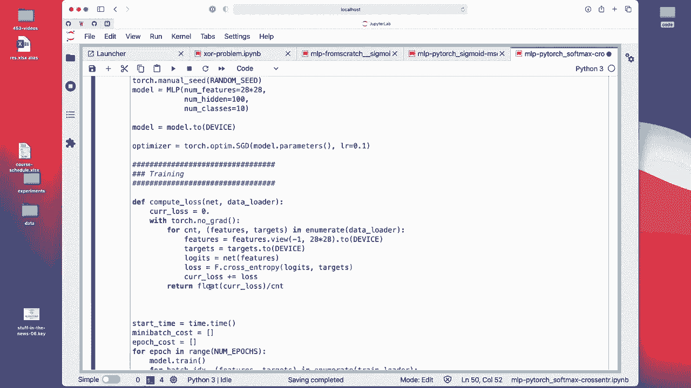

# 【双语字幕+资料下载】威斯康星 STAT453 ｜ 深度学习和生成模型导论(2021最新·完整版) - P66：L9.3.2- PyTorch Part 2／3 中的多层感知器(Jupyter Notebook) - ShowMeAI - BV1ub4y127jj

Allright， let's now take a look at some code examples。 so I prepared multiple notebooks。

 One is a multiar preceptron from scratch implementation just to practice my calculus skills。

1 is Pytor sigmoid and means code error implementation that I showed you on the slides。

 And this one is the Pytorch。With a soft Pyth implementation with the softm activation and across entropys。

I will only walk you through this one because they are all fundamentally very similar。 And yeah。

 I don't want to make the lectures too long。 So let's get started。 So here again。

Just the boilerplate stuff， all the imports。Here are some hyperparameter settings。

 I set the batch size to 100。 It's kind of arbitrary。

 usually people like to use also values like powers of2， like 32，64，128。

I use 100 epochs and yeah here the Mnes data set So the Ms data set is or how we loaded is how we did it also in the Somax lecture。

 so there's nothing new here。 I will have a separate video explaining how you can set up these data load for your own data。

So now here we are just regarding it as the standard Mnes dataset that is already included in torch vision。

 So what I want to focus on is really here the multi layer perceptron implementation。

So， here。Really， what's new compared to softmax regression is that we have this hidden layer。

 So if I remove this hidden layer。

For a second。And just right。Noumb features here。Oops。

Then this is the same as the softmax regression code。

The only maybe small difference that you might notice is that。Okay。

 I would also have to remove this one。Cance the not。So the only difference is that I'm using small。

 random weights。 I asked you why we don't。Implement or why we don't initialize the weights to zeros in multi episodecyclron。

 So that's something for you to think about。 But yeah here。We use a standard normal。

Distribution and we scale it。 So the mean。 So there are two parameters for this。

 the mean and the standard deviation。 So usually a standard normal distribution， as you might know。

 has mean0 and unit variance。 So standard deviation of one here。

 we use a smaller value01 just making the distribution a bit narrow， closer to 0。

 So that's because we don't want to have yeah two large or two extreme values because recall sigmoid activations can chaturate。

So then we have very small gradient。 So it's actually good to have them not too big。 So yeah。

 that is what we do here。 The whole point really is just having small random weights center at 0 later in later lectures。

 we will also learn about other ways to initialize the weights。But yeah， let me undo that。 Otherwise。

 the code won't work。 So now。What it's different from softm is really that we have this hidden layer here in between。

 right between the input and output layer。

Alright。 so， but there's nothing really new。 I mean， I wish I could tell you something exciting here。

 but actually， it's very similar to softm。 So it's actually maybe a good sign。

 It's not too complicated， I hope。

Yeah， just use Probu here。 You don't have to do that so you can actually skip this step。

 You don't need that because if you use the cross entropy loss。

 Pythrch will already compute that softmax implicitly automatically。

Yeah， and when we initialize here the multiceptron， the number of input features is 28 by 28。

 that's the dimension of MNT。

And I use a hidden there with 100 units。

That's a hypoparameter can change that number and see whether it performs better or worse。

Yeah we use also the stochastic gradient descent。

업트에서。Notice now。 So this is So I have a separate function for computing the sets for each epoch， so。

How I implement that is I am iterating over the data order。And compute the loss and add it up。

So this is instead of computing it on the whole dataset because the dataset might be too large to load it into memory。

 So in M for MS it might work， but it's just a good practice to implement a function that does it also incrementally notice this is just a compute loss function that I used to compute the loss on the training set。

 This is not a training function。 but there was a good question on Piazza I used something similar before no Grd I before used on the manual version like enable enable gradient faults。

This is the same thing。 So here I disable the gradient。 or I'm saying we don't need a gradient。

 So I'm saying don't build this computation graph。

Why do I not have to have a computation graph。 So here I'm just computing the loss。

 So there is no backward word， so it would be wasteful。 Actually。

 this should be just net would be better。

Yeah， also how I'm computing the losses actually， I can show it to you also here。 So here。

 how I'm computing the losses， I'm using the negative log likelihood loss。

And then I'm calling lock Probu。 This is how we do it。 let's say， theoretically， mathematically。

And I've done that in my from scratch and the other implementation。

 but in practice it's actually better to use F cross entropy， a functional cross entropy version。

So actually， let me modify this code to show you the recommended way。

 I did that just for comparison purposes， but。

It's actually better。To have it like this。Hope I don't delete lead it in a way that it doesn't work afterwards。

 What we will see will be a surprise。

Okay。😔，So here， I call it cost。

Alright， so yeah， we don't need to call softmax ourselves because， yeah。

 Pyrs already doing it for us。

But except that the training is exactly the same。 we have， we call forward here。

 So that gives us the outputs， the logics， compute the cross entropy where this one does the logof Max for us。

And we set the gradients from the previous round to 0， called backwards to do the back propagation。

And this is just for logging purposes。Maybe I should put it down here。

 It's like just for keeping track。

So we can make the plot。And this is the model update。

Yet he am computing the loss over the whole training set。 This is just for plotting。

So this is using this function here。I will actually show you another video after that where I reflect this a little bit into Python scripts。

Alright， yeah， I。Common problem。 I forgot to execute these things。

Okay， it's training。 So this is training on the CPU。

I compiled Pyr for the M1 Mac， So it might be a bit faster than on a normal CPU。

But yeah， it's still simple enough to just run it on a CPU。 You don't need a GPU for that， really。

Right， you might take a while now。 You have seen the results on the slides already， right。

 So the loss and things like that。 So let me。

Past this video。 I can show you the result in the beginning of the next video。

 and I will show you also how I would personally run code in Python scripts。

 So using Jupyter notebook is super nice for teaching because we have everything in one notebook。

 But like I said， if our code becomes more complicated。

 It might be nice to put some of the code into Python scripts where it's sometimes easier to debug And also you can then reuse some of your functions。

 So let me pause this video， I will make another video showing you the Python scripts。

