# 【双语字幕+资料下载】威斯康星 STAT453 ｜ 深度学习和生成模型导论(2021最新·完整版) - P67：L9.3.3- PyTorch 第 3／3 部分中的多层感知器(脚本设置) - ShowMeAI - BV1ub4y127jj

Yeah， let's start by taking a look at the results from the previous run。So， as we can see。

It finished after approximately 4 minutes， as we can see， yeah， the loss looks nice。 It goes down。

 so you can see。For the different epochs， the loss continually。Goes down。

 Maybe training a little bit longer would have been nice because we can see there's still a trend here。

 But overall， that looks pretty good。And then also， when we compute the accuracy。

 we get a good accuracy here。Now， let me show you how I would organize my code if I work on a bigger project where I do more tuning。

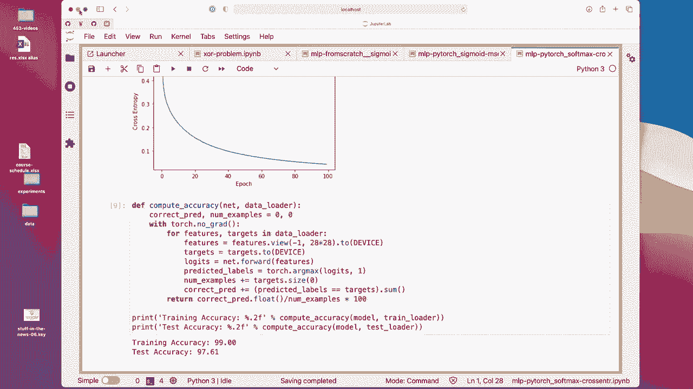

So what I like to do is I like to do like to use Pi scripts for that So if I have a folder here I have usually multiple files。

 one helper do pi file sometimes also multiple helper files where I keep functions that I want to reuse yeah across different projects but also if I have multiple models I keep like general functions in there for example。

 computing the accuracy would be such a function and I also have a settings file with model settings and hyperpar settings and so forth and then the main train model file which is yeah used for training the model。

So let's open them and take a look。

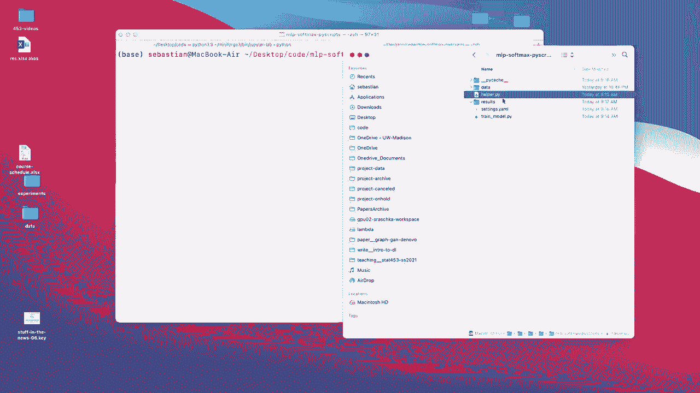

So I'm opening them here in visual studio code。 What I really like about Vi studio code is that it's fast and also shows me if I make errors。

 for example。 So if I， let's say。I don't know。 Let's say I make a typo here。

 I type FLSE set of faults。 It would tell me undefined name。 So it's quite smart。

 It will find out if I have something that is not defined。So that's what I like about it。

 So it's easy to quickly find typos to yeah debu your code。 So starting with， let's say。

 starting with a train model file。 So the train model file here is。Importing from the helper file。

 So there are general functions， like I mentioned。 So I'm importing the data loads and functions for setting the random seeds and making everything deterministic。

 Im， This is something I'm using in many different projects。 So I'm keeping this in my general file。

And also things like computing the accuracy and plotting the training laws and accuracy and so forth。

 So that's something I like to reuse in other projects or if I have multiple train model files。

 let's say train model MLLP1 and train model MLP2 and so forth， I can reuse that code。

 I don't have to copy and paste it every time。Other things here is I'm also setting it up such that it yeah that it can read command line arguments。

 I will show you how to run this in a second。 but here， for example。

 I'm setting it up with this argument Pa that it accepts one argument called settings dot path and one results dot path。

 So here this is where it finds the hyperpar settings and model settings。

 And here's where it's putting the log files and results from that run。

 So my settings file I'm using Yal。So Yaml is think it stands for yet another markdown language or mark markup language。

 so。But that means it's just a simple way of of writing a text file that is human readable。

 So here's my Yal file。 And there's actually。Python library called P Yal。

 which lets you load these Yal files。 I'm doing it here。 So if I'm loading it like this， then。

Settings will be a Python dictionary。 So it's loading the yaml file into a Python dictionary that I can use。

 So why am I doing that It's just for organizing things so。I could， for example。

 have multiple settings files， and each one has a different hyperparmeter setting。

 and then I can keep everything organized by having these files。But， of course。

 you can always or put everything。 It could put the settings。Also， instead of using the Yaml file。

 I could， of course， also write up。Python Dictionary here。And then， yeah， you would have to。

At the strings and then chromas and so forth。 So you could also， of course do do that。

 But if you have bigger projects， it might be helpful to organize things this way。

 because then you have maybe multiple settings files that you want to set up and run in parallel or something like that。

Here I'm using a trick。 So to， how can I say that， So usually I like to print things to the command line when I run my script。

But also， I want to keep a record of it later on that I can take a look at。 So here。

This is like a trick so that you can see the output on the command line， but also。

 it will be written to a file。So everything I print。

 this will also be written to a file called training do lock， which will be in the results path。

So I'm going over this rather quickly， but if you have any questions。

 let me know Also this is nothing you have to know for the exam or anything。

 I'm just showing it to you and sharing it with you because I think it could be helpful for your project if you are using Google Colllap it may be easier to have everything in a single notebook but I think in general if you are organizing your projects on your computer it might be helpful also sometimes to use these scripts files before you run them on in a notebook。

So。Yeah， so going down here， just printing some output for logging purposes that I'm using my set deterministic function from my helper file that I imported earlier。

 This makes my code run deministically。 That means if I run it again。

 I will get exactly the same results。 Now also the data load I'm loading here。 so。It's， I think。

 more convenient because it's a lot of code to put this into a separate file。 If I go here again。

 So the data load up。I think I put it on the bottom here。 It's actually a pretty big code chunk。

 so I'm just writing it here and then reuse that in my different projects when I use Mnes so I don't have to always put all the code into this file。

 I just have to copy and paste my helper file。Alright。

 so here this is now how I provide the hyperparmeter because settings is a dictionary。

 It has the dictionary entries corresponding to these entries here。 So there's a batch size。

So I am passing， so I'm not hard coding these values。 They are all read from the settings files。

 So if I change my settings files， I don't have to， I never have to modify train model。

 So I never have to really touch that。 I can yet do a hyper tuning by just changing this only this one single file。

All right， so then there's my multide hypoceptron here。

Just the regular training using a different I use atom here。 I just see， could also use S GD。

 We will be。Talking about Adam in a future lecture， it's like a slightly improved version of SGG。

Yeah， and then this is just。The whole code I used also in the previous notebooks。 And then yeah。

 I have a plotting function for plotting the loss and the accuracy。 Again。

 you don't have to know all these details。 It's just can copy and paste that from my code。

 It's usually just something。 Yeah， it's it's more like software engineering at that point。Yeah。

 I also just for bookkeeping， I create a results dictionary， so here I keep the training aacies。

 the abl aacies， the final test set accuracy。And also the settings for also bookkeeping。

 So if I want to look that up later， I have a record of that。 So， for example。

 let's say you run your model， but later on， you decide you want to make some different plots This way。

 you don't have to rerun your model。 You have all your data here。And I am saving that to a yaml file。

Alright， so let's run this then and see how it works。

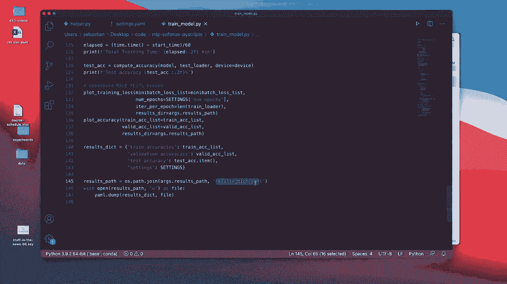

So here I'm in this folder。 and if I want to run this， I type a Python train model not Py。

 and then remember there are two arguments。 I can maybe try to run without it should complain。Yeah。

 it says following arguments are required settings path and results path。 So just to show you。

 let me show you the results。 you can see it's empty right now。Now I'm executing it， Python。

Train model， giving it the settings。Pas。Just called it settings that。Ymo。

 so this is just this file here， and then results。Path。Just call it results。

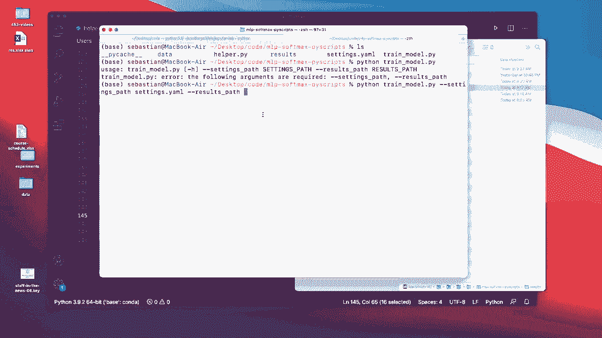

So then it's running。And you can see while it is running， it's putting things here。

 but it's already also putting a log file here so you can either check the command line here。

Or you can or if you don't have， let's say， if you are on the server and you don't have a stable connection and this gets interrupted。

 then you still have this log file here。Okay， already we finished it was pretty quick。

 So now everything we have seen is in this log file here as well。 So just for records。

 for future record， if you close this session here， you will have it still available。

Then we have our plots here that we generated。 So this is。A slightly fancier version of yeah。

 the mini Bchelors。 So here I am computing the running average。And。Yeah。

 this is on the left hand side， the training and validation accuracy。For the different epochs。

 for the 10 epochs。Yeah， and I have that now for my records and I also have this results dictionary if I want to create new plots。

 so this is also a Yamal file with settings， the final test that accuracy。

The training acricacies and validation aricacies。

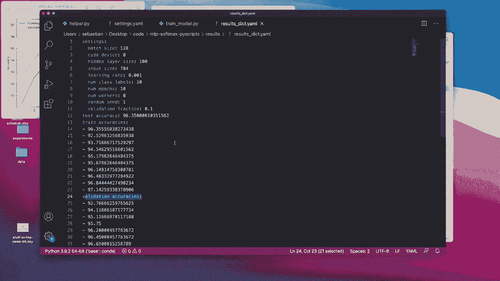

Of course， if you have let's say you have a Jupyter notebook， you， it's sometimes more convenient。

 for example， if you on Google callllab to have everything in a single file。

 but there is also a way you can do a hybrid of that。 So if I go into this directly。

 let me just create a new。Jupiteroc， for example， like here， it's a new Jupyter notebookoc。

 I can also。Maybe don't have to use the Yaml file。But， I could also。

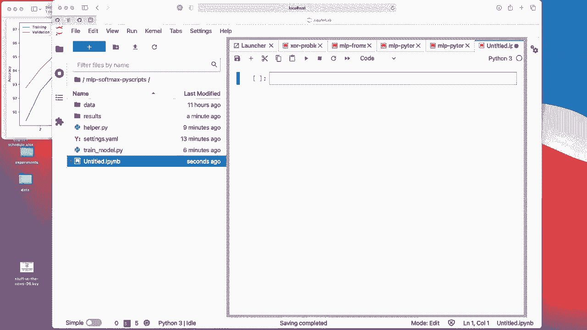

。I close these files， one second。

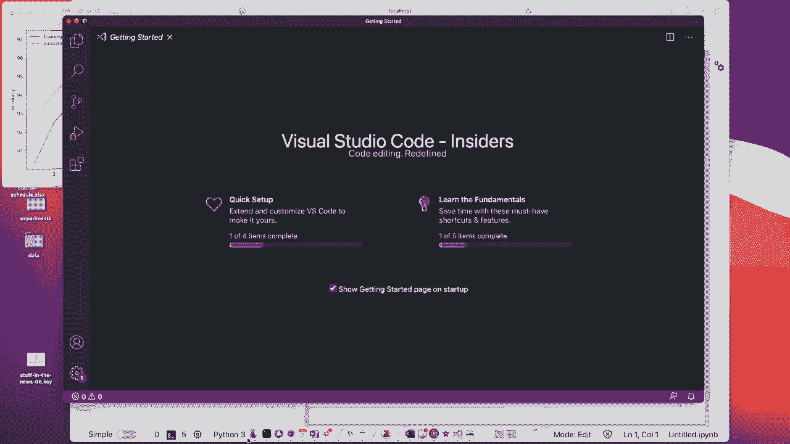

I could also import for my helper file， so。😔。

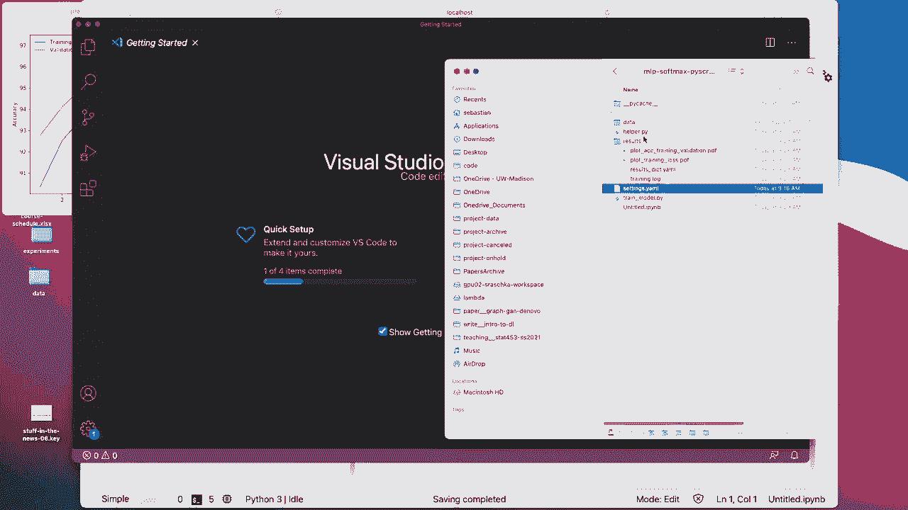

When I have， for example， here these imports from help import。

 I can do the same thing also with my Jupyter notebook。 I can also import here and see。 So only。

 the only thing I have to do is I have to have the helper file in the same folder as the Jupyter notebook。

 But that way， you can keep your。

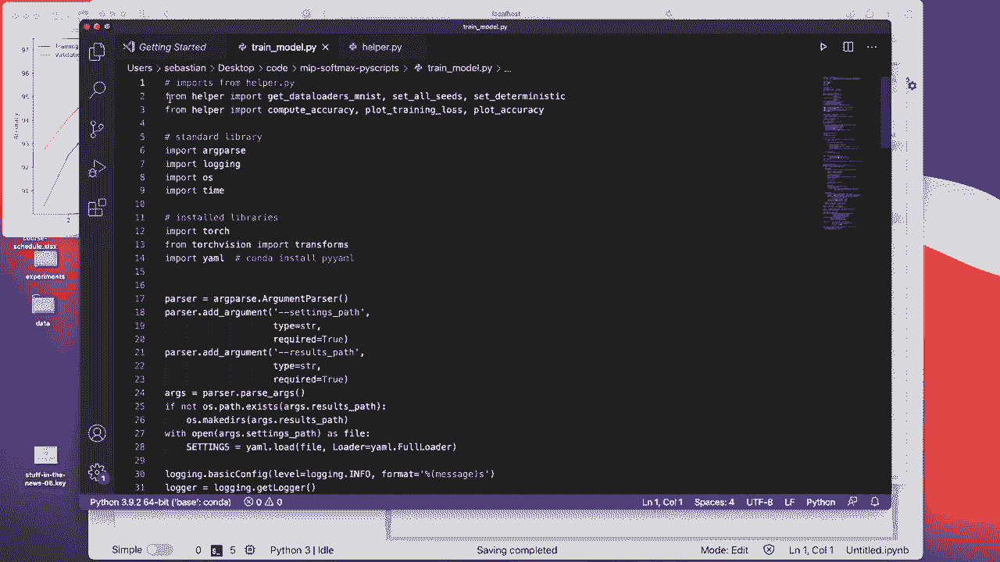

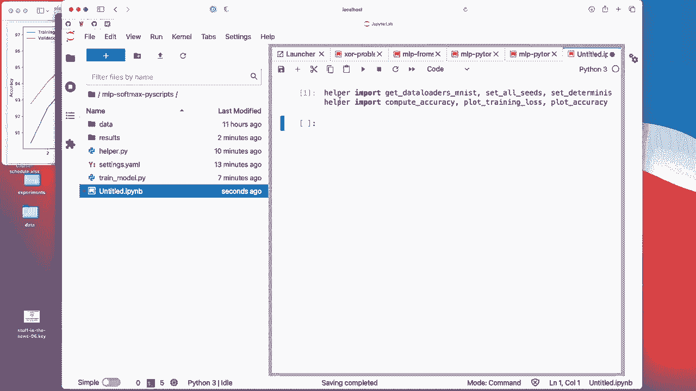

Jupiter notebook box rather small。 You don't have to make them huge so you can technically。

 you could also。

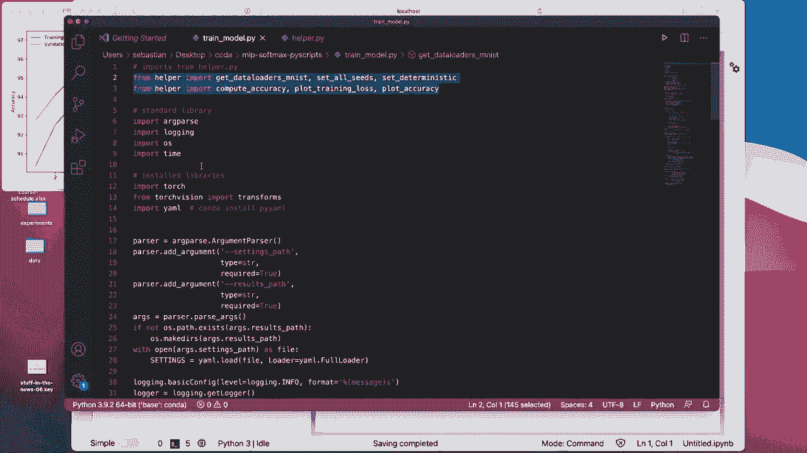

Copy and paste this。 You have to make some modifications because we don't have these。Arguments。

 but we could， as it say。Yeah， Arc's result path。 Yeah， the problem would be， we had。

 we would have to change。This one to result path。You could do it like this。

And then let's say results。And then。settingstting。Like this。 And then we have to remove this arc。

Here， everywhere。So how I can maybe quickly do that is by。Making a new text file。Then， replace arc。

Dot actually， I don't know how this works here。 Okay， I w， maybe I can do that in quick。

 more quickly here。

A that。Just replacing every instance of worksrcs。Like this。

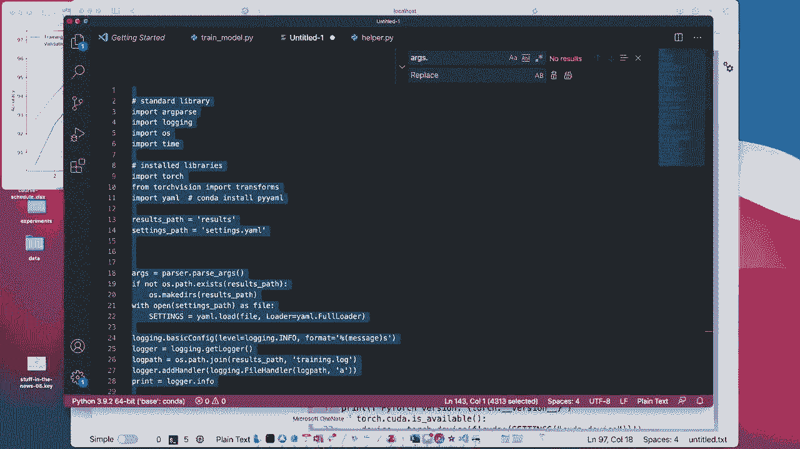

And then。Cing it back。Here。嗯。Yeah， that should technically work。 as will probably complain。

 I've probably forgot something here。No it actually works。Yeah。

 so we could also run the code then in the Jupyter notebook here if we wanted to。

 So note that we saved some space by not putting these functions from the helper functions into this notebook。

 So it's a little bit shorter。 So this way you can also yeah take advantage of that on Google call。

 Allright， so this is it for the coding examples。 I will upload them all to Github so you can take a closer look。

 and then we will continue with some aspects about multilayer perceptrons。

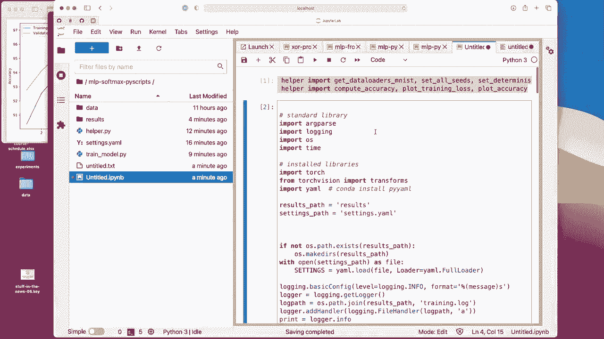