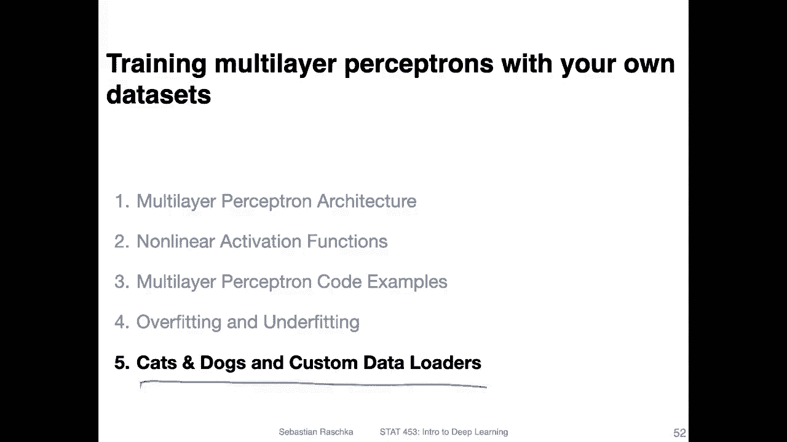
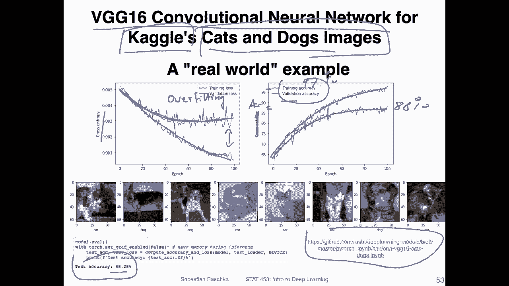
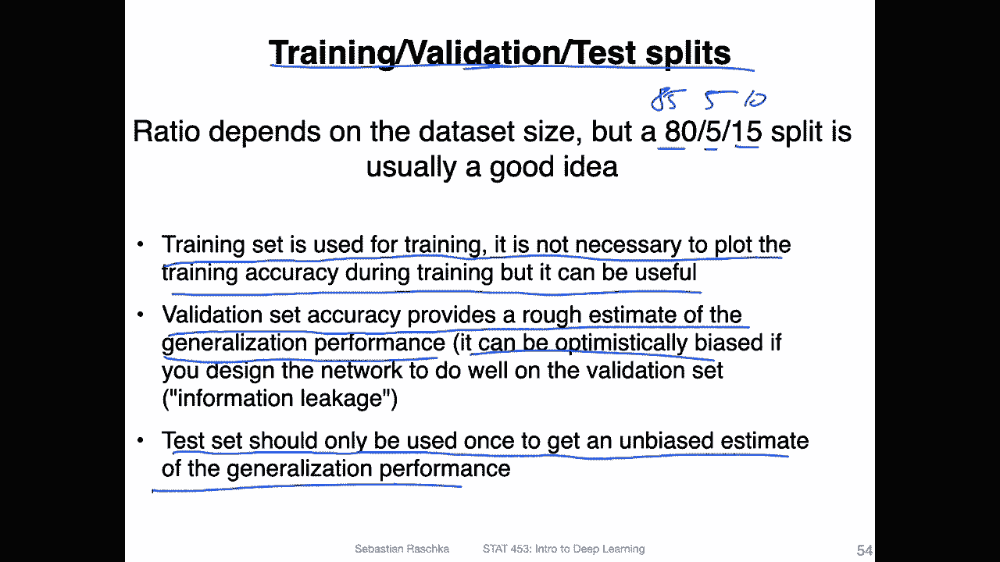
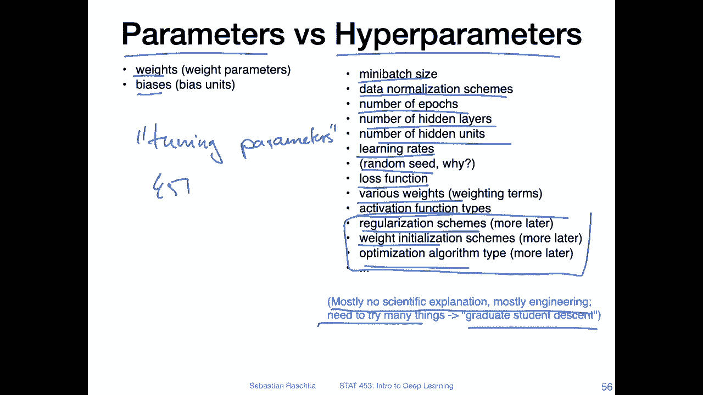
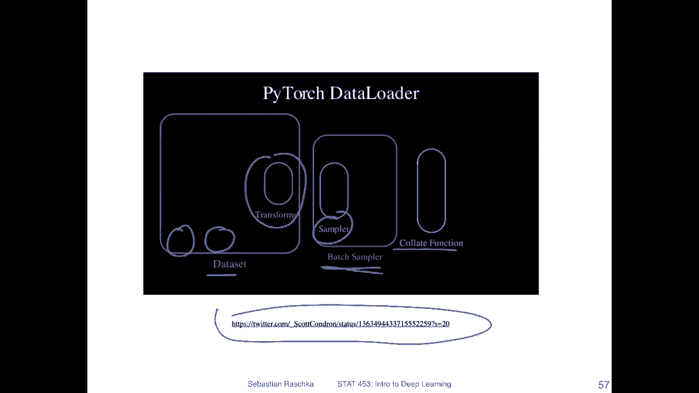
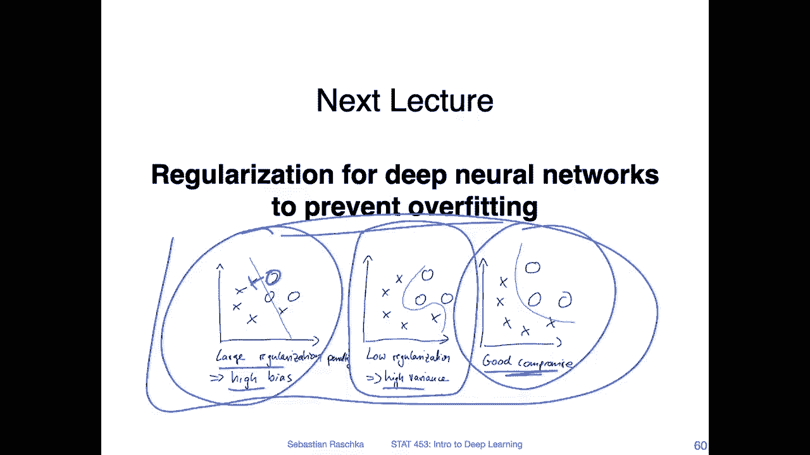

# P69：L9.5.1- 猫狗和自定义数据加载器 - ShowMeAI - BV1ub4y127jj

Yeah， let's now talk about cats and dogs and custom data loaders。

I should say I just edit cats and dogs to make this a little bit more interesting because I can imagine if you just read data loads or custom data la。

 it doesn't sound so exciting by itself。So I was like using that just to get you attention。

 But in any case。 So here what I'm showing you is indeed cats and dogscs classifier。

 I trained from a Keaggel data， So he had trained a VG G16 convolutional network that we will be discussing later in the convolutional network section or lecture。

 So here this is yeah， think of it as just a neural network for the sake of having a model here that performs yeah。

 reasonably well on a more complicated data。And then in order to fit this model。

 I downloaded this data set from Keegel containing cats and Docs images。

 but I needed to yeah create a custom data loader for that and in this video I will show you how you can create a custom data loader I will be using a simpler data though because then you don't have to download such a large cats and Docs data。

You will be or you can actually get this though and download it so I have the code link here and if you're interested you can download it from here。

 or here I at least have the instructions how to download it and I also have this model there。

But yeah I wanted to before I show you the custom data load， I wanted to make a few more points。

 So here I'm showing you the training loss and accuracy。 So actually this should be。

The accuracy here on this axis。Don't want to hide the 90 here。

 And let's focus on the left hand side first on the cross entropy so you can see。

During training that the training loss goes down as expected， This is something you want to see。

 but you can see。I'm using a validation set and for the validation set。

For each epoch I evaluate on the validation set and you can see that here the yeah the loss does not go down。

 So at first it goes down， but then it stagnateates。 So in this case。

 we don't make any further improvement on the validation set while。

It continues to improve on the training set。 So here we can see there is overfitting。Going on。

 So even if I train longer， I may still not be able to improve the model。On the right hand side。

 that's the same for accuracy。 but yeah， the accuracy is usually you can think of it as the cross entropy as inverse surrogate for the accuracy。

 So it behaves similarly here。 So you can see the accuracy goes up continues to go up let's maybe even yeah I say maybe。

Let's say， 97% even。But you can see for the validation set。

 it goes up and then it tends to stagn it maybe year at。I'll just say somewhere here。😔。

Let's say maybe 88 per， something like that。I then also evaluated the performance on an independent test set after the training has completed on that training a test set I also get 88%。

 so maybe approximately like the validation set， which is kind of expected。So。Yeah。

 what we can see here is extensive overfitting and。Here。

 the validation set gives us orient indicator of that。

 so we don't have to use our final test set necessarily。

 We can already see based on the validation set that is's overfitting。

 So the test set should only be used ideally one time in the end， it should be kept independent。

 So if you want to tune your model。You can do this entirely on the training validation set if you tune your model a lot。

 if you change a lot of hyperparmeters and do a lot of tweaking。

 you may find that the validation set performance is actually a little bit better on the training set and or sorry during training so when you evaluate it but then。

It's not as good it's better actually sorry it's better than the test set because you will see that if you tune your model a lot。

 you will also slightly overfit to this validation set。

 Of course you don't use your validation set for model training right so you don't fit the model on that data you only use it to evaluate it during model training。

 however， just by chance you may end up picking a model that just performs well on the validation set due to chance and then you have this effect of overfitting so。

In any case the procedure I outlined using training set validation set and a test set for the final evaluation is near the common approach in deep learning in regular machine learning we tend to use Kfold cross validation。

 but it's a little bit too expensive for deep neural networks。

And also because we have large data set sizes， like usually large validation and test sets。

 that's also usually okay。Yeah， what is a good ratio when we use the training validation and。

testest set， I think， I mean， it's relatively important to have a relatively large test set to get a reliable performance estimate。

Also， it's useful to have a lot of data because we've seen in the previous video the more data usually the better。

 So in that way I would say make the validation set the smallest。

 It's still important because it gives you an idea of the model performance during training。

 but it's not as important as let's say the test set or the training set。 So personally for example。

 I would do something like 80% training data 5% validation data and 15% test data。

 but you can of course also change it。 you can make it 85，5 and 10 or something like that。

 So it really kind of depends also。There's no real correct way of doing that。

 It's usually something approximately around these values。So yeah。

 just to summarize the training set is used for training。

 and it is not necessary to plot the training accuracy during training， but it can be useful。

 So you don't have to do the plots during training， right， But I find it useful to look at it。

Because then I can see based on the validation and training accuracy curves。

 how much I'm overfitting。So the validation set yeah provides a rough estimate of the generalization performance。

 It's kind of like the test set。 but because we use the validation set a lot and we choose hyperparameter such that the model performs well on the validation set。

 it's it's not truly independent anymore。 and we have an optimistic bias here。

 So from the validation set on the validation set would usually report a model performance that is slightly better。

Then the model would perform on。Truly unseen data。Yeah， and like I said。

 the tester should only be used once to get an unbiased estimate of the generalization performance。

 So this is like really in model evaluation in a nutshell in like a minute。

 So like I recommend in the previous video if you want to know more details。 I recommend the article。

 I link there， I will also link it again on canvas。

So yeah here's how it looks like you don't have to make plots also usually when I train a model。

 especially if I do that on a server， I just print。

These values like the training accuracy and the validation accuracy。

 and let to train and then after training I would print the test accuracy。

There are multiple tools that can help you to monitor。Model training during yeah during training。

 So to take a look at these curves in real time it yeah it requires some setup because yeah。

 we have so many important topics to cover in this class I won't go into too much detail because it's like I would say more like an engineering thing like like a software engineering thing。

 So after you understood the basics of deep learning and are familiar with Pythhor。

 you can yeah add more tools to your tool belt and explore additional tools。

 I don't want to cram too many tools into your tool belt right now。

 you can but if you're interested you can explore them on your own like after class or for your projects。

 So some tools are for example。There are nice R M L flow。 and there are others。 And yeah。

 these allow you also to plot yeah performance values during training in a plot interactively。

 There's also。Ts are bought。And Tensor board is originally for TensorFlow but it's also compatible now with Pyth and also a lot of people use Tensor board so you can maybe look at these two tools but of course there are more。

 these are really only the two that spontaneously come to mind but if you are interested I can also share a list of more of those tools。

In any case， so now just before we get to the code in the next video。

 just a few more things to mention there are。Parameters and hyperparmeter。 So just to recap。

Parameter are parameters like the weights and the biases in the model that are trained or learned from the training data。

 So that's what the model learns via back propagation。However， there are hyperparmeters。

 and I haven't used this work yet。 So， oh， I havet used this word， but I haven't explained it yet。

 I think so hyperpars you can think of them as。Tuning。Perrameters。

So students who have taken 451 have encountered this in the context of k nearest neighbors as the number of neighbors and so forth here we have different hyperparmeter。

 So here these tuning parameterss are， for example， the mini batch size way we normalize the data。

 for example， I mean mix scaling standardization just dividing it by a constant and many different ways we can normalize data and hyperparmeters are really parameters you as the person who sets up the model you have to choose them yourself and you have to try them out and practice and see what performs better。

 there's no way let's say we can use back propagation to learn these。 I mean。

 there are maybe some tricks or something but usually this is something。

That is set up by the person who yeah implements the neural networks。 For example。

 the number of epochs can also be considered as a hyperparmeter or the number of hidden layers。

 The number of hidden units， everything really that affects the performance of the final model the learning rate to some extent also the random seat。

 So the random seat is something you probably shouldn't tune。

 but there are sometimes random seats that don't produce are good models because the initial starting weights are really bad。

 So sometimes so usually I recommend。If you want to report the final performance of a model you present a model。

 I would recommend to run your model at least three or five times with different random seats and then average over the results。

And then you can also assure the standard deviation or even confidence interval。

We have the loss functions the hyperparmeter。Here various weights in terms of weighting terms you can weight certain examples more heavily than others in the loss function。

 the activation function like syigmoid， a logistic syigmoid 10 H or Relu and so forth。

 regularization schemes We will talk about that in the next lecture weight initialerialization schemes and optimization algorithms。

 These are all things we will cover in the next three lectures。

So here there are really no good ways to choose these。 yeah， I would say。

Maybe there are some ways now， but I would so based on meta learning。

 you can train your model on different dataset sets and you can see what performs well how how you set up your model so that it performs well on different data sets。

 but in the grand scheme of things， it's something you still have to experiment with so。

But I'm saying it there's no kind of scientific explanation for why or no no theory or theorem。

 why certain parameters， Hys should work better than others。

 So what we have to do is we have to try many things。There's this joke， probably like。

Because of gradient descent， people call this graduate student descent because graduate students usually。

 yeah unfortunately have to spend a lot of time tweaking these things。

These hyporoas。 Allright， so here has actually a nice visualization of Pytorch data order。

 how it works conceptually。 I just saw it the other day。

 and I thought it might be fun to include it in the video because it's really a nice summary of how things work。

 So I saw this here on Twitter， original link。 But yeah， let's just play the video here。😊。

So you can see。Oh， sorry， let me stop it first。 let me explain first。 And then I start the video。

 So on the left hand side， you are shown the inputs and the labels in the data set。

 So this is your dataset set。 Then are certain transformation methods。

 We will cover this in detail when I show you the data lot in action。

And there is a sampler and the batch sampler。 So the sampler sample one pair of inputs and labels at a time。

 The batch sampler yeah samples them for a batch， and then the collate function combines them to a mini batch that we can use in the model。

 So let's play this again。So you can see the inputs enableds go through the transform and through the sampler and get collected in this batch sampler。

 Once we have a batch ready， it goes to the col function and it produces the batch of inputs and batch of labels。

 And then yeah， it does the next batch and you can see。Here it's sampled without repetition。

 So each sample is used exactly once also each pair of inputs and labels。

 And then yeah once we are finished， we finished the epoch and then there will be another epoch。

 So you can see there are also chosen randomly here。So it's basic equivalent to shuffling。

So then the last batch here。Alright， yeah， so and then you would do the whole thing again。

 But of course， yeah， you would choose them in a different order if you have， there's a parameter。

 It's called shuffle。 If you have shuffle enabled， it will choose them in a different order then。

Yeah， this is conceptually how the Pytch loadout works。 So here's how it looks like in code。

 and yeah I actually I think I should make a separate video and walk you through this in the Jupyter notebook it will be a little bit better to explain compared to walking you through it here on the screenshot。

So just to wrap up the slides before we go to the last video of this lecture to the code example。

 So we have now the good news that we can solve London nonlinear problems。 That's great。

 right however， now we have the bad news that is that our multilayer neural networks now have a lot of parameters。

 And yeah， it's easy to overfit the data。 So in the next。😊。

Next year we will talk about techniques like regularization techniques to help prevent overfitting。

 so here's a simplified example of how that might look like。 So if we have。

 for example a model in the center here that is maybe too complicated and doesn't generalize well to new data then here on the right hand side there is a model that is slightly simpler we can make it even more simple like just as linear decision boundary。

 but this is not sufficient here to distinguish between these crosses and circles。

 so there is usually。A good compromise between a model that is。

 let's say overfitting It has high variances or a model that is underfitting that has high bias。

 So regularization helps to simplify decision boundaries in a certain way。

 if you think of it as if you think about it visually but yeah。

 we will talk more about that in the next lecture。 So in the last video or the next video。

 I will show you the custom data order and practice。

