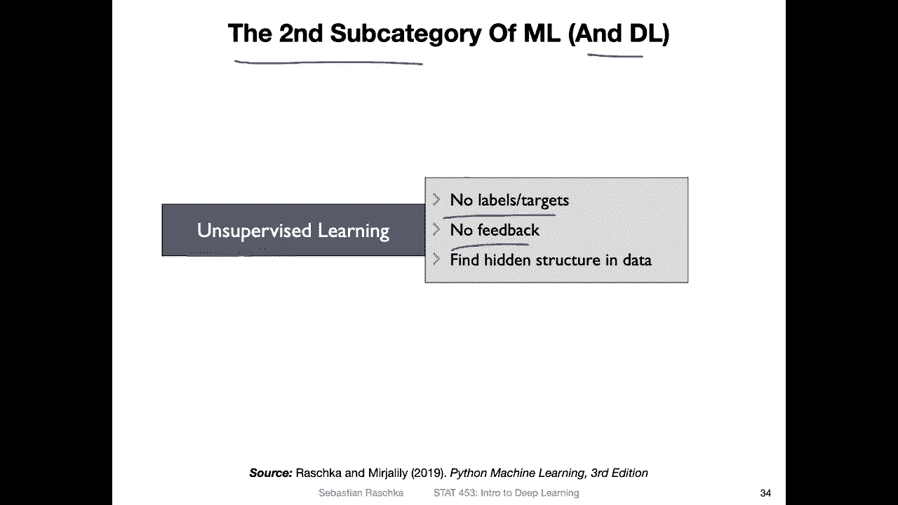

# 【双语字幕+资料下载】威斯康星 STAT453 ｜ 深度学习和生成模型导论(2021最新·完整版) - P6：L1.3.2- ML 的广泛类别第 2 部分：无监督学习 - ShowMeAI - BV1ub4y127jj

Okay， let's now talk about the second subcategory of machine learning and of course and also implies it's the subcategory of deep learning。

 so this is unsupervised learning which in contrast to supervised learning does not use any labels or targets so we don't have any feedback here and it's more about finding a hidden structure in the data。

So in that sense， we can also think of unsupervised learning as representation learning。

 and this is sometimes also used for dimensionality reduction。

 It doesn't have to be used for a dimensionality reduction， but it's one application of it。

 So you probably have heard of principal component analysis and other statistics classes or short PCA。

 which is a linear transformation technique that rotates the data and then yeah。

Extracts linear combination of the inputs， so。If you consider this example here。

 there are two features of feature。One and feature 2， these are our inputs。

And here these circles are our data points in this space。And with principal component analysis。

 we find the eigenvectors of yeah this data set。 So in that way。

 we yeah use these eigenvectors to rotate the data。 So we have these two principal components。

 These are essentially eigenvectors。 and usually we sought them by decreasing order so that we saw them by the eigenvalues by the corresponding eigenvalues。

 So we usually keep the large eigenvalues or the eigenvectors corresponding to the large eigenvalues。

 So in this case。The eigenvalue corresponding to the first principle component is larger than the second one。

 so in a practical application we may yeah use this first principle component to have a compressed representation of our data but yeah this is a little bit more detail than we need to know I just wanted to show you an example of unsupervised learning if you don't know how PCA works。

 no worries about that， It's just if you know it， this is a nice example of unsupervised learning。

Another example of unest learning are auto encoders。

 and this is something we will be talking in part5 of this course。

 So this will be the first lecture in part 5ative adver gene generative deep learning。

So auto encodes work like this， it's actually a very simple concept。You have input data。

 So this is your。Input data。 And then you have。The output produced by the auto encoder。

And the auto encodeder consists of two parts， an encoder and a decoder。 And first。

 the dimensionality of the input is very large。 And then through hidden layers， there are。

That's a learned representation。 that is smaller dimensional。

 So we call that also the latent representational featurebedding。 this is let's say， low dimensional。

And this is high dimensional。So you can think of each pixel in the image as a feature so if we have。

 let's say， 100 times 100 on。Pix salts， we have。100000 features is input。 So in that way。

 it's a very high dimensional input。 And then you can maybe make this like， I don't 10 dimensional。

It really depends on the data set。 But let's say we make this 10 dimensional。

 This is learned by the encoder。 It's a neural network。 And then we have a decoder， which undos that。

 It's basically the opposite， taking the low dimensional input and making the。High dimensional。

 let's say the 100000 dimensional output。 So the goal here is reconstructing。The input。

 So why would we be interested in that， So why is that a useful exercise， What。

 what's the point of this Al and quota if it's just learning how to reconstruct the input。

So the goal is basically。 what the interesting part is this latent representation。

 So you can think of this as a yeah， a compressed version of your data。

 So if the decoder is able to reconstruct the original image from this。Yeah， small dimension。

 It means that this， this dimensionality here is sufficient to encode important information about the data。

 So it's， you can think of it as a compressed。Version。Of yeah， the data。 So in that way。

 it's also a dimensionality reduction。 There's actually a close relationship between an auto encoder and principal component analysis。

 If the auto encoder consists of linear activations。 but don't worry about this detail。

 We will be talking about auto encodes more in part 5。

 it's just another example of unser based learning here。

And just yeah， for reference， because I already had this nice cat picture， again。

 how classification works is the majority of deep learning is about classification。

 So consider we have an input。Data point here。 it's this cat image and during training we have a label that's a cat here and then the network produces a probability。

 The probability that this image is a cat， and then we can give it a new data it could be a do or a cat and basically everything anything。

 and then it would produce a probability How likely is it to belong to the class cat for example。

 So a classifier is classifying the images， but label they have。

 whereas unservisized learning is really very different。

 It's not about predicting any labels here it's about learning this hidden representation that can be used then to reconstruct the input。

Okay， so this was one example of unest learning the dimensionality reduction or representation learning。

 Another example of unest learning is clustering。 you have probably heard of clustering before it's assigning a group membership to unlabeled examples。

 So here it's consider a data set where I have again two features x1 and x2。

 I don't have any cluster tables。 I'm just grouping them by similarity and just by looking at it。

 you can think of these points here because they are closer together that they may belong to a cluster and these belong to a cluster and so forth here it's kind of obvious what belongs to a cluster in real life cluster boundaries are sometimes not so clear。

 it's also usually high dimensionality。 So usually clustering is about finding group memberships。

So yeah， but here the difference again to classification is that we don't know the true labels。

 so we can also say this could maybe be one cluster and this could be one cluster。

 they are some measures for measuring cluster quality， like intrinsic measures。

 but we don't have like a real true answer here。Also clustering， I'm just mentioning it here。

 but it also won't play a role in this course， so we won't be talking about clustering in this class。

 It's really not yeah the goal of this class here。 It's more like a data mining topic， I would say。

All right， in the next video， let me briefly talk about reinforcement learning。

