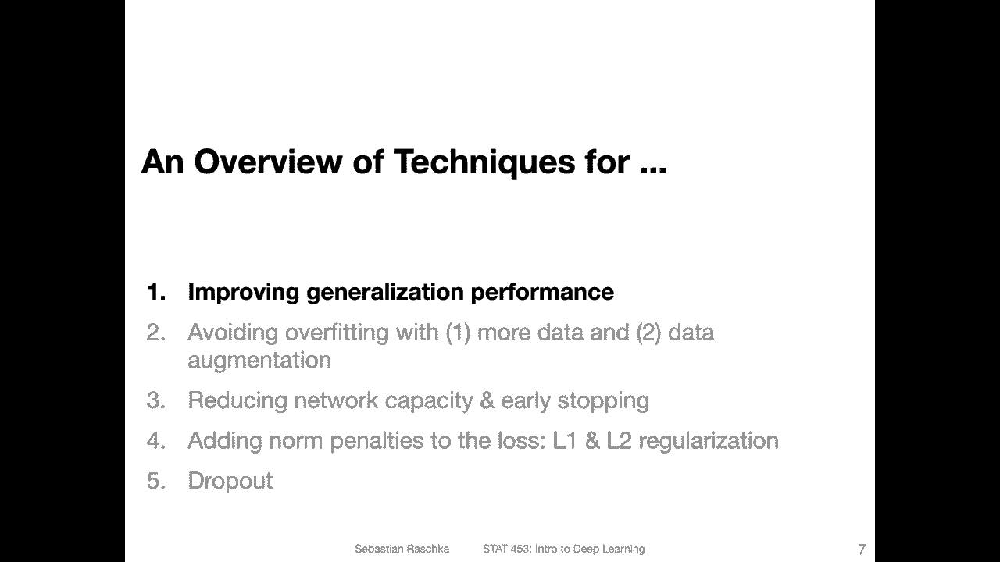
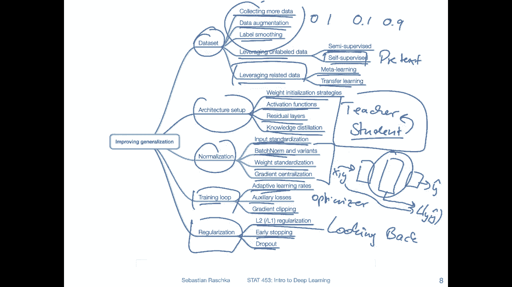
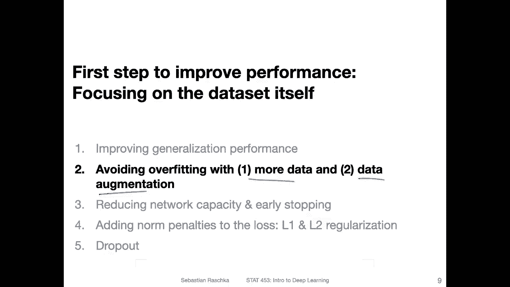

# P73：L10.1- 减少过拟合的技术 - ShowMeAI - BV1ub4y127jj

Yeah， like I mentioned in the previous video， I wanted to share some techniques with you for improving the generalization performance of a model。

So I did a very spontaneous， brainstorming session where I took a mind map software and just wrote on everything I that came to mind。

 This list might not be very exhaustive。 There might be other techniques。 I'm not listing here。 Here。

 I was really just focusing on the most popular ones that came to mind that are useful in practice。

And yeah， of course， we can't cover all of them in detail in this course because yeah。

 there are so many other topics to talk about， but at least you get the big picture and you may want to look into some of these techniques that you could find useful for your class project。

So like I said， this was pretty spontaneous， so there might be different ways to organize this better。

 but I chose a few categories to have some structure to this。 So one category is I call it data。

 So here I'm referring to techniques that really modify either the features or the labels in the dataset or even yeah creating new dataset sets or using different dataset sets。

So。I would say personally， one of the best bangs for the buck if you want to improve model performance is collecting more data。

 if you can。 This is not always the case， of course。

 but there are many scenarios where more data can generally be helpful。

 And this will also be something I will discuss a little bit more in detail in the next lecture。

 sorry not next lecture in the next video。 I will show you a graphic or a plot that can help you finding out whether more data could be useful。

Another technique is data augmentation。 So this is for modifying the input features。 So by。

 for instance， rotating an image and things like that。

 And that is also something I will talk more about in the next video。 So， yeah。

 another technique is label smoothing。Personally， I haven't really worked with that extensively。

 I only have used that in the context of generative adversarial networks。

 but I think it can be also useful in a general classification context it's basically preventing the classifier to become too confident and that can be achieved by instead of using let's say 01 labels by having softer versions of that for instead of let's say0 and1 we can use 0。

1 and 0。9 and this has been shown to be helpful in the context of generative adversarial networks and I can think of also classification of being。

Positively affected。By that， in certain cases。Then a big topic is yeah， leveraging unlabelled data。

 We talked about this a little bit in the introduction to this cause。

 So one approach is semi supervised learning， which is essentially about。

Leveraging unlabeled data by looking at how confident your classifier is。

 So you fit your classifier on the subset of labeled data， and then you apply it to unlabeled data。

 For example， if you have a larger data where you have data points that are not labeled yet。

And if the classifier is very confident for some of those。

 then you may yeah consider them or you can consider the predicted labels as the true labels to make your training set larger。

Self supervis learning is a little bit different。 So self supers learning is also leveraging un data。

 But here you create a so called pretext。Task where you make up a different classification task for which you can create the data yourself。

 So I showed you in the introduction to this course， like an example of， yeah。

 solving a jigsaw puzzle where you take an image and then you divide that image into smaller subimages and then you train a network to predict the order of these images that would be。

 for example， selfsvis learning。 But yeah， these are topics both semi-svised and subsvised learning that go a little bit beyond the scope of this course that might be。

A future topic for a different cause at some point for more like advanced topics。 Yeah。

 so also related to what I just said there also。A set of techniques for leveraging related data。

 So selfsvised learning is really like a leveraging unlabeled data It could be from the same domain or the same data that you are working with for which you have labels So let's say you have a dataset for which you have labels but you can design this pretext task on the same dataset。

 So here you may also consider related different data sets So for instance。

 one technique is called meta learning where you essentially learn how to learn like from different dataset sets let's say multiple small dataset sets So is actually very common in the context of fu shot learning。

And another， this is a bit unfortunate。 another definition of meta learning is also really learning from met data。

 That is another thing。 So you have multiple data sets。

 you can create met data and then train and classify on that meta data。

And yeah another technique is transfer learning so actually this came up when I was just grading class projects so some students are working on CoVID-19 prediction from chest X-ray data so but the datasets are very small so one thing one could do is to collect a different dataset set of lung x-ray images for instance。

 for diagnosing a different disease and then you train a classify on this large data for let's say I don't know some other lung disease and then after you train the model you take that model and find unit to the CoVID-19 chest X-ray database。

So we will talk about transfer learning also briefly later in this course。

 So this' is actually a very useful technique too。So okay， this was all considering data sets。

 And so there's also there are some techniques related to architecture setup up。

 how you structure your architecture， the deep neural network architecture。

 So there will be weight initialization strategies。 We will discuss that in this course。

 So and I want to talk too much about it at this point。Yet choosing activation functions。

 we talked about this already， yeah， last week when we talked about， for example。

 the value activation function。Residial layers。 they are so calledled I consider them as yeah skip connections。

 I think they are sometimes called skip connections。 So we are skipping。

 or we are adding a connection by skipping certain layers that can also be helpful to avoid vanishing and exploding gradient problems。

 And this is also something we will talk later about in this course。So there's also。

 yeah knowledge distillation。 So this is beyond the scope a scope of this course。

 but it's kind of an interesting setup where you train a large neural network。

 And then you call it the teacher。And then you have a smaller neural network。

 you call it the student network and the student network。

Learns to predict based on the predictions from the teacher。

 So you train the teacher on this data and then you run this teacher to make or create the predictions and you train the student。

 usually a smaller network on the predictions of the teacher。

 And what's kind of interesting about that is yeah， for the teacher。

 you can run it infinitely on also yeah larger data So you can actually have yeah infinite in a way。

 infinite predictions for the student。Anyways， yeah another。Set of techniques。

 concerns normalization。 we talked already about input standardization。

 I will mention it again in the next video when I show you the data augmentation there is also a set of techniques related to batch normalization。

 This is related to input standardization but here it's internal in the network。

 So instead of only looking at the inputs to the network we also look at all the inputs to the hidden layers。

 So the hidden layer activations and we normalize those two theyre also have flavors of that called group normm and instance norm and layer norm and also those are a topic for future lecture in this course。

Yeah， weight standardization is also there are also techniques for standardizing weights。

 It's kind of related to the weight initialization topic。

 but there are also yeah additional topics for that and also gradient centralization so gradient centralization is similar to input standardization except that you normalize the gradients so that they have zero mean and unit variance。

So， yeah， and next。There are techniques from， yeah。

 I would say modifying the training loop So the fall loop over the epochs and the mini batchches。

 so what we can do there in terms of the optimizer and things like that I should have maybe added something like different optimizers here because there are also optimizers that go beyond adaptive learning rates。

We will talk about this also in more detail in later lectures so for example there are adaptive learning rates which are super helpful。

 they are also auxiliary auxiliary losses so we can add additional loss functions in intermediate layers and then also modify the training intermediate we can modify the network training by having these yeah additional loss functions。

So one common thing that comes to mind right now would be the inception network。

 We will talk about that in the convolution network section。

 where we have multiple loss functions that we combine from different places in the network。

 and that helps yeah also training the network。 So just briefly if you have a network like that。

Usually， you have the output here， and then you have a loss function。 and you have the label。

 So you have the true label。 So you have the your input image。 The X goes into the network， whoops。

And the y goes into the loss function together with y hat， the predicted label or probability。

 So you get y Y hat as the loss function that you compute for back propagation， but。Yeah。

 but you can also do is you can also have an intermediate value here。

 intermediate prediction from the intermediate layer， and also add that to the loss function。

 that is essentially how Inception works。 and with that you can make sure that if you have a very big。

 big long network that also the intermediate layers are trained well。 So Zhangji and I。

 we also worked on a method related to this topic called looking back。Looking back to。

Earlier layers for， yeah， designing better loss functions。Yeah， then there's also gradient clipping。

 so avoiding like very large gradients。 so if they go too large you we can clip them by giving giving it a maximum value So that is's also sometimes helpful to avoid exploding gradient problems。

 and now the last set of techniques just put them also here because those are the ones that we are going to cover in this particular lecture here in addition to these topics。

 So we will talk about L2 regularization and L1 regularization for yeah adding a penalty for large weights So that helps with having smaller weights and that also helps with making the network less sensitive to certain input So that makes the network predictions a little bit less noisy so reducing the variances。

And we' will also talk about early stopping by looking at validation set performances and then drop out like dropping random units in the network。

 which is kind of like a way of adding noise to the network and then helps also with yeah overfitting。

 Allright， so this is just like the big picture overview of all the different techniques that spontaneously came to my mind when it comes to improving generalization performance again。

 we will talk about many of these techniques， not all of them but many So just have to be patient because we can only talk about one thing at a time。

 but I think this is probably a useful overview for you。

Al right， so in the next video we will talk then about overfitting by considering making our data larger and by augmenting our existing data。

