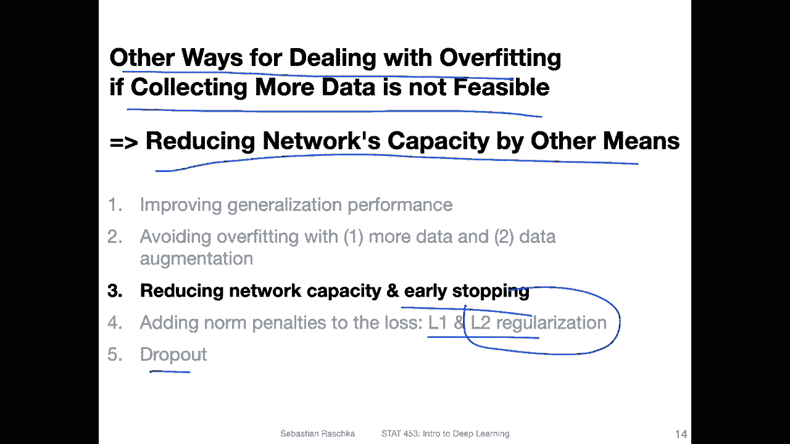
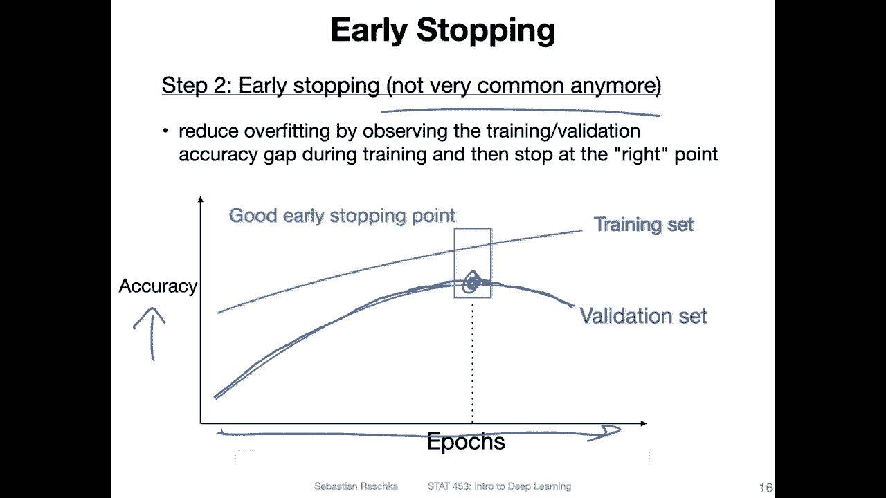
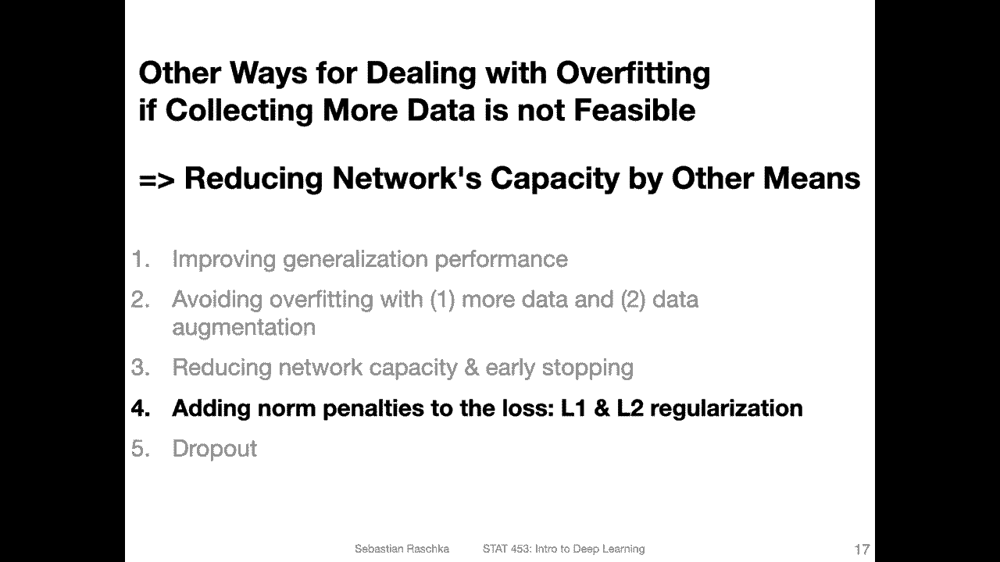

# P75：L10.3- 提前停止 - ShowMeAI - BV1ub4y127jj

Yeah， let's talk about some other ways we can use for。Yeah。

 let's talk about some other ways for dealing with overfitting。 For instance。

 if collecting more data is not feasible and if data augmentation only gets used so far。

So one way would be reducing the network's capacity by other means。

I decided yeah not to do an extensive slide on that because we discussed several techniques already in that overview video I made with a mind map and also to be honest the really most exciting topic here is dropouts。

 and I want to spend too much time on other techniques at this point。

 I will briefly talk about early stopping though and then in the next video I will also talk about2 regularization which are two ways that allow us to yeah reduce the capacity So capacity is essentially interesting term it refers really to the ability of the network to fit complex functions so like you can think of it as the complexity of the decision boundary。

 So adding a penalty against complexity that's essentially what L2 regularization is it helps reducing the capacity but also let's say adding noise my dropout also reduces the capacity in a way。

So all these topics are kind of related。 So in this video。

 we will mainly focus on early stopping and in the next video will explain regularization。

Yeah， and as far as early stopping is concerned。 So there's a general strategy here。

 So this is usually something I always recommend when you work in deep learning。

 you split your dataset set into three parts， a large training set and the second largest chunk should be your。

Data set for testing and then a smaller validation set that you use for model tuning and the test set should only ideally used once and the very end once you yeah。

 you found your model， you are happy with it by tuning it on the validation set。

 then you use your test set to evaluate the final performance of this model。And yeah。

 the validation set is essentially for tuning the model。 But then you can also use it， of course。

 for early stopping。 That's part of the tuning essentially。 So last week。

 I showed you some real data， like the。

Training。😔，Over the epochs and the accuracy， we also did the same for the loss。

 So you can also do that for the loss here， just for the sake of keeping things simple。

 I'm just showing you an idealized drawing of that。

So early stopping is essentially yeah a method for looking at the training and validation set performance and you from there you try to deduce a good point for stopping the training。

 for instance， you may see that the validation accuracy goes up。

So the validation set serves as a way of estimating the generalization performance。

 you can say the generalization performance improves。

Up to a certain point where you find that the validation set performance goes down again。

 So in that way， training longer may make your performance worse。 However。

 there might be some exceptions sometimes like we've seen in the double descent paper last week。

 but in general there might be something like this where you find that if you stop the training early actually get a better performance。

In practice， this method is not super common anymore。

 I mean it's not totally uncommon to do that but I would say first try it's either L2 regularization or even better using dropout to improve generalization performance and once you use both techniques and you still find that early stopping helps then I would probably consider early stopping but I would first consider the other two techniques I'm going to present in the next two videos。

But again， this is yeah also a useful technique to know about。

 So in the next video I want to show you L2 regularization。

 which is essentially a penalty against complexity。 and then we will get to the main topic dropout。

