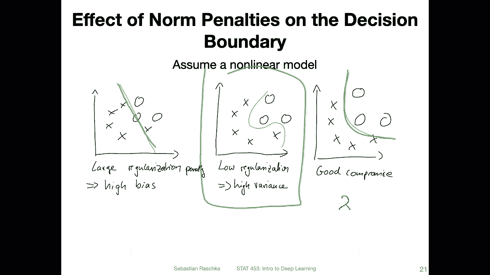
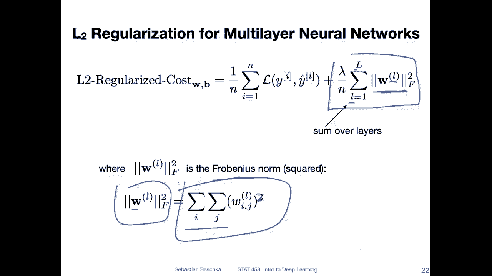
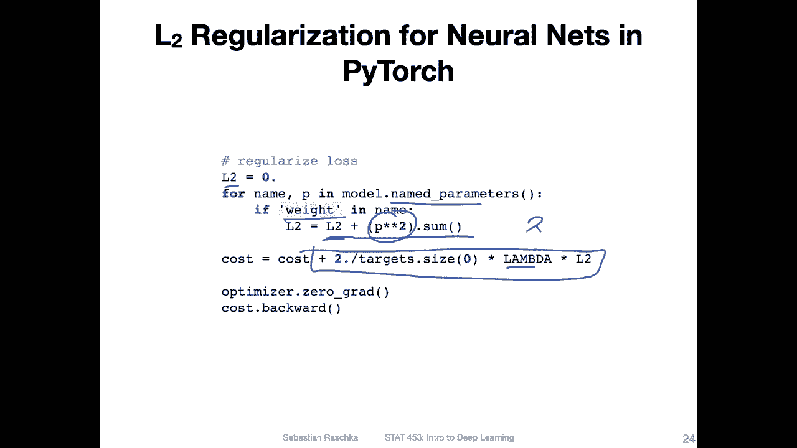

# 【双语字幕+资料下载】威斯康星 STAT453 ｜ 深度学习和生成模型导论(2021最新·完整版) - P76：L10.4- 神经网络的 L2 正则化 - ShowMeAI - BV1ub4y127jj

Yes， so in this video， I want to talk about adding a penalty against complexity。

 So we will be talking about the socalled non penalties that we can add to the loss function。

 There are two common versions， the L1 and the L2 norm。

 And what they essentially do is you can think of it。

 maybe in the context of a multi layer perception。 Let's say we have a hidden layer with。

3 units and two output units。 And then we have， let's say，2， to input。Features here。 And yeah。

 as you know， everything is fully connected。 Let me quickly draw that。

So if we have a setup like this。And we have a large weight connection at this point。

 It's called it W1。Compared to。The other weights that's say this is a very large weight， then。Here。

 W1 will have a large effect on the network， although it's only one feature that has， let's say。

 a large weight。 So if you have a lot of inputs that might happen that there's one large weight。

 and then it outweighs all the other features so that could be yeah causing a lot of noise or variances in the model。

 it could be very susceptible to small changes in the input that way。

And by adding like a penalty against large weights。

 by keeping them more small and more uniform or closer together。

 we can help yeah with preventing like fluctuations in the network。

So yeah you probably heard about L1 and L2 regularization from other statistics classes。

 so I will keep it relatively short here， it's also not the most important technique in deep learning。

 so it's also not what I'm saying is it's also not let's say a priority in this course to talk about it because they are more I would say important techniques to talk about in the context of deep learning。

But yeah。You may have heard of this in the context of Lasso regression。

 so Lasso regression is essentially a linear regression with an L1 penalty。

 and there's also rich regression， which is essentially linear regression with an L2 penalty。

And sometimes that's also called weight shrinkage because yeah。

 it shrinks the weight because a large weight will add a penalty against the loss， which will， yeah。

 make more sense when I show you actually how it looks like。

So here is an illustration of the L2。Norm or the L2 norm penalty， So L2 regularization in a sense。

 for linear models， for example， for logistic regression because yeah in this course we talk more about classification rather than linear regression。

 but everything on this slide would also apply to linear regression and then I will also later in this video show you that how we can generalize that to multilayer neural networks it's actually pretty trivial。

But just for simplicity to take one step at a time。Let's consider a logistic regression model here。

 where we have。The loss function here。 That's the negative lock likelihood。 And yeah。

 I'm just calling this cost here。 So I took this， I think， from my book or something where。

Traditionally， I differentiated between cost and loss。 I called cost。

Something that is computed over the whole training set， whereas the loss is， for instance。

 just on a single data point I here。But you can also think of it as， as loss， if you like。

So this is nothing new。 This is how we compute the loss between。

The true label and the predicted label in here assume this is the binary cross entropy or negative log likelihood。

 Let's just say binary。cross entropy。That is， again， nothing new。

 What's new is that we are adding now this term here shown here。 And this is essentially。Weighted。

 yeah， it's just the sum， the credit as。The weights squared so that we don't have negative values。

 So we are just adding a sum over the squared weight terms here。So， that means。

The larger the weights， because it's even squared even having a larger effect。

 the larger the weights， the larger this regularized cost will become， right。

 So because if a weight has a large， positive or a large negative value。

 this will make the regularized cost larger。 And what is this term here。 So this is lambda over n。

 This is just like a normalization term and Lada is I'm saying it here。 It's a hyperparmeter。

 It's something you have to choose。 It's essentially the。Regization。Strength。

RightSo the larger a lambda， the stronger the regularization。

 usually people use a small number like 0。01 or 0。1 for regularization， but of course。

 you can also choose a number larger than one and then that will be a pretty strong penalty。Yeah。

 and I'm not showing you really L1 regularization because it's the same concept except that instead of using。

Squared weights you would use the absolute value here。

Yeah， so this here is a geometric interpretation or a geometric intuition behind the L2 regularization。

 So this drawing is based on a seminar talk I once saw by Professor Robert Tiip Shirani， hope Im。

Pning this。Correctly or his name。 He was one of the main people working on these techniques。

 L1 and L2 regularization。 if I remember correctly and。

What this is showing is is a surface plot of the loss function。Let's say， the mean squared error。

Lo for linear regression。And we have。A model， a linear regression model with two weights here。

 and let's ignore the biasious unit for simplicity。And。In the center here we have the loss minimum。

 so that's the point we want to reach。 So we want to find the weights of the model such that the loss is minimized。

 the mean square error is minimized。 the further we are apart here。

 these contours represent the magnitude of the MSE。 so the further we are to the outside。

 the larger the loss。 So really we want to find the weights here， this position。

 let's say if we only focus on on the episodes here。These weight values that minimize the loss。

That would be the regular MS E。 That is something we can do via gradient descent， for example。

 as we' have seen a couple of lectures ago。 But now we have， yeah， we have this new term。 We have。

2 norm， right of the weights。So。We have two weights， right？ So over the two weights。

 we have this L 2 norm and。It is added to the loss function。

 So the larger the weights on the higher the penalty here and。This。

Grace circle here represents the penalty term。 So this term here。No。

It becomes essentially a constrained optimization problem。 We still want to find or reach  zero loss。

 but the loss。Consists now of two parts parts consists of this M E loss and this penalty term。

 So the penalty term is really here， is pink colour。Penalty term is pretty here like this circle。

And the MS E loss here， it's this one here。 so we want to minimize both。

 we want to have small weights， so we want to weights close to 0 because of this term。

 but we also want to have the weights such that the MS E here is minimized。So in practice。

 what will happen is that， for instance， an optimization algorithm like gradient descent will find a good compromise between the two。

 So for instance， it will try to keep the weights close to0。

 but also it will try to keep them close to this is E also for instance it might find this compromise here between the two。

So you can see。Here for this part， what let me use green。For this part。

 these weights are not too large， so are somewhat close to this center that we want to minimize。

 but they are also somewhat close to this point。 So it's like a compromise between the two。

 So that's how you can think of the L2 regularization。

 It's still minimizing the main loss Another constraint that we want to keep the weights relatively small。

So in practice， what the practical implication of that is is that let's say you have a model。

Let's say a multi layer perceptron like that。 It has a relatively complex decision boundary。

It will essentially make the decision boundary somewhat simpler for it。 For example， like that。

 if you have a very strong regularization， it might even become like a linear model， a very， yeah。

 too simple。The decision boundary。So yeah， usually you have to find a good hyperparmeter for Lada to have a good regularization compromise here。

So in the previous slides， I mentioned how that looks like for the generalized linear models like logistic regression。

 where we have just a sum over the weights。 So how can we generalize that to multi layerer。

Your networks where we have multiple layers of weights。 we don't only have a weight vector。

 but also we have like weight matrices。Actually， yeah it's very simple。

 we just use the Frrobinius norm， So instead of yeah having the sum over the elements in the vector。

 so instead of having the L2 norm we now have the Frrobinus norm。

 which is essentially the same as the L2 norm except that we have a sum over the rows and the columns in the weight matrix。

So， we have。Here， the forbi is known for one matrix，1 matrix in the layer L。 Of course。

 we have multiple weight layers in that way。You can either have a different lambda for each。

 so you can have a lambda for each layer， or you can use the same lambda for all the layers。

 but you also don't have to regularize all the layers， but that's usually common。 So here。

 for instance， you would have。summation also over the Frrobinus norms for the L layers。

 You can see that here。 That's the L layer weight matrix in each。

Each probinusn would be computed via least two sums over the columns and the rows。

So that's just yeah， a simple summation of the weights。Actually， are the squared weights， of course。

So now that we modified the loss function。 So how do we do the training if we use gradient in descent It's actually。

 yeah pretty straightforward。 a gradient in descent recall we take the derivative of the loss function with respect to the weights。

 And， we would do the same thing now with the added penalty here。 I mean， if you think about it。

 this is just plus right， So it's a sum， a sum between the normal loss。 let's call it the。

Normal loss， and this。Regularization。Term， because it's just a sum。We can use the sum rule。

 and we can compute the derivatives separately。 So this is。

The derivative as usual that we talked about or gradient， if you will。

 And then we can also yeah compute this part separately and add them up。 So for instance。

 if we have the gradient or partial derivative of the loss with respect to one of the weights here。

 we would have。

For the weight I J， the derivative of this regularization term as follows because it's， yeah。

 it's just a square term， right， So if it's。Like this， we can just bring it up front， right。

 So in that way， very simple derivative， except there we have， of course on。Sorry， we have this。

Lambda term。 And then also if we have a summation over n。In O。Lo。

 we also have normalization here over n。So this is essentially it how we。How we compute that。

 So over in here is over the training examples， right。O。

So anything oh， yeah。 So we have also here an example of how we implement this in Pytorch。

 So I don't want to I have actually a code example。 I will just upload this and link this on canvas。

 but it's so simple that I don't even need to show you this in a separate notebook， I think。

 So how we can regularise the loss is。By， yeah， just summing over the weights in the model。

 So if you initialize your model， you。Can then iterate over these model parameters。

 And notice we only regularize the weights， not the bias units。So， here。I'm iterating over all the。

Perarameter in the model， I'm using named parameters instead of just parameters。

 Not this is model dot parameters is something you would give into the or provide to the optimizer。

 So you have seen that before。 Now we are using named parameters。

Why are we doing that so that we can then say here， only choose the weights， not the biases。

 And then yeah we。Add these to the loss。 So let's say we have the tool term here。

 We accumulate all of these， just the squared sum of these weights。 So P is weight。And。Yeah。

 and then we add this to the loss here， so I'm calling it cost， but you can also call it loss。

 So this one is essentially what we have seen in the previous slide。

 Lambda is our regularization strength here。

So， this is essentially。

But I was showing you。Here。Except for all the weights， of course。

And this is something you would do during the training loop during the fall loop。

 So there would be one way you can do L2 regularization for neural networks in Pythtorch。

 but there's even a simpler way。 So what you can do is instead of what I've shown you in the previous slide。

 you can just choose this weight decay argument here or you can use this weight decay argument in the of the SD optimizer and you can just provide the Lada regularization strength to the weight decay here and it will do L2 regularization for you。

 So actually you don't even have to bother with this。

 I mean this is optionally if you like to do it manually but you can also just do it automatically by specifying this here in the optimizer and this is it。

 So that's all you need to do。

For L2 regularization and yeah， neural network training。

Okay， so this was L2 regularization in a nutshell I I would say I recommend maybe trying this out in practice。

 but I must say it's not super common anymore。 What's more common is using dropout。

 which we will be discussing in the remaining parts of this lecture。

Actually I originally planned to only make one video。

 but then I think it might be a super long video so Im splitting it into far shorter parts。

 so let's get started then and finish up this lecture on regularization by talking about dropout。

