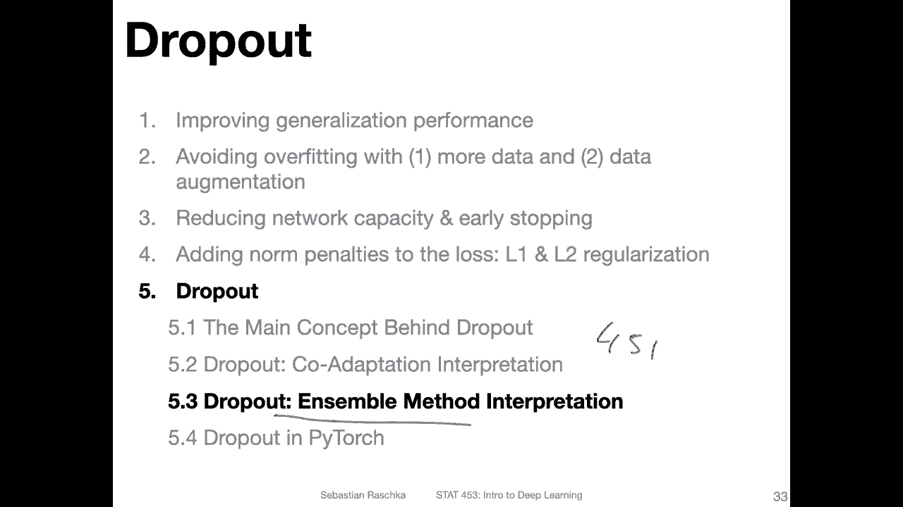
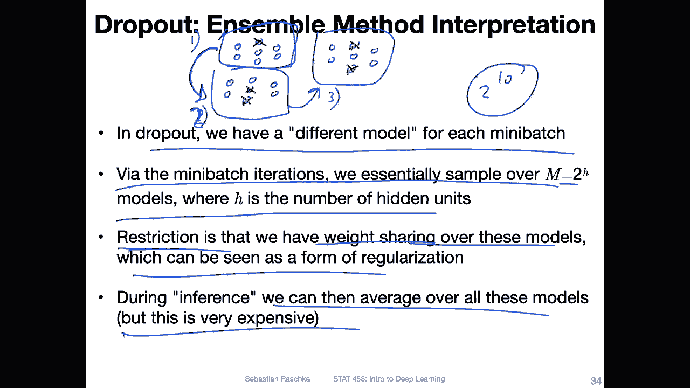
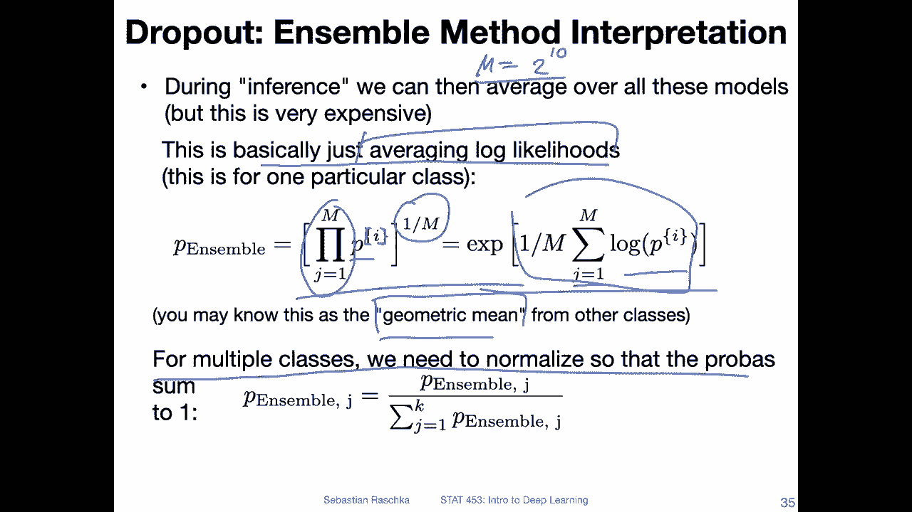
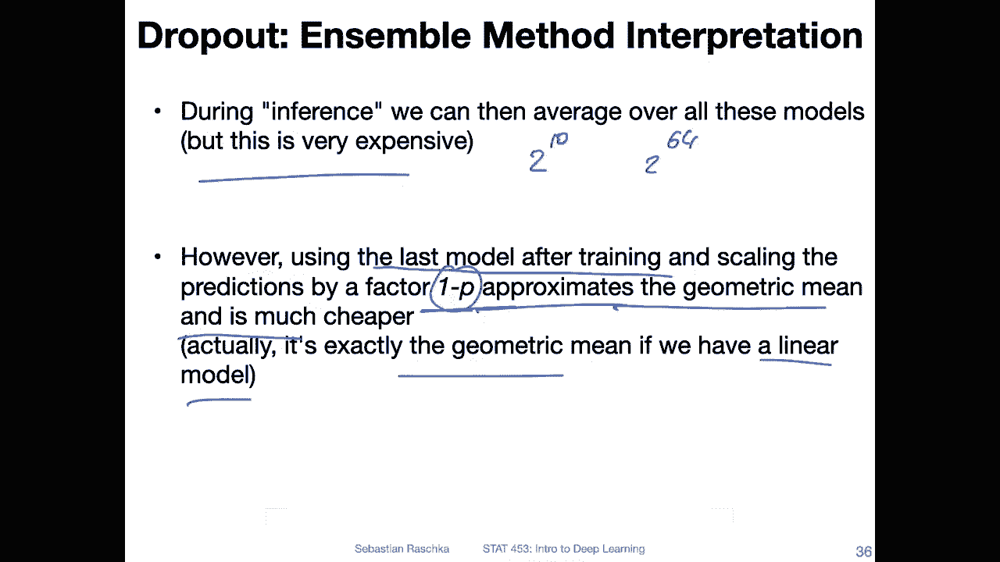

# 【双语字幕+资料下载】威斯康星 STAT453 ｜ 深度学习和生成模型导论(2021最新·完整版) - P79：L10.5.3- (选修)Dropout 集成解释 - ShowMeAI - BV1ub4y127jj

Yeah， now let's look at other explanation for why dropout might perform well。

 and this is in the context of ensemble methods， so we can essentially see dropout as an ensemble method。

 as I will show you in the next couple of slides。And yeah， what is an ensemble method。

 So students who have taken 451， we talked there about ensemble methods a lot。 we talked about。

 for instance， majority voting， begging， random forests， boosting。

 You don't have to know any of that for this class here， But in a nutshell。

 what is an ensemble method。It's essentially a combination of multiple models where you average the results of the models。

 So you can think of it intuitively。 let's say you have to make an important financial decision。

 let's say yeah you want to make or you want to buy something or invest let's say you want to invest into something。

 and it's a very important decision So you consider asking an expert。

 So the expert here is your model， and it might give you a prediction or some advice。That might be。

 yeah， a good advice if it's an expert and expert。Now is the topic very well。 however， in practice。

 it's usually an even better idea to ask a couple of experts and then consider。

 yeah the shared opinion of the experts。 So it's not always better than let's say the opinion of a single person。

 especially if yeah the committee doesn't agree with a single person and the single person knows something the committee doesn't know。

 but on average， usually asking committee of multiple people is a better idea than just relying on the opinion of a single person right so in that way。

 using multiple models and then averaging the predictions or taking the majority vote。

Its also often a better idea than yeah using a single model。 Why don't we do that always then， Yeah。

 well， because it's usually very expensive to train models， especially in deep learning。

 So in deep learning， I would say most of the time we want to focus on a single model because it's computationally cheaper and we also often care about yeah improving a model in general。

 And then let's say in production， you can always yeah train multiple of these models and then combine them。

To make the predictions even more robust， in any case。

 talking about the ensemble approach now why dropout can be seen as an ensemble method。

So you can think of yeah， drop out the procedure as having a different model for each mini batch。

 right， so because you randomly drop notes each forward pass。

 each mini batch will see a slightly different model and。Essentially。

 what we do is we sample over2 to the power of H models， by H is the number of hidden units。

 If we only consider a hidden layer， if we have multiple hidden layers， well。

 this becomes even larger。 but if you have already， let's say。

Well if you only have a hidden layer with 10 units。

 you already have 10 to the power of 10 possible combinations。

Of hidden layers that you may sample during each forward pass。So in that way， it。

 it can be seen as a model ensemble。Except that there is one restriction。

And the restriction is that we have a time dimension。 So we don't have these models in parallel。

 right？ So what I mean is if we have。Say hidden there。

 a network like that and another network like that。We it be。😔，Im runningning out of space。

Let's say each of these is one multiceptron。 I'm not connecting all the units here。

 but let's say in this first one， first fo pass， we drop this one and the other one。

 we drop this one。 And then here we drop these ones。 So we have three different networks here。

 but we don't use all of them in parallel， right， We usually。Because it's a training for for loop。

 we。Go through them one at a time， So we。Have during the first followed pass， maybe this model。

 during the second pass， this fall this model and during the third pass this model。

 So that's essentially a time constraints， a restriction。And。

We can also see this restriction as weight sharing， because。The second model。Receive or will。

 the first model will update the weights， and then the second model。

Will be depending on the weight updates from the first model， right。

 It's just like how the regular training works， because each iteration you update the weights and each consequent model will work with the weights from the previous backward pass。

 So in this way， there's like this weight sharing between the different forward passes。

So there's the weight sharing over these models。 And yeah。

 we can see that as a type of regularization， like a constrained。

 an additional piece of information or constraint that we add。 So in that way。

 we can see this weight sharing as a， yeah， as a regularization and。Still， we have。 meanwhile。

 we have the weight sharing during training， we could technically。

Create all these different models after training during inference and then average over all these models。

I mean， there's nothing that prevents us from doing that。

 The only problem with that is if we even only consider a small case with 10 to the power of 10 combinations。

 This is like a very large combination of models。 So this is very， very， very expensive。

 And this is something we technically wouldn't want to do in practice because yeah， it's。

 its just way too expensive。

But yeah， let's just for a second， continue with this thought experiment and assume we have now。Yeah。

 created all these models for or during inference。 So， for instance。

 if we had a hidden layer with 10 units， we have these 10 to the2 to the power of 10 models。

 Let's call that。And we have M models now。 So how do we average the predictions of these models for simplicity。

 Think of a binary classification case。 And in this case。

 it's essentially averaging the look likelihoods。Of the predictions。

 which is essentially what you probably know as the geometric mean， so。For instance。

 if we have a P probability Sc P for given test data point I。 So if this's test data point I here。

 then we multiply all these probabilities for the M models and take this。To the power of one over M。

 And yeah， I was just rewriting this to show you this is， yeah， essentially averaging likelihoods。

 so。So sum over the lock likelihood terms here。 and then times1 over M。

 And here I'm just adding the exponent。 So I was just taking considering the lock of this here and this one un the un does it。

 So it's essentially the same computation。 and here inside you can think of it as averaging the lock likelihoods。

 So essentially what this is its we are computing the geometric mean。

So that would be one way we can combine the predictions。And yeah， if we have multiple classes more。

Yeah， more than binary classification。 we also want to normalize these so that they sum up to one probabilities。

 because we have multiple classes， right， if we have multiple classes。

 we have multiple probabil scores and ideally， we want them to sum up to one。

 and the class label can then be obtained by considering the class with the highest probability。

Yeah， but this still doesn't solve our problem that this is very computationally expensive because we we have to consider2 to the power of 10 models right for averaging。

 And here this is also assuming that we only have one hidden layer with only 10 units if we have a hidden layer。

 let'd say， with 64 units。 Then yeah this would be really infeasible。So what do we do about that。

 How can we address this problem， So actually， the regular dropout technique that we discussed earlier。

Essentially is already computing this geometric mean。

 or essentially it's approximating this geometric mean。 because yeah。

 the scaling factor that I mentioned， the 1 minus p that we use to scale the data after training when we use the model for testing。

 This is essentially an approximation of this geometric mean。

 So we don't have to create all these different models。

 we only consider the last model after training。 So just the model that comes out out of training and then this scaling will essentially。

Compute an approximated version of that geometric mean。

 as they mentioned in the original dropout paper。And they also argue， essentially， if you。

Have a linear model。Then the geometric mean would be actually exactly like this scaled version here。

 So essentially we are approximating the geometric mean in dropout of a model ensemble。

 And this is essentially the explanation of dropout why it might work well。

 because essentially we can think of it as a model ensemble。

