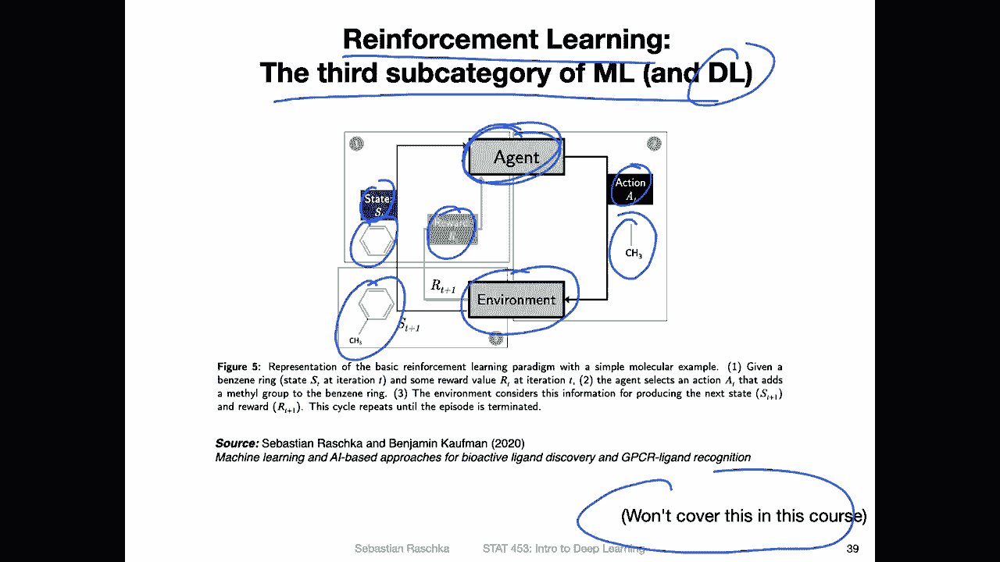
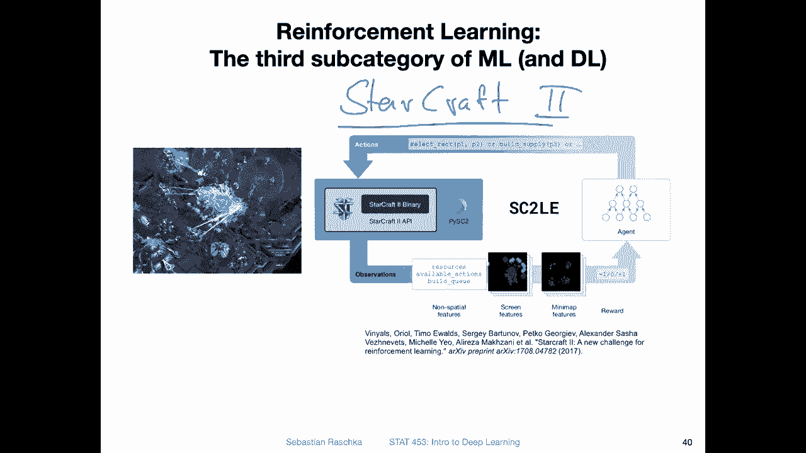

# P7：L1.3.3- ML 的广泛类别第 3 部分：强化学习 - ShowMeAI - BV1ub4y127jj

All right， reinforcement learning， the third subcatego of machine learning And of course you can also use deep learning for reinforcement learning。

 but also don't worry about it too much because this is another topic that we won't cover in this course。

 It's because yeah reinforcement learning is really a long and big topic by itself and you can have a separate whole course and multiple textbooks on that topic。

 I have a chapter on reinforcement learning for beginners in my Python machine learning book。

 it's like 30 or 40 pages long。 if you are really interested in reinforcement learning with deep learning。

 however， like I said in this class it won't be a topic but just yeah for completenessness because it's still maybe be interesting to briefly talk about it in two slides how reinforcement learning works。

So reinforcement learning is about learning a series of actions。

 So here in this case this is a drug design problem where we want to design a small molecule。

 so let's say we have a current state that's usually a current state in the environment so the current state is that we have this benzene ring here and the agent sees this current state and then has to take an action on it。

 So here the action would be to add this small chemical group to it so this methyl group。

To the benzene ring。 And yeah， this will be then updating the environment。

 or that will be updating the new next state。 So it will then look like that。

 So we'll have the benzene ring with a methyl group attached， so。

The agent is the part of the reinforcement learning program that updates the current state and it has access to the environment and it takes one of the possible actions and that will be also a reward for taking this action and modifying this environment so this is like going over multiple rounds until you would have for example a complete small molecule and in other areas you can also think of designing a chess game with reinforcement learning where each move in on the chess board would be one action taken by the agent and then yeah you take these multiple actions and there will be a delayed reward in the end it's about winning or losing the game and then based on that you optimize taking these actions。

So maybe a more concrete example would be Starcraft2， so that's a video game。You probably。

 I'm not sure maybe， maybe you haven't maybe have played it。 I actually played it。

 I think back in as an undergrad a long time ago， but yeah。

 it's a game where there are a lot of things going on at the same time。

 it's a very complex lots of things， lots of possible actions you can take at any given moment and yeah recently a few years ago。

 Deep mind started working on designing yeah reinforcement learning。For Starcraft。 So here。

 of course， the goal is not to yeah design the world best Starcraft play。 I mean， it's a sub goal。

 but ultimately you want to develop reinforcement learning systems that can yeah generalize to other things maybe be self-driving cars other more important things。

 But yeah， impressively， I think the current state of the art in Starcraft too is that they were able to beat most of the world's best players。

 human players。 So it was actually pretty impressive given how complicated this game is so many different yeah actions going on and things going on in that way。

Yeah， that was actually pretty pretty impressive。 Allright， so yeah。

 this was just a short note on reinforcement learning。 but like I said。

 we won't be going into too much detail in this class about reinforcement learning。

