# 【双语字幕+资料下载】威斯康星 STAT453 ｜ 深度学习和生成模型导论(2021最新·完整版) - P80：L10.5.4- PyTorch 中的 Dropout - ShowMeAI - BV1ub4y127jj

Al right， finally， let's talk about how we can implement dropout in practice。

 That is how we use drop out in Pytorch。

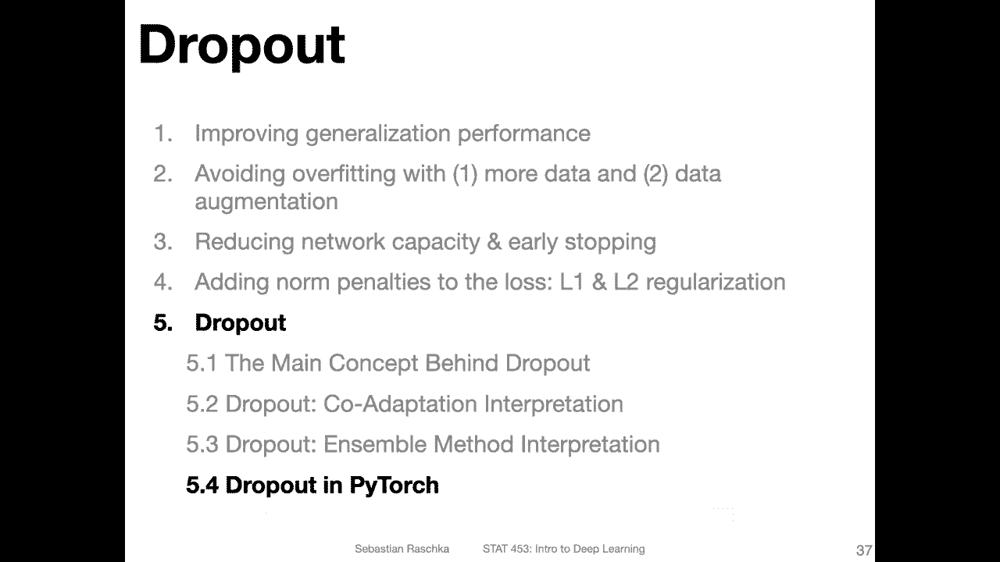

So but before I can do that， I have to explain one more thing。 It's called inverted dropout。

 but don't worry that's actually a very simple concept。 It is hopefully simple to explain too。

So and there， I wanted to explain that because， in fact。

 nowadays most frameworks implement inverted dropout， including Pywach。

 So what you are going to use in Pywach is called inverted dropout。So what is inverted robot。

 So if you recall in an earlier video， I mentioned that we are scaling the activations during testing by a factor of 1 minus P right。

 because during training。With。We drop。Notes， right。 And in testing， this is in regular robot。

 we scale。Activations。Bye。😔，F of1 minus p。And that is because during training。

 when we drop the notes， if you think of the net inputs。They will be。

Smaller than the net inputs during testing， assuming all the net inputs are positive for simplicity。

 And so because other units in the network expect these activations on a certain scale。

 the scale of the activations during testing would be too large if we don't drop any node， right。

 Because during testing， we don't drop any node， But then we have to adjust the magnitude of these activations。

 So we're scaling by 1 minus P where P is the。Drop。Probability。Okay。

 so this is what we do in regular dropout now in inverted dropout。

 we still drop notes during training， but we what we don't do is we don't scale the activations during testing anymore。

So， instead。So instead of doing this during testing， the scaling， we do it already during training。

So， we do。During training this scaling by a factor of 1 minus p。

 and then we don't have to do anything during testing because then the activations will be on the expected scale during testing automatically if we already scale during training。

So why do we do that， why do we do the inverted dropout？I'm not 100% sure。

 but I believe this trend was started back then in 2015 in Tensorflow thats was that at least was the first time I've seen it。

 So I've seen it in Tensorflow。 And I think my theory is that if you have a big company， let's say。

 like Google。You do a lot of predictions right， you have millions or billions of people using let's say。

 Google search and if your Google search engine relies on a neural network with dropout。

 it would be very expensive to scale。The predictions for each user。 I mean。

 the scanning is a simple operation。 It's just one multiplication， right。

 But if you have a billion search queries， you have to。

Think about having 1 billion additional operations right So that way。

 I think to save computational resources during prediction time， during inference。

 people are scaredd during training so that they don't have to do anything during testing。

 that's at least my theory。In any case both dropout or inverted dropout should give you exactly the same results。

 it's just a matter of whether we perform the scaling during training or during testing。

 and it happens that most frameworks nowadays， including Pywach use actually inverted dropout。

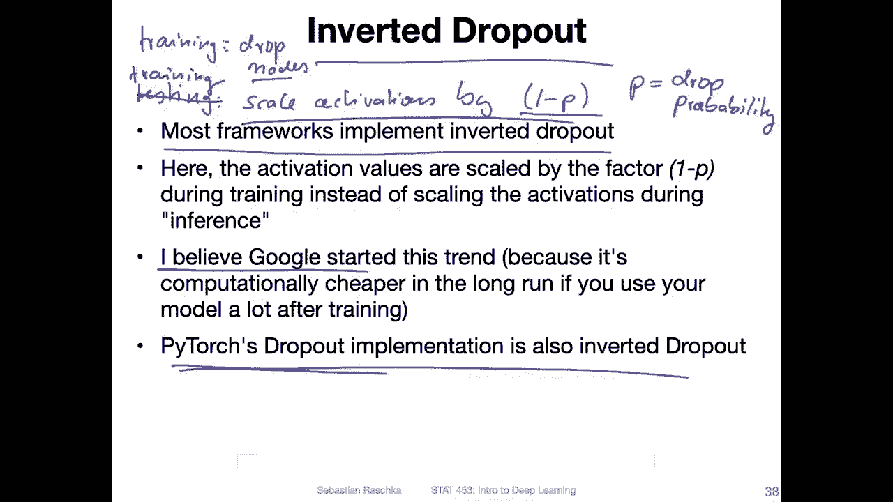

Yeah， and here's a code snippet illustrating how we can use dropout in Pytoch in the sequential layer。

 I have the full code example also in a Jupyter notebook。 If you are interested to take a look at it。

 I have a link somewhere later in my slides， but I also will post it again on canvas like always。

 So but here here's the essential part for dropout。

So here what I have is a multi layer perception with two hidden layers。And okay。

 this is the first layer， first hidden layer。 and this is the。Second hit layer。 and I'm just adding。

 you can see I'm just adding dropout here。After the activations。So why after the activations， Well。

 because we we want to zero out the activations， right， But in the case of Relu。

 it doesn't really matter whether we have it before or after Relu because。If the input to Red is 0。

 then the output of Red is also0， right， because recall。How re looks like it looks like。This。

 however， it would make a difference if we have。Let's say logistic syigmoid。

 because for the logistic syigmoid。At0， we we have this S shaped curve， right。

I'm not good at drawing this。We have this S shaped curve for the logistic sigmoid。

 And if the input is 0， then we will get actually a pretty large output of 0。5。 So usually。For Relu。

 it doesn't matter whether we have drop out before or after， but for other activation functions。

 it might matter。 So it's always good to have drop out after the activation just to be consistent。

Any case。 So yeah， this is how we use dropout。 So the drop probability is just some hyperparmeter I also provided here as input。

 Yeah， one more thing maybe to mention here is we don't use dropout for the output layer。

 Why is that？ Well， because it doesn't really make sense， right， if we have， let's say。

10 class labels。 And I drop three of the nodes corresponding to the class labels that would be a little bit awkward。

 right， So we don't want to drop any class label predictions。

 We only want to drop hidden activations。Yeah， this is essentially how you can modify a neural network to use dropout。

Alright， so also， I maybe my not thing to mention， you don't have to use the same probability here and there。

 You can use different probabilities also。

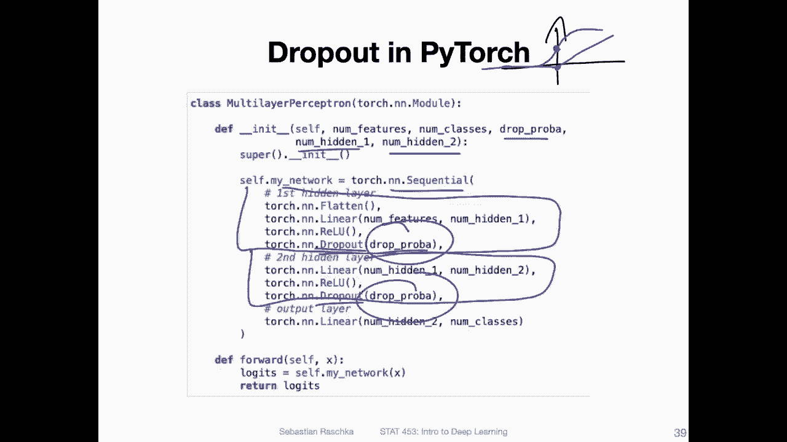

Yeah， one more modification you have to make in the code though is you have to make pay attention that you use model train and model Eval when you do the model training and the testing so I mentioned this earlier when we talked about Pythch that this is important。

 I always do that no matter whether I have dropout or not just to make sure that theres no unwanted side effect or no unwanted behavior。

So why is that required？This will essentially set the model or tell the model that it's currently in training mode。

 So it will automatically use dropout。 So during training mode。

 it will actually use these drop out things。 However， during model evaluation， during testing here。

 it will essentially。

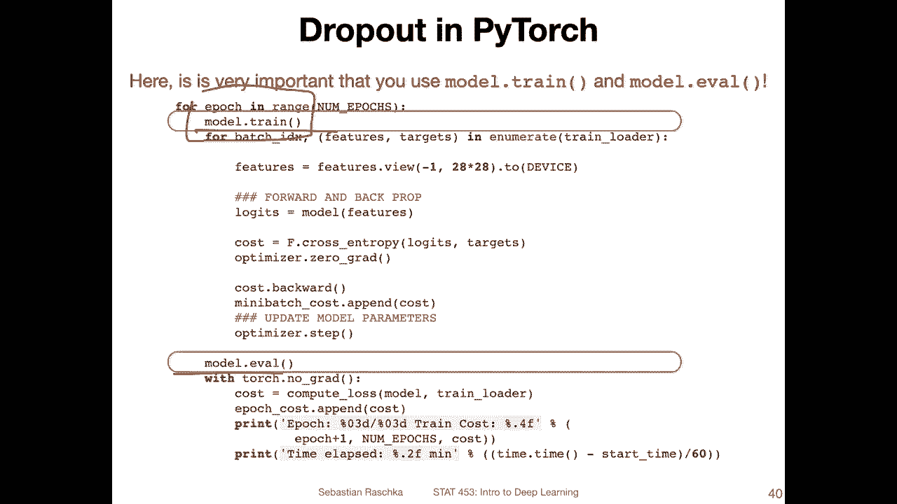

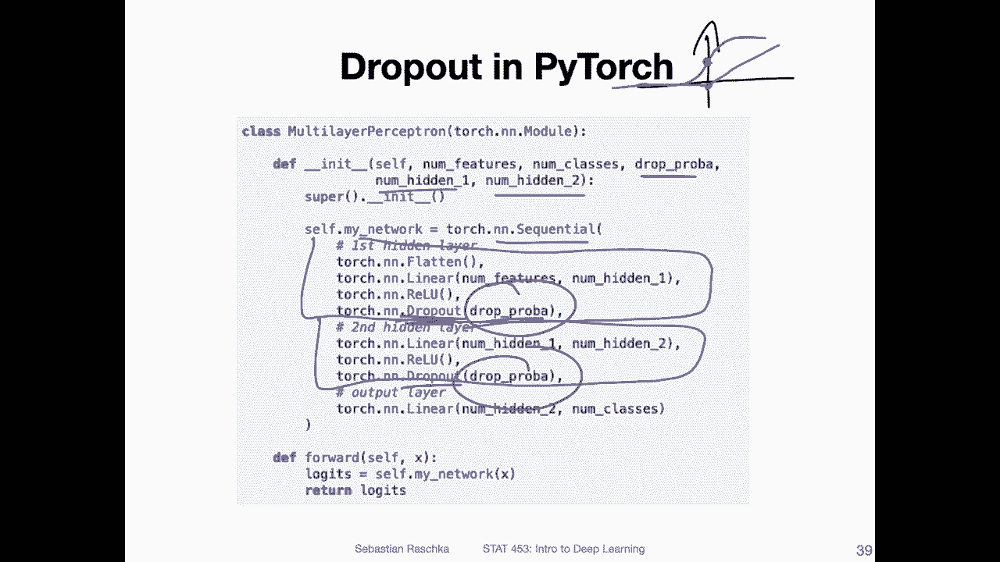

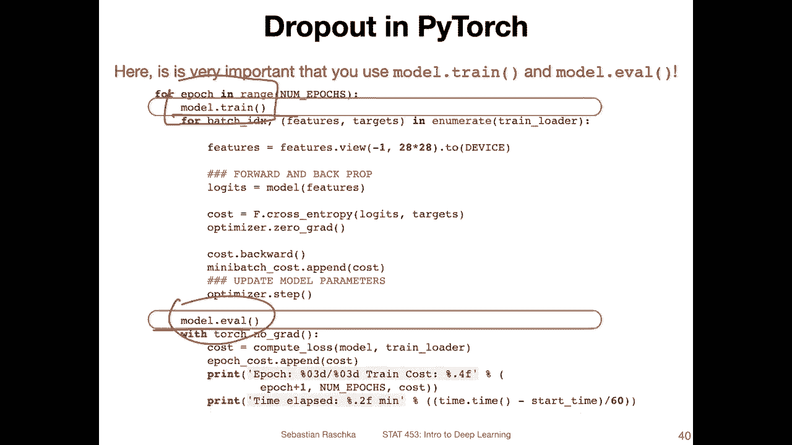

Skip dropout right， because we don't want to use dropout during testing or prediction。

 So when we set our model to Eval mode， Eval stands for evaluation， then it will not use dropout。

 So it can essentially just skip dropout or you can also think of just setting the drop probability to 0。

0。 So it won't drop anything。 So this is important。

 So you have to really make sure you use train and eval。 And not only if you use dropboard。

 I would always recommend doing that because yeah， it doesn't hurt right。

 So it's always a good practice to using those。

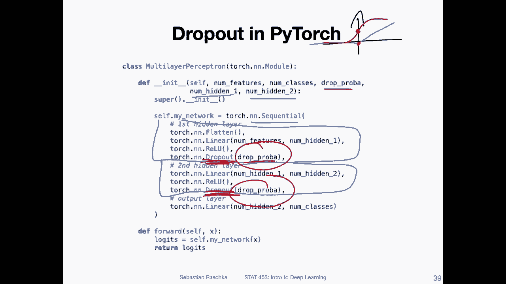

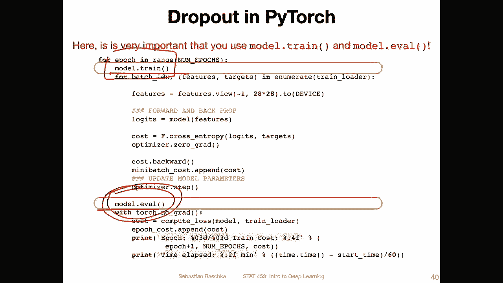

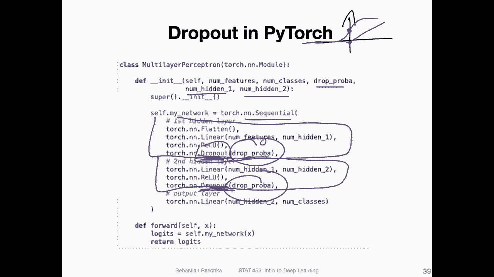

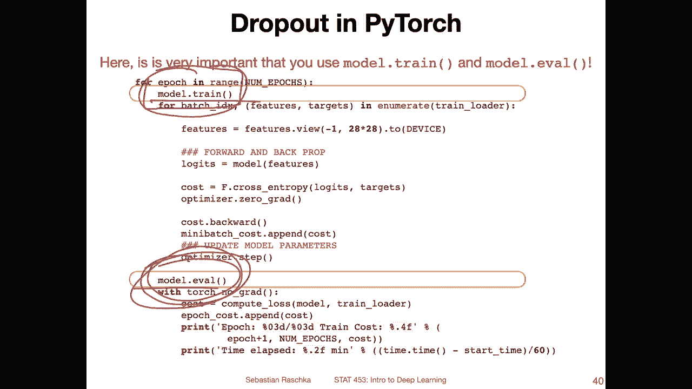

You have the full code example for that here on GithHub if you want to check it out。

 so here I train this multilay perceptionceptron on MN。

 so at the top I have no dropout so you can see the training loss on the left side as the training loss for 50 epochs it goes down。

And here on the right hand side， this is the accuracy on the training and validation set。

 and you can see the training set accuracy goes up like expected during training and the validation accuracy also goes up but what you can see here is that at some point you will have a overfitting gap here。

 So the model without dropout starts to overfit at some point here at the bottom I added 50% dropout。

 So this is exactly the model I was showing you here with 50% dropout now So you can see the accuracy improves。

 but here we don't have any overfitting anymore。 So we are reducing the overfitting I should say there is one little caveat though if I computed the test set accuracy。

 This was like 97。5% approximately and this was only 96。5%。

 So maybe I was doing too much dropout here at the bottom。

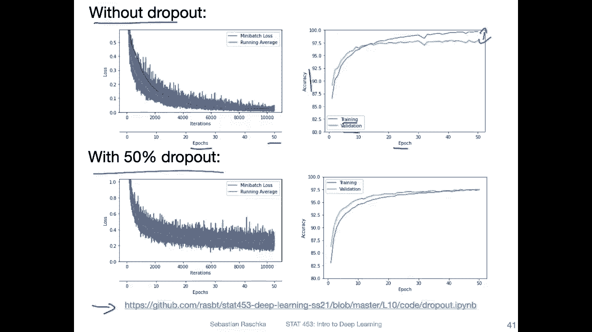

Cause I reduced overfitting， but at the same time， I also yeah。

 maybe added too much of a regularization penalty here using dropout so that also that yeah the performance overall role is a bit lower。

 But yeah and essentially this is how dropout works， you can play around with that。 And yeah。

 with that， maybe some more practical tips。 So I recommend not using dropout if your model does not overfit。

 So I would maybe just train the model and see how it behaves。 if it doesn't overfit。

 then there's no need to use use dropout。 But if you see that there's overfitting。

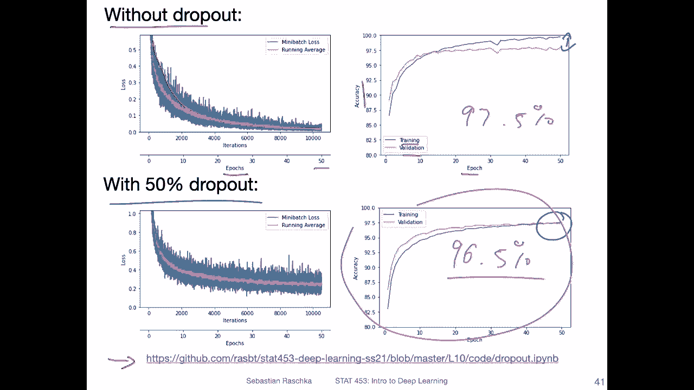

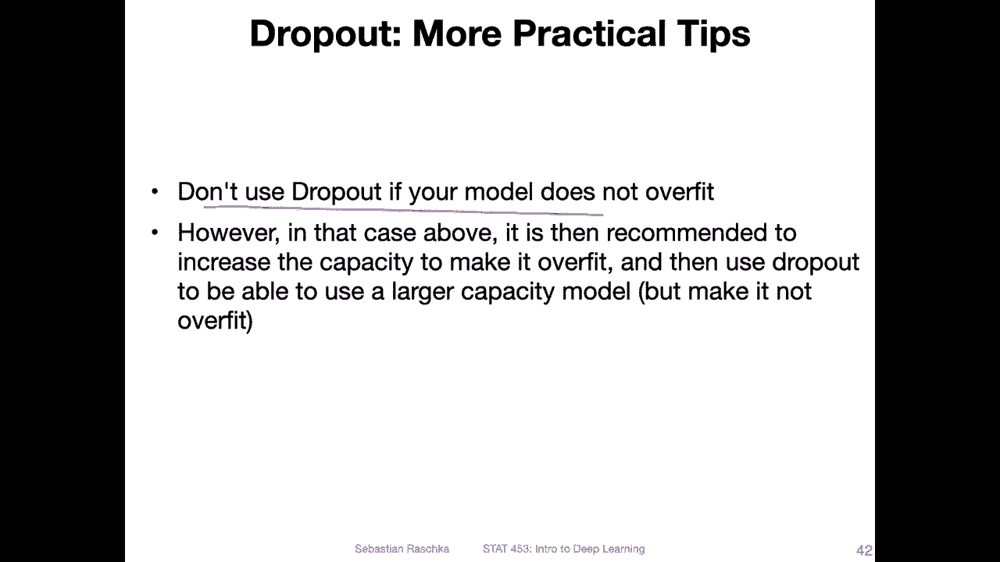

Like you can see here， then it's worthwhile actually adding dropout。

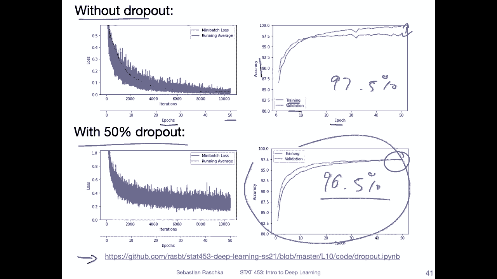

In practice， also， the creators of dropout recommend essentially。

 if you observe that your model does not overfit， you should increase the capacity of your model。

 adding more parameters until it overfis and then adding drop out to it。 So essentially。

 they are arguing that。It's better to design a model that overfis and then add drop out compared to designing a model that does not overfit。

 So overall， they expect to see that。You will get a better performance if you make a model larger。

 such as it overfits and then use dropout to reduce the overfitting。

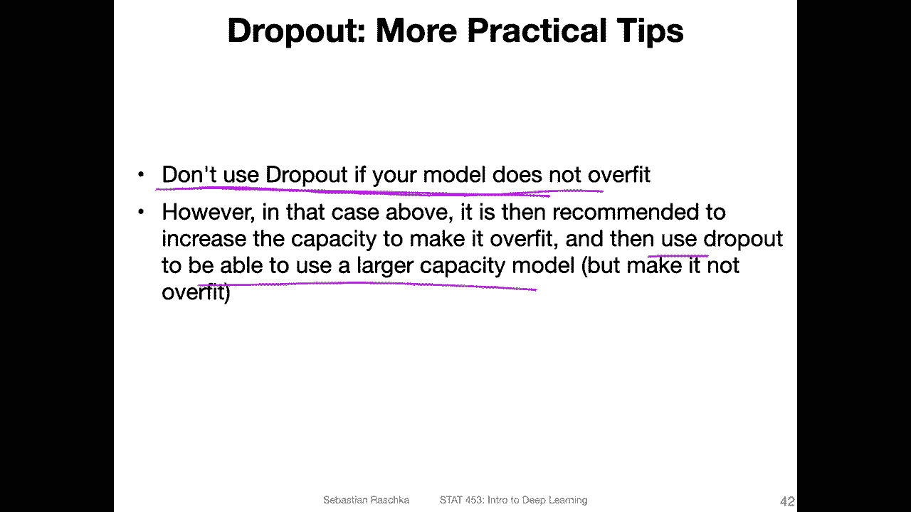

Yeah， there's also you may have already had this idea while listening to this lecture。

 there's also a related idea， randomly dropping weights。

 So instead of dropping the activations in dropout。

 we can also actually randomly drop dropping weights。

 So if you had this idea as a potential research idea I have to unfortunately disappoint you。

 Someone has already worked on this。 It's called droprop connect。

So it has it's more like a general generalization of dropboard because yeah， you can think of it。

 it can if you。Let's say， if you consider。Let'd say this note here。

 if you drop this weight and this weight， both weights， if you drop both。

 then it's essentially the same as dropping this activation。

 So that way you can think of drop connect as a generalization of drop out。 but yeah。

 in a more general sense， it's just dropping weight randomly。

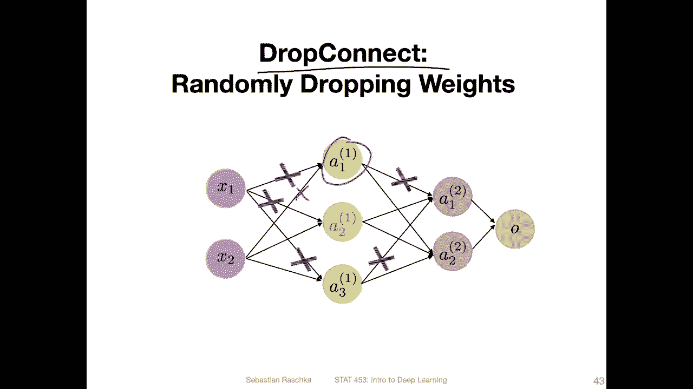

So the paper for that is can be found here。Unfortunately， or I'm not sure if it's unfortunately。

 unfortunately it doesn't really matter。 but it happens that this is something I find that works not so well in practice。

 I long time ago， I tried it once。 I found that dropout works better。

 and also I really don't see it often being used in practice。 So I think it's just。

 less popular than dropout， maybe because it doesn't yeah perform so well as drop out。

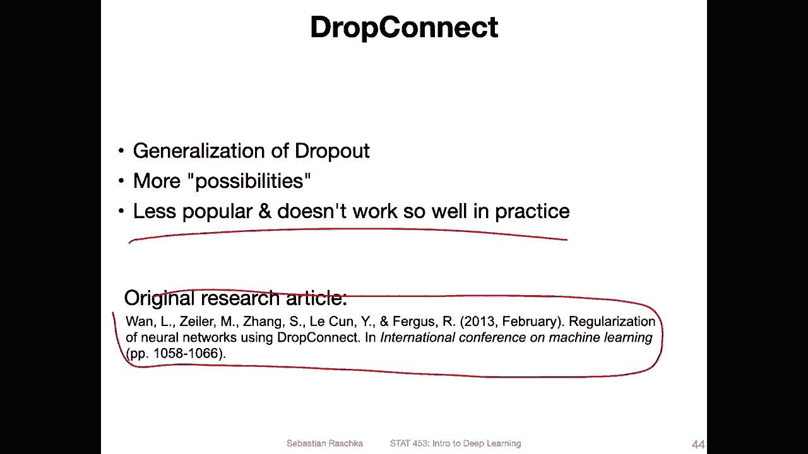

Yeah to close this lecture， I have a reading recommendation for you。 the original dropout paper。

 It's actually a really nice paper， very， I would say intuitive and nicely written and very accessible。

 It doesn't have any or not much mathematical jargon， which is nice。

So if you want to practice reading research papers it's actually a good one to start with and yeah also happy Women's Day if you're watching this today so today is the International Women's Day and with that let me close this lecture and next time we will talk about some weight initialization techniques and also then we will talk about learning rates later and different optimizers so essentially other techniques for improving neural network training。

