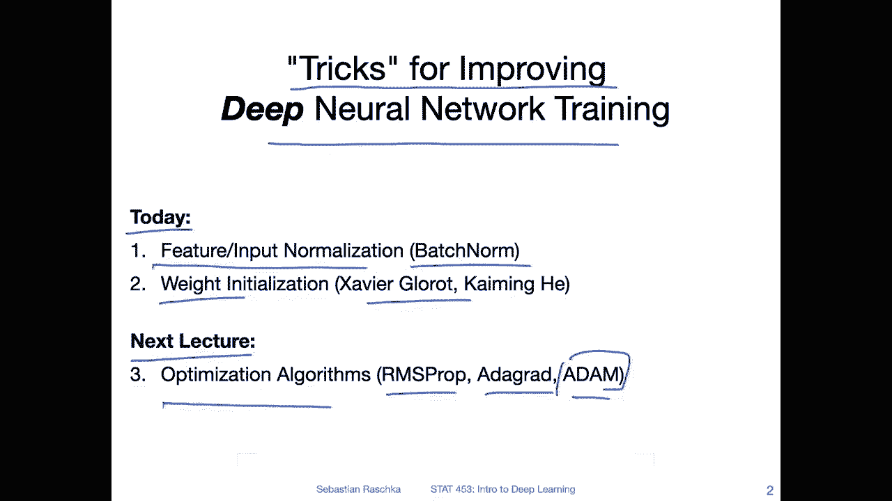
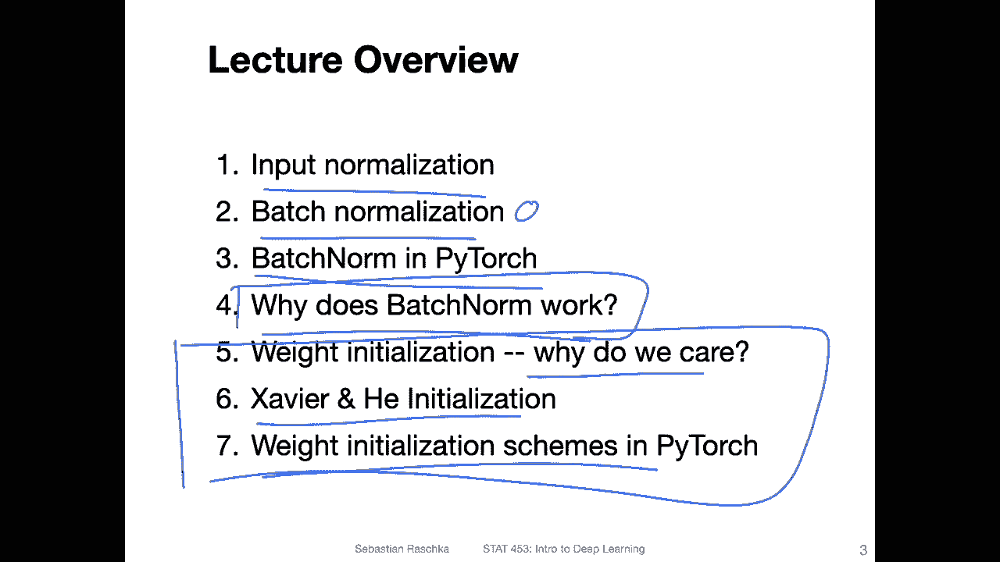

# 【双语字幕+资料下载】威斯康星 STAT453 ｜ 深度学习和生成模型导论(2021最新·完整版) - P81：L11.0- 输入归一化和权重初始化【课程概述】 - ShowMeAI - BV1ub4y127jj

Yeah， hi， everyone。 So last week， we fell into a little bit of a rabbit hole when I started talking about different ways we can improve neural network training and the generalization performance。

 Of course， we can't cover all the topics I outlined on that mind map。 However。

 I think there are a few important ones that are really worth talking about。 So in this lecture。

 I want to talk about batch normalization and also a little bit about different weight initialization schemes。

 which are also kind of important to make neural networks work well in practice。😊。

And then in the next lecture， I want to briefly talk about optimization algorithms。

 And then yeah we will move on and talk about cooler things like convolutional networks and recurt neural networks。

 But for now， let's talk about batch normalization because that's really a good technique for making the network train better and faster。

All right， yeah， just to recap again today we are talking about tricks for improving deep neural network training。

 So today in particular we will talk about feature and input normalization and focus on a topic called batch norm and then I will also talk about weight initialization schemes when we initialize the model weights and there are two particular techniques we are going to take a look at there's the Xavier Got initialization scheme and the caing he initialization scheme。

Yeah， and then in the next lecture we will talk about optimization algorithms for improving gradient descent learning。

 for instance， as R Mepro Edaggrad， Adam， and I will also provide you with a list of many。

 many more algorithms， but yeah personally I think stochastic gradient descent with momentum and Adam are still the most yeah useful or at least most popular ones。

Alright， so as an overview， things we are going to cover today。 So I structured it into seven parts。

 Some of these parts will be very short， but I try to yeah structure it as always so that they go by topic and that it is somewhat organized。

 So first， we will just briefly talk about input normalization。

 Then we will switch to batch normalization。 I will show you how we do batch normalization in Pytorch。

 And then we will have a discussion of how why batch normalization works。

 So I will explain here how it works like the techniques the procedure。 and then。

We will revisit this here and discuss why it may have a positive effect in practice。

 so it's still a controversial topic so its still not clear and I will highlight some of the theories then we will switch topics in this section here and talk about these different weight initialtization schemes like why we care about that to different examples and then also how it works in Python Alright so with that let's get started with input normalization。

