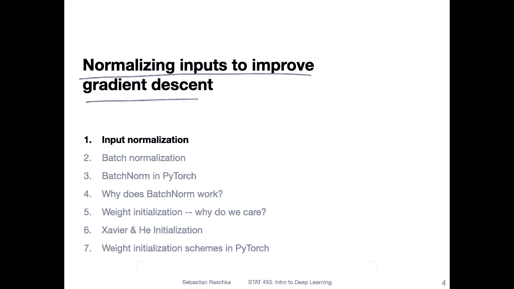
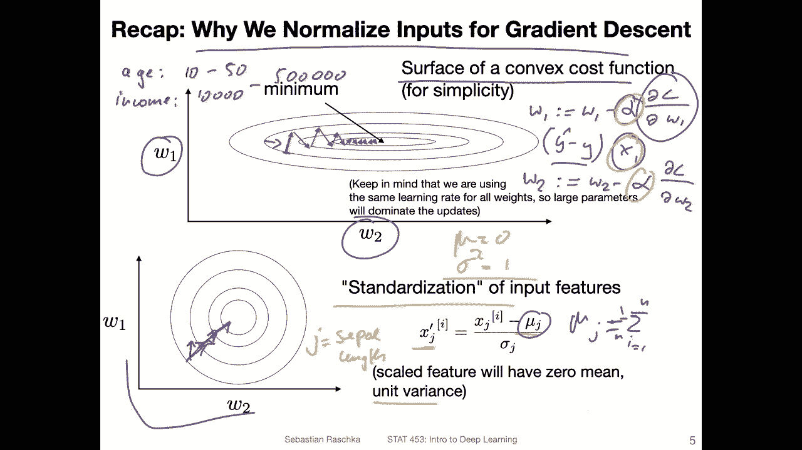
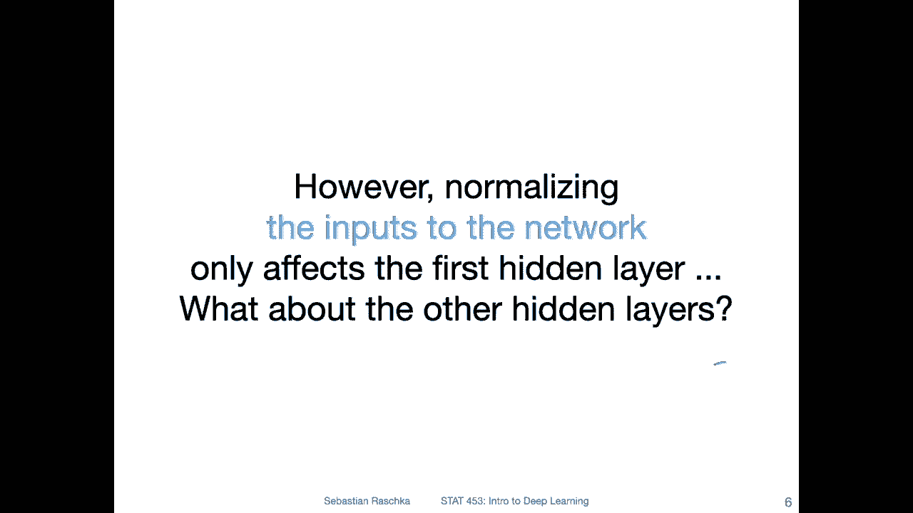
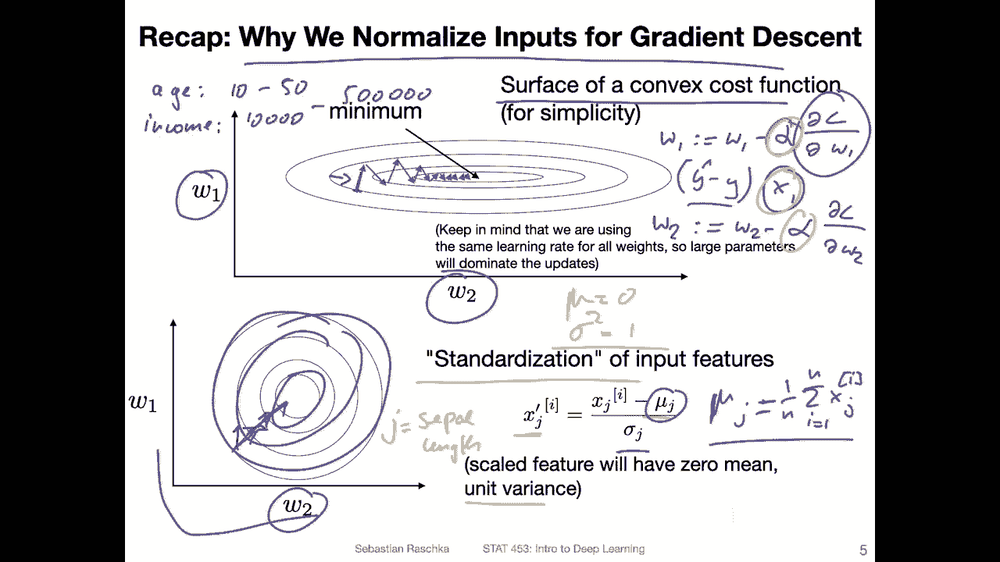
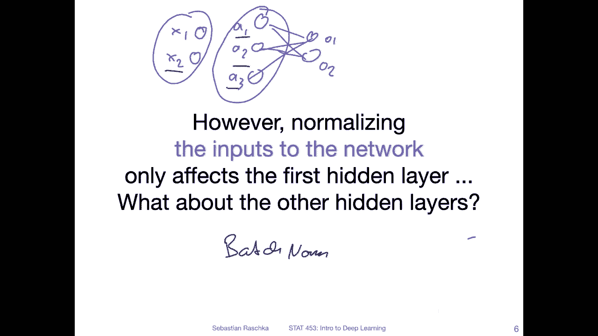
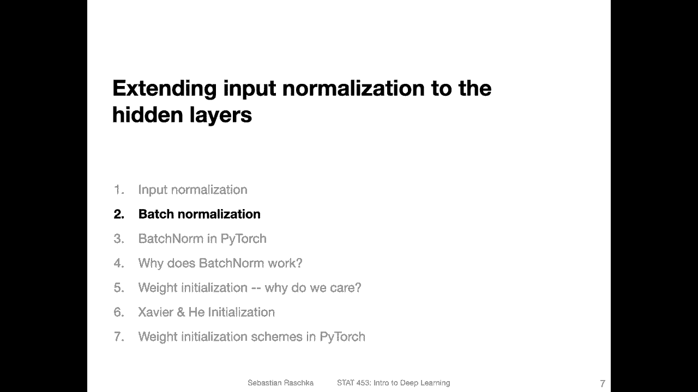

# P82：L11.1- 输入规范化 - ShowMeAI - BV1ub4y127jj

Alright， let's start by talking about normalizing inputs to improve gradient indesscent。

 So essentially， input normalization。

Yeah， so this is just a brief recap why we normalize inputs for gradient in descent。

 We already talked about this a little bit earlier when we talked about gradient descent and stochastic gradient in descent。

 I think it was in lecture 5。So yeah， just to recap。

 why do we normalize on those weights So that is really to find a good learning rate and to have a。

 I would say， more stable training。So suppose for simplicity。

 we have here shown a surface part of a convex loss function。

 So here this is like a convex function shown here。

 So usually when we work with deep neural networks， that's not the case。

 that's not a convex function anymore， but just for simplicity， assume here it's convex。

 and we have a， let's say， a linear model。Let's say linear regression with two weights just to keep things simple。

Ignoring the bias also。 now， technically， when we have something like gradient descent and this is fully。

Circular， let's say， in this lower case here， we would usually take steps perpendicular to these contours。

However， when we have stochastic gradient descent， also these steps won't be。Yeah。

 perpendicular anymore。 And especially this will be exaggerated if we have。These elliptical losses。

 So where we may overshoot in one dimensions instead of， let's say going in here。

 we take a step perpendicular， but。Instead of stopping here and then taking this step here。

 we overshoot and then we go this zigzagging。 And then also if we have stochastic gradient sentences even more exaggerated。

So why why this weird also zigzagging can be amplified is when we have features on different scales。

So， for instance， imagine a data set where we have， let's say。The age of a person from。

10 to 50 years and then let's say the income of a person。Let's say， from， I don't know，10000 to。

Let's say，500000。US dollars or something like that。 So these are on vastly different scales， right。

And remember how we do gradient in descent。 So usually what we do is we have the weight update。

 let's say weight 1， we would update it by。We  one minus the partial derivative root of the loss with respect to that weight。

 and then times a learning red alpha， right？ So in this part， this computation involves usually X。

 the input itself， for example， it could be。Y head minus y。Times， so let's say x。

X1 is the input feature。 So here， the input feature kind of scales。The whole thing。

 And then if we have input features on very different scales， then well。

 finding a good learning rate would be hard。 we would have to， yeah choose a learning rate for each。

Weighed individually， and that would be yeah， a lot of hassle。 So， for instance。

 because if we consider no W 2。Were2 minus。How far。😔，Like this， so。那's。This one and this one。

 these learning rates， we usually use the same learning rate and this really only works well if the features are on the same scale right because if this one is like1 thousand times larger。

 we may have to use a thousand times smaller learning rate to get a good behavior。

Another thing is also that most optimization algorithms really work well if the features are centered at zero and have only like a small。

 yeah small values around zero。 One issue is also always when we have very large or very small numbers and computational context because then we also have a computational instability issues。

So， one。Common theme that works pretty well in practice is Z square standardization。

 So people just call it standardization。 It's essentially giving your data or features the properties of a standard normal distribution。

 I mean， the data after applying this won't be normal if it wasn't normal before。

 but it has the properties of a standard normal distribution， which is zero mean and unit variance。

 So unit variance is a fancy word for saying that the standard deviation is one or the variance is one。

So。😊，Again， if the data is not normal to begin with， this won't change。

 This won't really change the distribution， how it looks like。

 it's just people say it has the parameters of the normal distribution because essentially it will have。

0， mean end。Unit variances， But just think of it as。

Here as centering the data with standard deviation of variance 1。So how it works is for each feature。

 So let's say this is for a particular data point。So we want to scale data point。I。

 let's say this is like an iris flower eye， and we want to scale the J feature where J might be something like let's say Sal。

Length。And how we do that is we subtract the feature in。 So here the feature mean。This would be over。

我不哦。Flowers1 over N， right。And let me do this properly here。

one我。

Go over in。A equals1。In， and then x。H。😔， so we will just compute。The mean across this feature。

And here we do the same thing for the standard deviation。

And this is essentially it this usually helps with a better behavior。

 so we will then usually have a more elliptical sorry a more symmetric loss surface。

 but again this only applies really if we have a very simple generalized linear model like linear regression in this case。

 for example， if we have something else like a deep neural network。

 this won't be a convex loss function anymore， but still it helps to standardize the inputs it still yeah recommended in practice。

Okay， so this is one way we can standardize the inputs。

 but now when we talk about deep neural networks。 So let's say we have the inputs here， x1 and x2。

 and then we have activations a1 a2， a3， and then let's say we have two output units。

 Let's call it01 and02。 Okay， so previously on the previous slide。

 we talked about standardizing these things here right， So the inputs。

 Now what about the activations。Might also be helpful to standardize the activations that go then into these。

Output into the output layer， right。So that might also be helpful to standardize the activations。

 the hidden layer activations， because you can really think of these AC as the activations。

 You can think of them as the inputs to the next layer。 Theyre essentially just like x。

 except that these are the inputs to the next layer。 So in the next video。

 I want to talk about one technique called batchnob。

Which is essentially a variant of this standardization for yes standardizing hidden activations。

 It's coming with a twist There will be a learnnable or two learnnable parameters for that。

 but essentially you can think of it as yes standardization of the hidden layer activations。

 so that will be the topic of the next video。

