# 【双语字幕+资料下载】威斯康星 STAT453 ｜ 深度学习和生成模型导论(2021最新·完整版) - P83：L11.2- BatchNorm 的工作原理 - ShowMeAI - BV1ub4y127jj

Okay， let's now talk about extending the input normalization to the hidden layers using the technique called batch normalization。

 I will just show you in this video how it works。 and then in the next video I will show you how we can use it in Pytorarch。

 and then I will show you or explain to you why it works。

At least we will discuss some of the theories trying to explain how it works。

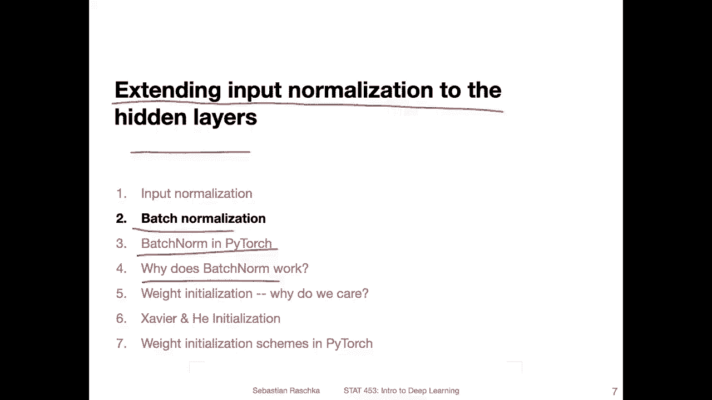

Alright， so batch normalization or in short batch norm goes back to a paper published in 2015 called batch normalization accelerating deep network training by reducing internal covariate shift So internal covariator shift that's like yeah I don't know fancy word for just saying that the feature distributions shift during the course of the training internally in the hidden layerss we will explain or think about this more when I go to the video where I offer some theories why batch normalization works well in practice。

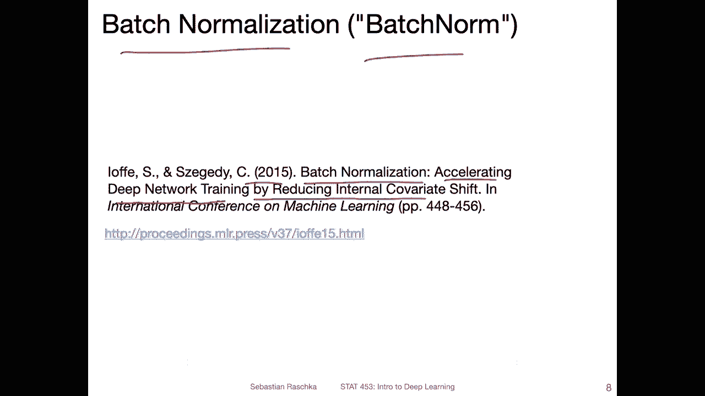

So here on just the I would say， the short version of batch normalization， what it is。

 it's about normalizing the hidden layer inputs instead of just normalizing the inputs to the network。

 we normalize yeah also internally the inputs to each hidden layer and this helps yeah with exploding and vanishing gradient problems so that the gradient sound become too large or too small。

And overall， it can increase the stability。During training。 So in that way。

 training progresses more smoothly， and also， the convergence rate improves。

 That means it may be that we need fewer epochs to， yeah。

 get the same loss that we would achieve if we don't use batch。 So usually with batchia。

 the networks train faster。And how you can think of it is as an additional normalization layer。

 And there are also some additional trainable parameters involved。

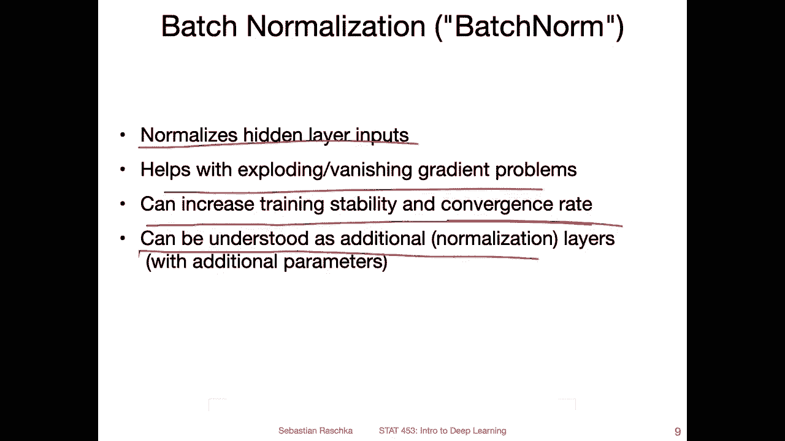

Yeah， so in the next couple of slides， I'm going to walk you through the procedure of batch normalization。

 So just for context on let's suppose we have a multi layer perceptron。

 So let's say we focus in on this activation here and the second hidden layer。

 the first activation in the second hidden layer。And we are actually looking at the net input of that activation。

 So remember how we compute the activation。 So it's usually by applying。

Activation function to the net input。What type of activation function doesn't really matter here。

 it could be logistic sigmoid， 10 H or Relu should work with any type of activation function。Alright。

 so yeah， we are focusing on this hidden layer net input corresponding to the activation here now and also now suppose we have a mini batch。

So we have a mini batch such that the net input of a given training example at layer 2 is written as followss。

 so I have now this index I here for the index of the training example in that mini batch so if I have I equals one this would be the first example in that mini batch and just of the first simplicity I will actually ignore the layer index in the next couple of slides just so that the other notation is a bit simpler to read。

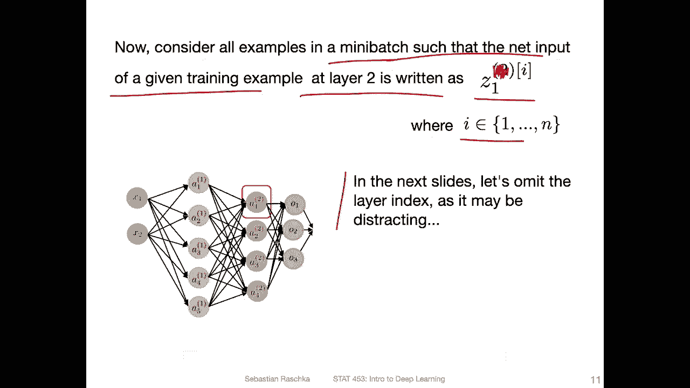

So yeah， here that's the first step of patronome。 There are two steps。

 So the first step is to normalize the net inputs。 This is essentially the same as the standardization that I explained earlier for yeah。

 the inputs。 So what's going on here is we are computing the mean。

Over a feature So the J is the feature index again。So。

You can actually use batchome for any type of input。

 So we will also see there is a two dimensional version for that for convolutional networks later on。

 But here we are just focusing on the regular one dimensional version where you have a feature vector。

 for instance。 So let's say we have。Yeah， the J feature。 And if I go back。

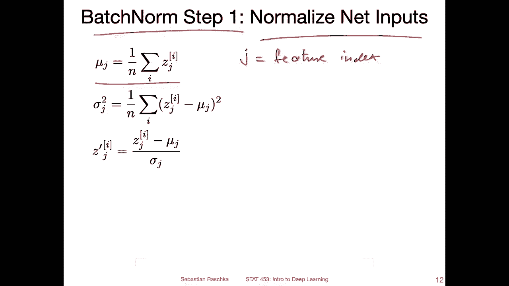

So if you consider this activation here， what are the features。

 So the features are all essentially all the previous。Layer activations， right， So all these。Go into。

That activation。 So all of these here are the features。

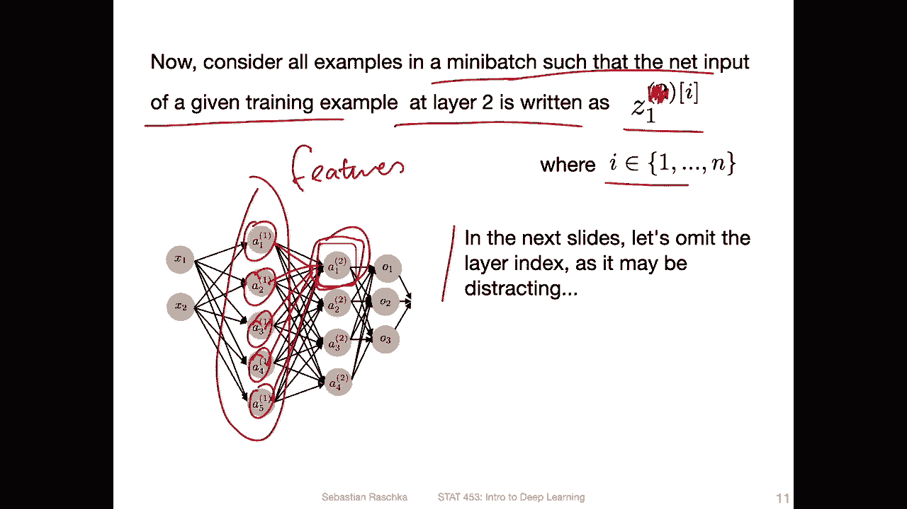

off。This activation here。So J really is the index over the activations from the previous layers。

 or we can also think of it as the feature index or previous。Which are the previous。Layers。

Mctivations。Yeah， so we compute from that the mean。And。😔，The variance。So that is， yeah。

 nothing that should be new to you。 It's simple， yeah， simple calculation here。

 And then we standardize。 So this is like what we had in a previous video as standardization。

And this is essentially it's in that way， step one of batchome is similar to the input standardization。

Except now we are looking at a hidden layer。 So instead of looking。

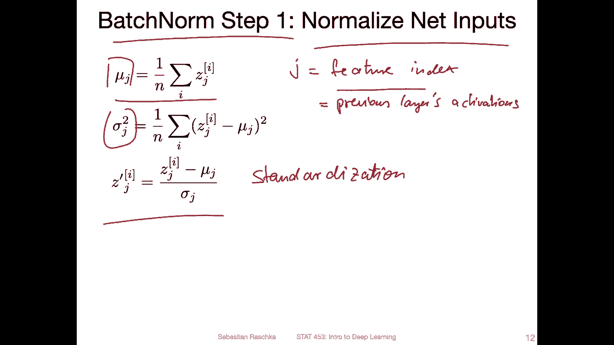

Instead of looking at standardizing X， we are now standardizing these A's from the previous layer。

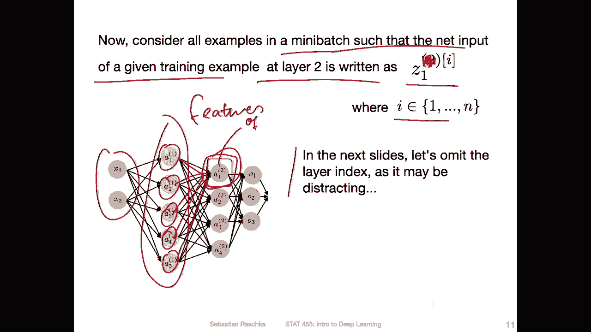

So after step one comes step2， so one more thing to say about step1。

 so in practice we modify this standardization slightly such that we don't bump into yeah division zero issues if the variance is zero if there's no variance。

So for numerical stability， we add a small value epsilon here。

 So here we have the variance plus this little epsilon。

 And then we take the square root instead of dividing by the the directly。

 That's just like a small computational trick to prevent division by0  errorss。

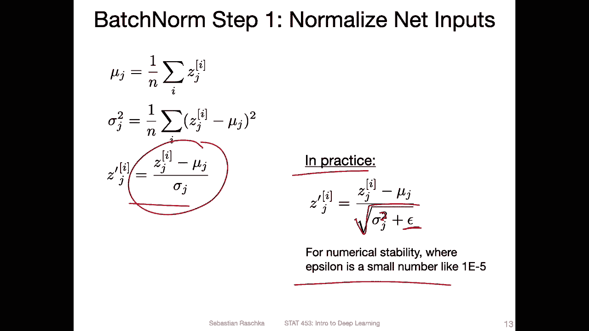

Now， step 2， So step 2 is。Yeah on the pre activation scaling。 What do I mean by pre activationation。

 So this is the value。That is computed before the activation is computed。

 and it will become more clear in in the next slides where I have step one and step  two connected to each other。

So。This is essentially what we have done in the previous slide。 So if I go back。

 this is the end of step 1。 and then from。Step 1， we go here to step 2。Where we apply a scaling。

 So there is a gamma J and a beta G。And both of these are learnable parameters that are also learned using back propagation。

So similar to the weights in the network， these are also updated via a propagation。

So what do these do， I mean， essentially there is a scaling parameter here。

And there is a shift perimeter。Right， so technically， it can。

Learn to undo what we just did in step 1， right？ So it essentially can。Undo its， if。原么。I J， sorry。

 if that happens。To be equal to， let's say， this term。And beta J happens to be equal to。This one。

 I mean。These are learnables that may happen so the network can actually learn。To undo step 1。

 the skating。A sitization。Whether it does that or not， it yeah it really depends。

 but I'm just saying here the possibility exists that it can undo this。But in that way。

What's happening here is it's something that is a little bit more flexible than just regular standardization。

 So here， step 1 would be a regular standardization of the hidden layer activations。

 and step 2 is a little bit more， I would say， flexible， so。Technically。

 this whole step 1 instead step 2 thing can just simplify to regular standardization if this is given or it could be something different。

 And in practice， it happens that。This setup， the step 1 and step 2 setup works better than just step 1 alone。

 It， it just happens。 So。 and yeah， one theory。Could be。 it's just my theory that I'm coming up with。

 but one simple explanation could be， for example， it might perform better because yeah。

 we just have additional learnable parameters。 It's essentially as if we have more， yeah。

 more parameters in the network。 So the network has a higher capacity maybe。 but yeah。

 we will look at some other theories in a future video。

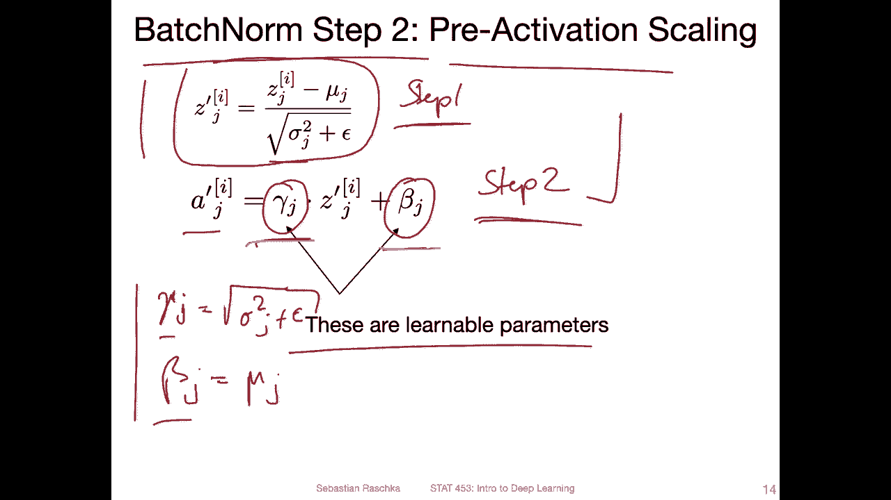

Alright， yeah。 so as I said， so this controls the mean and this controls the spread or scale so。

From this one and this one， basically。嗯。And like I also already said， technically， emotionalally。

 I could learn to perform standardization with0 minute unit variance if， yeah if。These are the same。

 and。

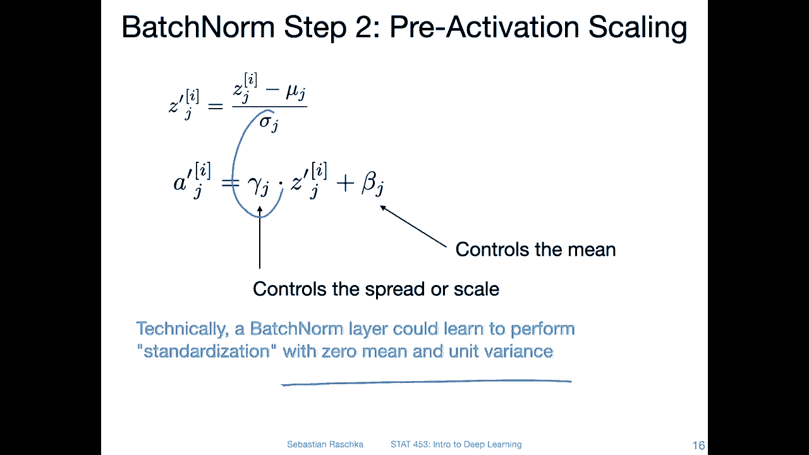

These are the same。So here is step1 and step 2， connected and summarized。So yeah。

 I'm not showing you the numerically stable version， but you probably know， I mean。

 we can also do it。Doesn't really matter。It's just for yeah， keeping things simple。

 So here's the whole procedure of how it would look like。 here I'm applying it to both。

This layer and this layer。 So the colors should match here。 So let's say x is our input。

 Then we first compute the net input。 So if we are here， we are computing the net input。

 and then this would be step one， where we standardize。The net input。

Then what we do is we compute this pre activation scaling， so this is a scaling。

 and then we compute the activation。So the activation in this case would be computed by。

Sigma or let me write the stone properly， a1。So be sigma。A prime。One， right？

And then once we have that， we go to the next input。 So this is the next net input。 Then again。

 we do step one。 So here we can。Just at one。And then we do。Sep 2。😔，And then we compute again。

activationation。This should be the one here。Sigma。诶。So yeah， this is essentially it。 And yeah。

 this is how patchome works。 do you have anything more。 Yeah。

 one more thing to consider is that this one also makes the bias redundant， right。

 So I'm not showing the bias unit here。

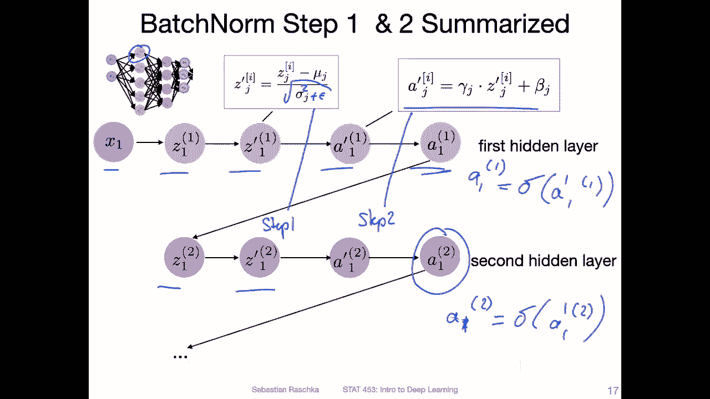

In this network， but technically， you will have a biased unit。B1 here here B2。Here。😔。

B3 that gets added to the net input。Right， so that is something that you are familiar with and。

The if you think about how the bias works， right？ So if I I have a simple case here， the net input。

 it's。m it like。😔，W， just for a simplified case。So let's say I'm computing the net input for the。

Second layer， this would be weights from the first layer。

Multiped by the activation from the first layer。 here layer 1 and layer 1， and then plus。The bias。

 So I'm only considering you a simple case omitting the index。 Otherwise， I would have another index。

 But yeah， you know what I mean。 So I would have the bias added to it right。

 But this kind of becomes L redundant because essentially the bias could be already included in this be or the be would essentially。

 if you leave out。This bias here， the beta would essentially take the role of that bias if we compute petome。

 So in that sense， you can yes skip the bias when you define the layers。

 I will show you that in the code example， how we can do that。 I mean， it it doesn't really matter。

 but。Whether we do it or not， it should work both ways in practice， but it's just。

 I would say a little bit cleaner to not use the bias because it's redundant。

 I will show you in the next video in the code example how that looks like so you can actually by an argument。

 say bias equals faults。Yeah， and also note that now when we use batch norm batch norm has learnable parameters。

 So if we use batch norm in a given layer it has we have an additional two vectors that have the same dimension as the biasve right So if we have we use batch norm here in this layer we will have two。

For。😔，Dimenssional vectors， like this bias vector here would also be four dimensional， right。

 because there's one bias for each。Hden layer activation。

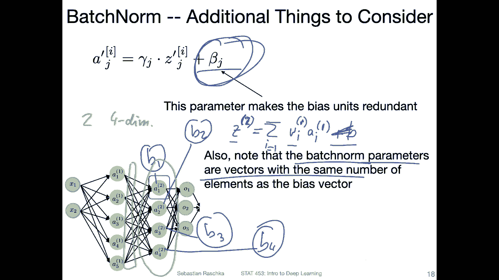

Alright， so I think， yeah， this is all I have about batchome。

 This is how batchome works In my slides I actually had also not sure。

 it was actually like 10 slides or so how we do back propagation with batchome but I promised you not to torture you with these nitty gritty details and math。

 the medical details because that's not super important because we use autograd and practice anyway I think it's in this course also more important to understand the bigger picture concepts And then if you're interested you can study those things later on So yeah also if we would start like going through these slides it would take another half an hour I would rather complete this lecture today so that next lecture we can talk about optimizes and move on to convolution networks。

 I hope you don't mind。 So in that way next video I will show you batchome in Pytorch。

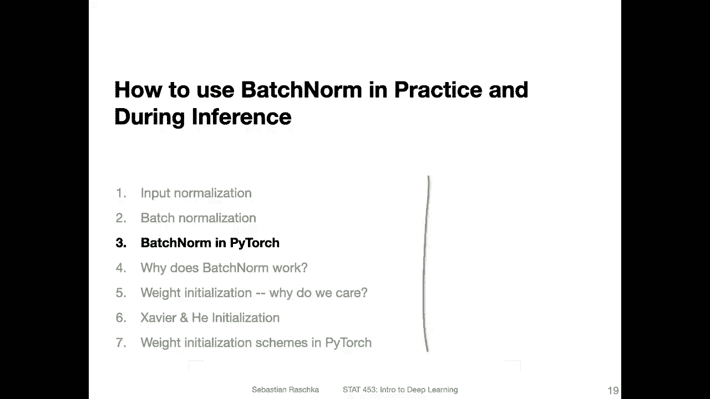