# 【双语字幕+资料下载】威斯康星 STAT453 ｜ 深度学习和生成模型导论(2021最新·完整版) - P85：L11.4- 为什么 BatchNorm 有效 - ShowMeAI - BV1ub4y127jj

Yeah， in the previous videos we discussed how batchchome works。

 Let's not discuss why batchcheome works。 I can't give you the definitive answer here。

 but at least I pool together some theories and some practical or empirical evidence to kind of support certain claims。

 So I think that might be interesting if you are really interested in studying batchchon。

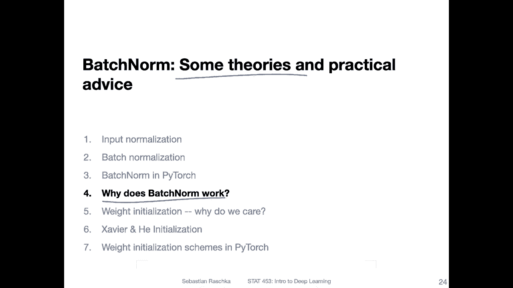

So originally， so the paper that proposed beome mentioned this internal Covariate shift。

 so the authors of the original beome paper said that yeah batchomization accelerates training by reducing this internal covariate shift。

What is this internal covariage of what does it mean， So it's essentially saying。

That the layer in input distribution changes。 So this shift iss a shift in the distribution of these inputs to a given layer。

 So it's essentially a feature shift。 So the features。

 if you think of the inputs to a given layer as the features， the distribution of these。

Features shift over time during the course of training。

So that's one theory that happens during a regular training and batchche norm helps preventing it by renormalizing these inputs。

However， theres yet no guarantee for that and there's also no strong evidence for this theory。

 I will show you a paper that kind of debunks this theory。

Another theory that's like more what I'm kind of sometimes speculating is。That yeah。

 beon provides additional parameters that might help。 However。

 I think this is also maybe not a reasonable theory because it is something you can simply test by inserting or making the previous layer a little bit larger。

 adding some parameters to it。 And I don't think I think at least someone would have tested that already。

 So that's probably not the case。 Another idea maybe that it makes these layers a little bit more independent of each other。

 So， for instance， if you think about one layer producing some nonsense outputs or something。

 yeah it's very， so let's say you have a late layer in the network。They are very close to the output。

 It kind of depends on the previous layers of giving it good input。

 So if you screw up one of the early layers， well， then the output layer。

 well all the other layers are really also depending on that。

 So we are kind of that's like a domino effect。 you have like if you screw up one layer。

 you screw up the other layers， too。 And the same thing can happen during both the forward and the backwardboard pass。

 right， because。InThe forward pass， you go from the left to the right and in the backward pass。

 you go from the right to the left。 So in that way， if something is wrong in one given layer。

 it will affect all the other layers。 And maybe with a batch norm。

 this kind of helps yeah decoupling the layers a little bit in terms of if one layer screws up the other layer a little bit more robust to that。

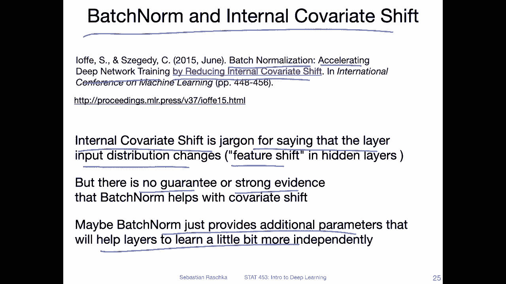

But that's also just one of the many theories。So here I found a paper from 2019。

 I mean it might already be outdated， I don't know， but I found it interesting。

 so I included it here。This paper is called How Does batchch normalization help optimization。

So here they in the abstract basically state that vgeome is good for stabilizing the training。

 but also the exact reasons are still poorly understood。

And then they mention the internal covariate shift as one of the potential reasons。

 but they demonstrate that such a distributional shift。

What distributional stability of the layers has little to do with the success of petm。

 So they are essentially saying the covariate shift or preventing covariate shift is not really why petome works so well。

Yeah， instead， what they find is that。It makes the optimization landscape significantly smoother。

 so essentially making or creating a smoother loss surface。And this helps then with yeah。

 making the training more stable and it allows us to yeah have larger learning rates and have faster training because we have more stable behavior of the gradients。

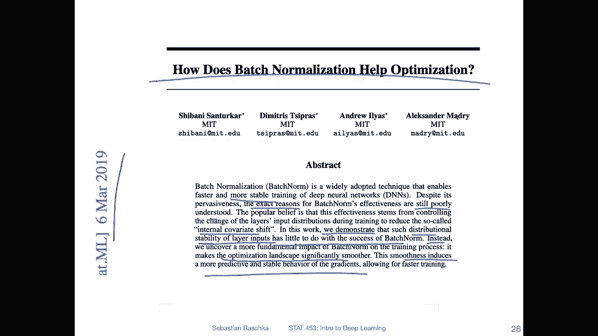

So I took some visualizations from the paper shown here。

I don't want to go into too much detail about this paper。

 I mean if you are interested you are very welcome to read it so here I only a few takeaways。

 so what they say is essentially that batchome enables faster convergence by allowing larger learning rates I found that interesting so let's focus on the left。

Plot first。That's the training accuracy here。And。This is the number of steps。 so instead of epochs。

 they have steps here so that's the steps you can think of it as iterations or mini batch updates doesn't really matter whether we have epochs here or mini batches plotted。

 it really just represents the the training， the course of the training。So we have 15000 updates。

 and you can see there are four graphs。So the red ones， a standard network。

With learning rate 01 and 05。 And just looking， let's use the red for this one。

 So just looking at this red curve here， you can see。The 0。1 trains relatively well。

 it reaches 10% at some point， however the large one， the 0。5 doesn't train so well。So it doesn't。

 So the learning rate is essentially too large。So， what we have then is。The same。1 and 。5。

 now with batch norm。Now， if you look at it， the one。With。Point1。Trains actually faster， also with 0。

5。It also trains at all。 I mean， the other one with 05， when we had the standard one。

 it fell apart here， right， So batch essentially allows us to also have larger learning rates。

 In this case， the larger learning rate is。Not better than the 0。1 learning rate， but it is stable。

 It is training。What the interesting takeaway here is， though， is that。Overall。

 the training with petome is faster。Even though we reach the same performance in the end and the training set。

 what is nice here is that bem trains faster。Now on the right hand side that's what we really care about that's the test accuracy How does the test accuracy look like So here I assume they are testing or they using the same test set for so they train the model and then they use the same test set to make this plot where this is really like the training steps here。

So。Yeah， what we can see here is during training。 So first， on also again， with batch norm。

 we see that the accuracy。Increases faster。 In the end。

 I would say there is a little difference between the red and the blue and there is a slight difference。

 So you can say maybe beon performs better。And you can see also， pet is stable worth a。

5 learning rate。I wouldn't say， I mean。I wouldn't say the training is faster。

 or convergence is faster because it allows us large learning rates because we can see the smaller learning rate still works better。

 but what I would say is it's making our training more robust so it's maybe requiring less time to find good hyperpermeter settings to get good results。

Which is kind of nice。 So if it just stabilizebils strain。

 this is something I would always want to do， right， Why would we not want to patch on。

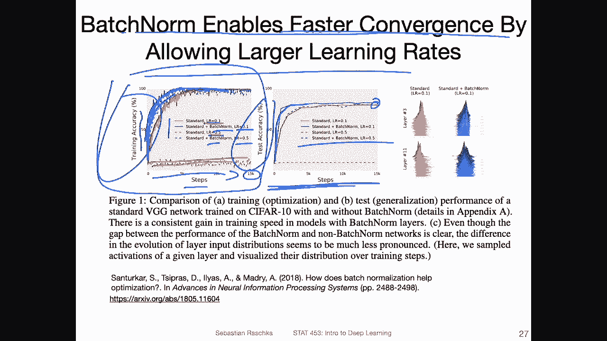

Then。Alright， so next day looked also into this covariate shift here。

 Let me take a look at this figure to refresh my memory here。Yes， so what they are showing here is。

 again。The training， the course of the training and the training set accuracy。

And on the right hand side， these are the distributions of the activations in the different layers。

 So they look at layer 2， layer 9 and layer 13 of a deep neural network of VG G network。

 We will talk about VG G in the con network lecture。 So what we can see is for standard。

That the distributions。Across layers are slightly different， so。あ。

Can't really read these numbers here。 it's very small。

 but these should be ordered by increasing size。 So I think this corresponds here to the to the steps。

So the steps that we see here。So this at the bottom is the later training in each。

You can think of each be curve or each histogram here as the activation。

 the distribution of the activations at that given step。

So what you can see is they are all kind of in line here。 So there's not much distributional shift。

 I would say here， maybe there's some， some shift you can see。

 it's maybe I'm not sure it's hard to see that the。

The mean of the distribution during the course of the training。

 during the steps shifts a little bit to the left。 for instance。

 but we can also see this a little bit here， right， So in that way， this one is the one with beome。

 It's not， I would say， that much different。Now， what they did is they produced a batch variant by adding noise to it。

 So here you can clearly see on that。The distribution shifts， so you can see。Here。

 this peak is very different from this peak。 so you can see a huge shift of the distribution。

 So I hear this one。 However， when they then do the training。

So you can see here on the left hand side， we then do the training。Both the standard。 sorry， the。

Bchm and the noisy batchm， both。Perform really well。

 So even though there is covariate shift or there is no covariate shift。

 it doesn't seem like it affects the performance that much。 So even let's say。

 if batch norm fixes this covariate shift。I， they think it's not really the explanation why it results in such a good performance。

 because then you would expect for this case here， a very poor performance， but that's not the case。

 So that's just one observation from this paper here。

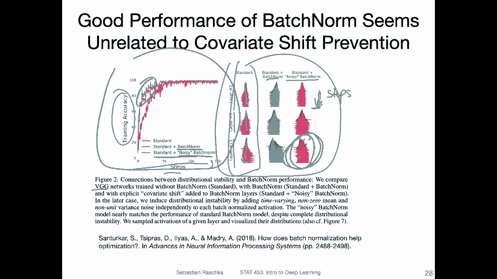

Okay， now let me list a few more papers， I don't want to go into these in too much detail。

 but if you are interested you are yeah encouraged to read more it's of course not required for this class。

 but yeah if you're really interested in batch doesn't hurt to read those okay so。

Just in chronological order， there is the theory that it reduces covariate shift。

 So this is the original paper。 Then we just saw the paper that says that it makes the optimization landscape smoother。

 There's another paper I found where they say that。

The reason why batchome works so well is that batch normalization implicitly discourages single direction。

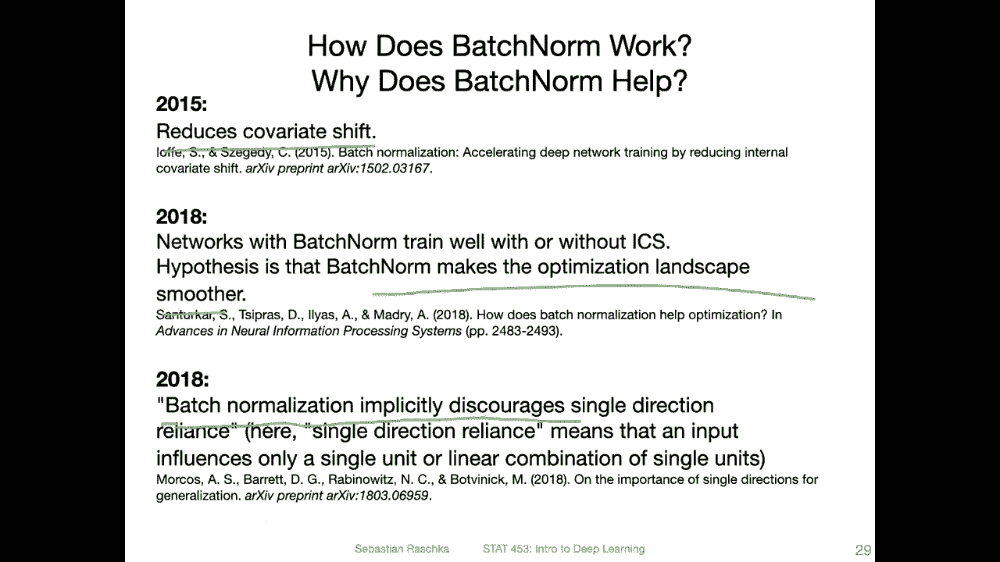

Reliance。Then another paper from 2018 also says that it acts as an implicit regularizer and that is then helping with a generalization accuracy。

And another paper was not so positive about bem。 It says essentially that bem causes exploding gradients。

So yeah， we will actually talk about these skip connections in a future lecture too， by the way。

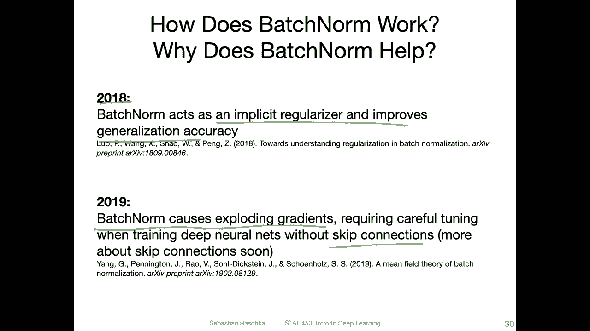

Yeah， let's get now to the practical advice section of this video。

 So there are also slight modifications of batchno， so one is putting batchn before the activation。

 So this is the original version of batchome that was discussed on the previous slides of previous video and also presented in the original paper So here the workflow is as follows First we compute the net inputs。

And then yeah， we apply batch norm， Then we apply the activation function。

 and then we compute the next layer inputs。 However， we can also put batch norm after the activation。

 So what we do is we essentially。Flip the order here。

 We first apply the activation function and then use batchome。 So we can see net inputs。

 applying activation function， batchome， and then computing the next layer inputs。嗯。

This could make more sense in practice if you think about it as， let's say for simplification。

 Let's say you use batchome and batchome learns to standardize。You are。

Fature activation distribution et say at mean 0。Right， so you have now0 min。Features。

 but then you apply the activation function。Let's say on the left hand side。

 we apply the activation function then。It would kind of change this distribution before it gets to the next layer。

 right， because let's say we have mean 0 for a given feature。 And if you use， for example。

 a logistic sigmoid function。Then the mean will change from 0 to 。5， right？

 So the next layer receives inputs that are at point centre at 05 and not centred at 0。 right？

 So that way。The sigmoid would re remove also the negative values。 So in that way。

 maybe it makes more sense to put pet norm after the activation personally， I haven't found any。

 yeah， big difference。 I haven't benchmarked this extensively。 I tried it here and there。

 I didn't notice a big difference。 I did some searching online。

 that was repository that I' found where they did some experiment or experiments。

 multiple ones and found that before and after。

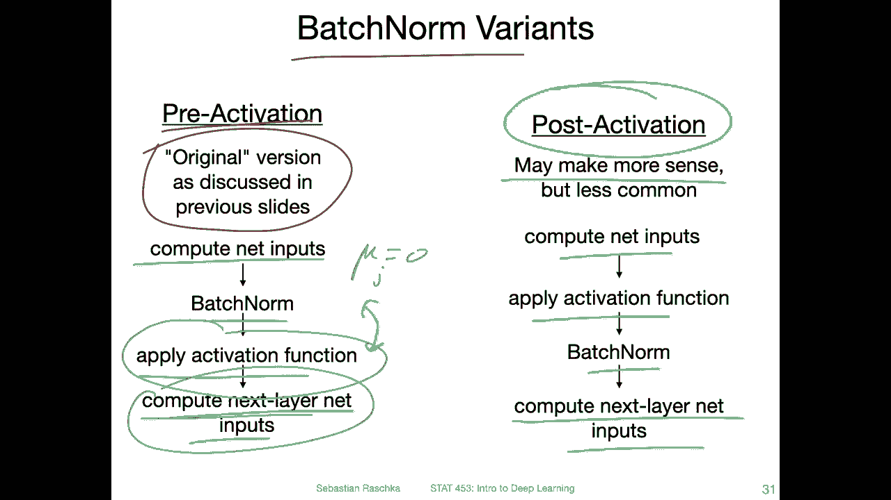

Did make or have a difference。 And they found， for instance。

 that putting beome after the activation indeed resulted in a in a better accuracy。So， I mean。

 why not It may make sense just to put it always after the activation and not worry about it。

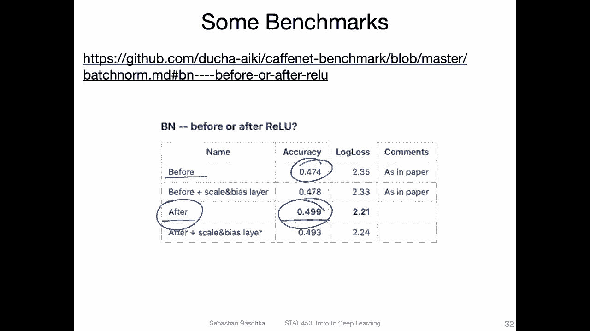

Alright， some more practical consideration。 So batch norm， I should also say。

 only works really well if we have reasonable batch sizes。 So if we make the batch sizes too small。

 then batchome doesn't work very well anymore。 So that might be explained by the fact that， yeah。

 these mean and standard deviation statistics become very noisy if we have small batch sizes， right。

So here I found a paper this is actually a paper about an alternative to batch norm it's more for convolutional networks but it's called yeah groupnm。

 we can revisit this maybe later we don't have to talk about groupn here。

 it's really just something that doesn't work for multilayer perceptionceptance it's only for convolution networks but what I found interesting was here this figure。

Ignoring the group norm plot here， what you can see is they did an experiment with different batch sizes。

 and here's the percent arrow。And。They have it yet 32。 Unfortunately。

 they are not showing larger ones， but you can see 16 and。32 both work， but if you make it smaller。

So if you make the batch size smaller， like 8，4 or2， then batchome becomes really bad。

 so get a very large arrow here。 So just a practical consideration， if you use batchome。

 it's yeah highly recommended to use a batch size greater than 16 in practice I would even say bigger than 6 32 even 64。

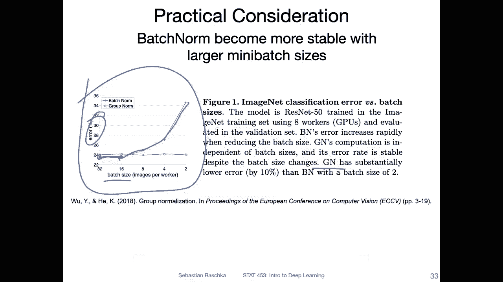

So here's some further reading resources。 If the previous ones were not enough。

 if you are interested。 yeah， like I said， we can't cover by everything in this course。

 This is an introductory course。 So I have to be very selective with topics。

 but if you are interested some。Additional papers that you might find interesting。

 maybe in the context of your project you can try one or the other paper and see whether that helps。

 so one is conditional batchome， which is essentially including class information so having different parameters for the different classes in the dataset which kind of makes sense。

Yeah， then there's a paper on measuring the effects of data parallelism on neural network training。

 So here what I just found interesting is it's not directly related to batch none。

 but it's related to the previous slide regarding the batch sizes。

So sometimes in practice people say don't use a large batch size。 So let's go back。

 So there are two theories， one theory or one not theory but recommendation is to use large batch sizes because large batch sizes help you to utilize the GPU better because you have large matrix modifications and then the training will be faster and it's it's better Some people say choosing smaller batch sizes is better because it helps with generalization because then maybe the loss gets。

Yeah， we less likely to get trapped in local mini on the lost surface。However， yeah。

 this is very controversial here was just a paper I found interesting where they say basically they don't find any evidence that large batch sizes degrade the performance。

嗯。Yeah， then。Another one here is。An alternative。To batch normalization that might I have not tried it myself。

 but it sounded interesting。 It just came out this year。 I saw that this year。

 I haven't even read this yet because I have such a huge list of papers I find interesting。

 and I want to read。 but there's only so many hours in the day， but that sounded pretty appealing。

 So they say that they present a pluck in replacement for batch normalization called exponential moving average normalization。

 which improves the performance of existing student teacher based self。

And semi super based learning techniques， amateur may whether it applies also to regular networks。

 but could be worthwhile looking into。 So I just had that on my reading list and I thought I just included here。

And the last one I have here is。嗯。It's actually without batch normalization。 So here。

 so usually people say batch normalization is very important to reach good performance。

 And here in this recent paper， also from 2021， they demonstrated that also。

 you can actually get good performance without batch normalization， so。

They mentioned that previous work was already successful in demonstrating that you can train without batch normalization get good performance。

 but these models do not match the test aacies of the best normalized networks and are often unstable for large learning rates or strong data augmentation。

 So while it is possible to get good performance， it's not as good as with patch batch normalization and。

The models are more unstable。But in this work， they， yeah。

 they have an alternative to make them stable。 So they call that adaptive gradient clipping。

 So gradient clipping is a technique。That if you have a very large gradient。

 you clip it at a certain value so that it doesn't cause problems like expding gradient problems。

 And they say by having adaptive， an adaptive version of that gradient clipping。

 they can train a network without batch normalization and get a good performance。 But yeah， again。

 this is a very recent paper。Time has to tell whether this is really also working well across other architectures。

 but that might be also something cool to look into。 maybe in the context of your class project。

 So again， I'm just throwing out some ideas or interesting reading material here。

 You don't have to read that。 Of course。 I'm just， yeah， sharing it because it sounds interesting。

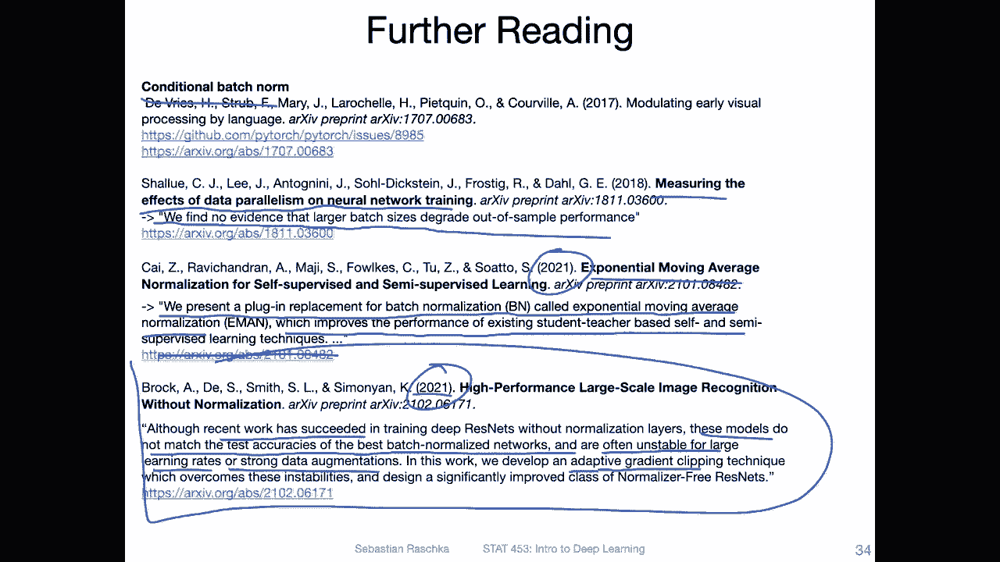

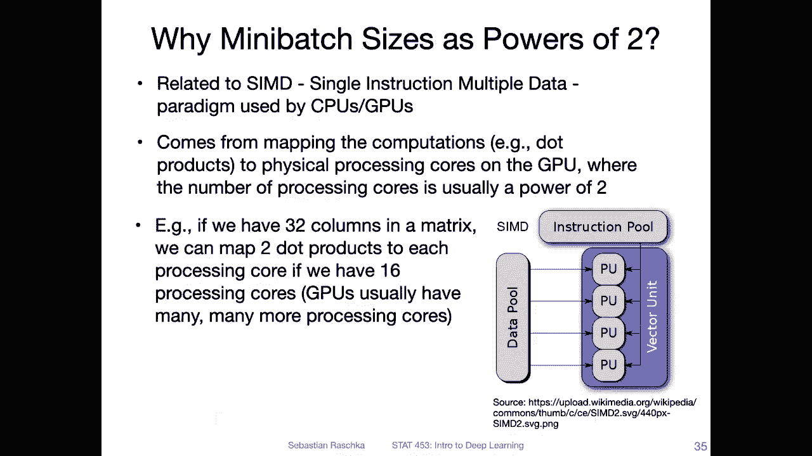

Allright， so one last thing。I mentioned here these batch sizes。

 and you may have noticed they are all powers of  two， right，2 to the power of 2，3，4，5，6。

 and so forth。 So why is that， Why do people usually choose batch sizes in powers of  two。

 So that has something to do with how GPus work。 Theres this。

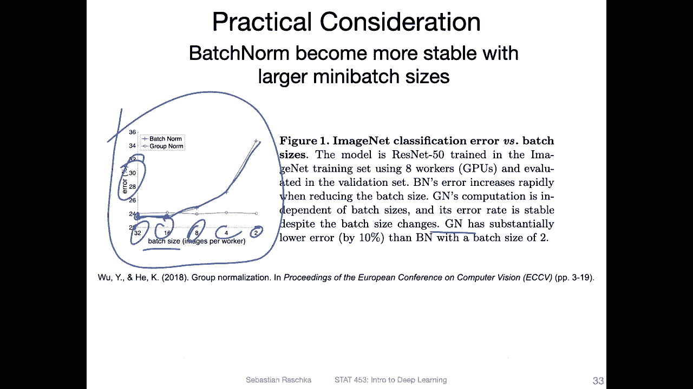

Just briefly， there this paradigm， single instruction， multiple data。 So let's like。

You have multiple data points， or let's say multiple values in a vector。

 and you have a single instruction， let's say like addition。

 and you can distribute this instruction to apply it to everything in a vector。

 So that's like how on a certain level， parallelism works on a CPU and GPU。So。And。😔，On GPUus。

 the number of processing qua is usually a power of two。

 That's just how I don't know the chip design works。Now。

 you can take that and take it or make it an advantage by choosing a batch size that is also a power of two。

 because then you can， you better balance out how these cores are used。 For instance。

 if you have 32 columns in a matrix， you can。So let's say you have your design matrix。

 you would do a transpose on this matrix。 and then these columns。

 you can map them to dot products to each of the processing core。 So if you have 16 processing cores。

 for instance， you can run two dot products on these 16 cores right So if you have only 31 columns。

 then one core。Would be finished faster， but it has to wait until the other ones finished anyway。

 so you don't fully utilize your CPUU GPU。So in this case。

 it's just so that the GPU is better utilized。 People prefer these powers of two when youre choosing batch sizes。

But yeah， this is also anecdotal。 You don't have to， of course。

 choose batch sizes that are powers of two。 Its just。You know what it is。

 It's actually also making life simpler because there are so many hyperparameter to tune and to consider。

 And if you know， also would consider values between values powers of  two。

 then you would even have more hyperparmeter to consider， right。

 So if you say I only tune powers of 2。 So you have 32 batch size，64，1 28 and so forth。

Then this is less than saying I will consider 25，30，35，40 and so forth， right， So in this way。

 it's also one way to keep things simpler for hyper permit tuning。 And yeah， of course。

 it utilizes the CPU and GP better。 but in practice。Does make such a huge difference。

 It's not like you get any significant speed up through that。

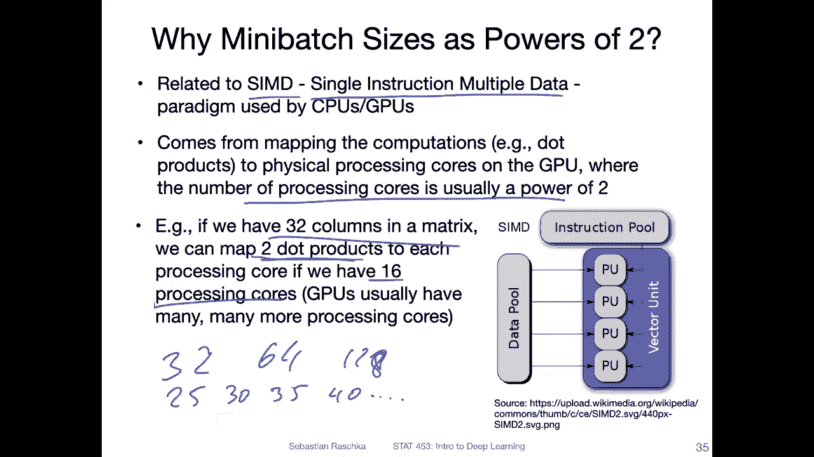

Okay， so that was enough about batch norm， let's now talk also about weight initialization。

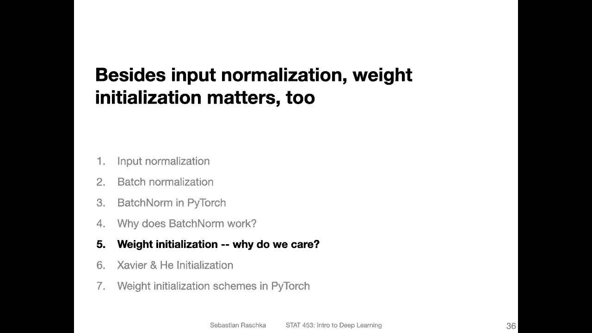