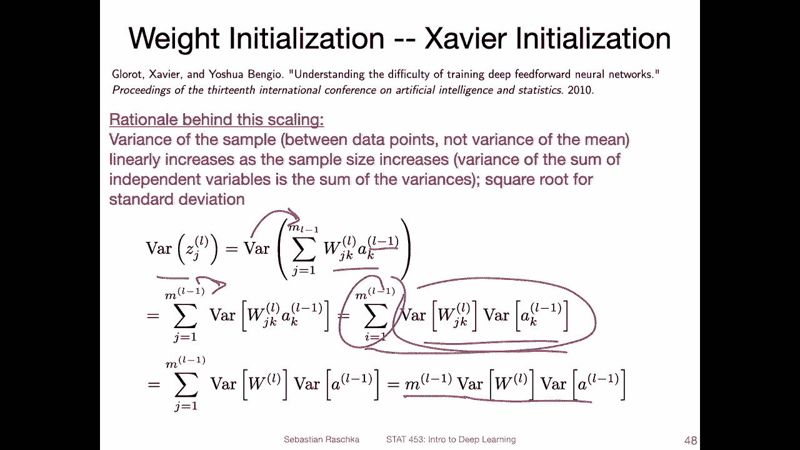

# 【双语字幕+资料下载】威斯康星 STAT453 ｜ 深度学习和生成模型导论(2021最新·完整版) - P87：L11.6- Xavier Glorot 和 Kaiming He 初始化 - ShowMeAI - BV1ub4y127jj

Yeah， let's now take a look at two of the most common weight initialization schemes for deep neural networks。

So the first one we start with is called Xavier Goid initialization。

 sometimes people just sayaver initialization， sometimes people say gloid initialization。

 so the fact or the name comes from the name of the first author of the paper that proposed this method。

So usually this type of initialization is used in connection with a 10 h function。

 the hyperbolic tangent activation function。 And here recall this is also a sigmoidal activation function similar to the logistic sigmoid。

 except that the output is centered at0 and。So。Where we have in the logistic sigmoid。

 something like this， I'm really not good at drawing this。It's try again where the output is。At 0。

5 for the logistic sigmoid， then we have for the 10 H。Something more like。

Like this where we have one and minus-1 here and。The if you recall。

 the partial derivative of that function with respect to this input is one。

 So instead of 025 for the logistic sigmoid for the 10 H， the derivative。

At the highest point here in in the center。Is one。 So in this case。

 we have less of a yeah vanishing gradient in problem compared to the logistic sigmoid。

 but of course。It still has the problem of this saturation near extreme values， so。

Here at this point and here at this point， we have still this very small or0 gradient。

 which is still a problem。 And yeah this Xavier initialization can act as a small improvement to prevent these extreme values。

So how does it work， So it's， yeah， essentially a two step procedure。

 The first step is to initialize the weights from a Gaussian or random uniform distribution。

And then the weights in the second step are scaled proportional to the number of inputs to that given layer。

And therefore for the first hidden there， the number of inputs would be the number of features in the data。

And then yeah， in the second layer， that would be the number of units in the first hidden layer and so forth。

So here's how it looks like， so。assume that the weight is initialized from a Gaussian distribution with mean 0 into small variance。

And。Let's say this is our yeah， our weight matrix from the Scussian distribution。

 Well random could also be a random normal uniform distribution。 sorry。

 and then you scale it by a factor of the square root of one over M。L-1。 So what is M。

 M is the feature number of features and L-1 is the layer index。

 So L-1 means the number of features in the previous layer。 So if I have。Set up like。This， and then。

Everything is， of course， connected to each other。So if I initialize the weights here。

I want to initialize these weights here。 they are initialized based on the number of features here。

Yeah， and if you didn't initialize the bias units to all zeros。

 you can also yeah include those in the scaling， but yeah it's fine to initialize the bias units to all zeros I just saying if you don't。

 then I recommend also including those in that scaling。

Yeah， what is the rationale behind applying this scaling factor here， So yeah。

 that goes back to making an assumption that。Let's say when we compute the net input。

 we have a multiplication between the weights and the activations from the previous layer。

 And you can think of them as yeah independent， right， So， and then。

If you have an increasing sample size。Then the variance of so here， I mean。

 if you have increasing number of units in the previous layer。

 So that's what I'm thinking here of the sample size then。

The sum increases because you have independent variables， right。

 And then you' are just adding up the variances。 So you can think of it as the variance of the sum of independent variables is the sum of the variances。

 And then yeah， we have。A scaling by one over M， where M is the number of。The samples， one let's say。

Maybe maybe the number of features would be more correct here。😔，And。Here。

 the square root is to consider the standard deviation。

Alright， so yeah， here's just a very， very brief sketch of what I meant。

 So if we have the variance of the net input。 So just focusing on one unit here。

 this can be expressed as the sum over。The weights times the activation from the previous layer。

 so that's nothing new。And yeah， we can。The variance of the sum is the sum of the variances， right。

 so we can rewrite this and here I'm just extending it into these these are independent variables。

And。Then essentially， cause we have a sum over these values and they are the same for all the different。

Positions， right， so I can actually。Say instead of summing over these。

 I can just say it's M times this product in a way。 So this is where the M comes from， right。

 So we are then scaling it back by one over M。

And since yeah， the square root is farther standard deviation here。

Alright， so， but don't worry about it too much。 It's essentially a scaling factor。

 You can think of it more broadly as a scaling factor that accounts for the number of features that goes into a given layer。

 So that's the main message here that we take take into consideration the number of。Features。

 and this is sometimes also called the number of features from the previous layer。

 It's sometimes also called fan in。 And I have no idea why it's called like that。

 It's another term that is commonly used。 There's actually a term fan in。 and there's also the term。

Fan out。 I only know everyone is using this like since 10 years ago or something。

 but I never understood where this name comes from。Alright， so in practice。

 also sometimes if you look at some initialization schemes， sometimes people。Also。

 include here the number of output units。 for example， they would write it as。

L here L is the output number of features that goes out from that given layer。

 So that's also some time， something things people sometimes do。 But yeah， in practice。

 I think fanine is more common than having both。

Yeah， so here's a visualization from theavavier initialization paper。

 So what they are showing here is a network with a 10h activation and without Xavavier initialization just for reference now so here at the top this is a histogram。

 a normalized histogram showing the activation value。

For the different layers in the network and you can see that in the early layers like one and2 the activations are more uniform。

 spread odd， whereas for the later layers they are largely zero。

 it just happens that how the signal propagates through the network that we will see in later layers。

 the activations are more centered at zero and here consequently。When we do back propagation。

 we have this multivariable chain rule， right， So the we we go usually from the right to the left。

 if I have a network， let's say like this。That's the forward pass， and then in the backward pass。

I start with Lair。5 and then multiply things until I reach layer1 when I do the updates。

 So what you can see here is for layer 5s， we have back propagated gradients that look reasonable in a range at say between minus0。

1 and 0。1。 but then the further back I go I get this vanishing gradient problem。

 You can see that the early layers almost get yeah0 gradients most of the time。

Which can then be a problem in this sense， the network will mostly only update the later layers。

 but almost ignore the earlier layers。 so this can be a kind of yeah not good if you want to train a neural network well。

 so。

Then here's a visualization showing what Ive showed you on the previous slide。

 and here a version with the yeah Xvier initialization。So you can see at the bottom。

 this looks much better if they use xxavaviia initialization。

 you can see that all the gradients are in a reasonable range for all the different layers。

 So in this way， that's actually pretty nice， it fixes this issue that some layers low and better than others。

Allright， so。There's another initialization scheme。

 So Xavier initialization scheme was assuming that you use the 10 h activation function。

 There's also something called a Hu initialization。

 So this comes from the fact that the first author on that paper was name or his name is Kaiing he。

And。Yeah， like I said previously， we assume that the activations had a zero mean or mean  zero。

 which is yeah reasonable。When we use the 10 H activation because it's centered at zero。But for。

 yeah， for Relu， it's different because the activations are not centerd at 0 anymore， right。

 if we have a relu function。I will only have positive values， right。

 because everything looks almost like a leaky roll。

Cause everything here on the left side left from 0。Will be set to 0， right。 So that way。

 we don't have the activation centered at0 anymore。

 So this paper proposes a method that works better with re units where we don't have the weights centered at 0。

 or sorry， the activation centered at 0。 And there's some complicated math in that paper if you're interested。

 you can check that out。 But the bottom line is。That we would add just a scaling factor of two here。

 So in， in total， we would add a， sometimes people call that gain。 We would add a gain of。嗯。

Square root of two。 And we can just put it inside here。 So essentially。

 it's just adding a scaling factor。 And this addresses。 yeah。

 the issue with having the activations not center at 0 in the case of relu。

Ohs sorry it。 Okay。 so yeah， so you don't have to， I would say。

 worry about these types of things too much if you just， yeah， use regular neural networks。

 So there are reasonable defaults in Pytorch。 So this video was more like illustrating that。

Different weight internationalization schemes exist。But in practice， I mean。

 it is a good idea to choose a good initialization scheme， but yeah。

 mostly frameworks handle this automatically pretty well these days。

 so I will actually in the next video show you how this is done in Pythtorch and how we can change the initialization scheme in Pythtorch。

