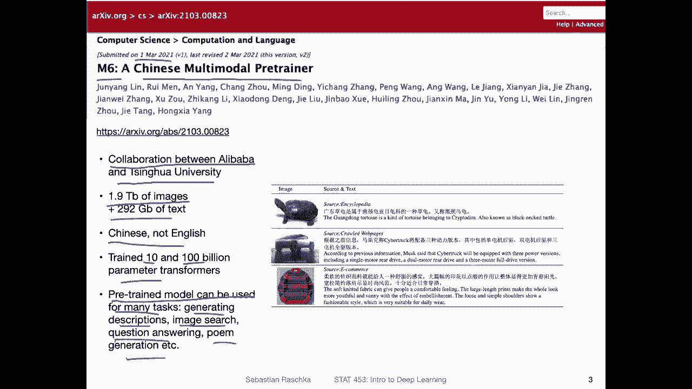
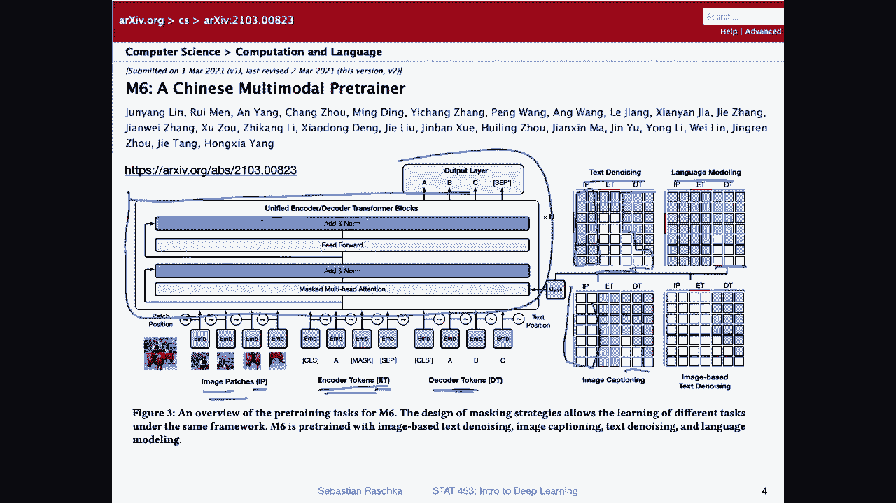
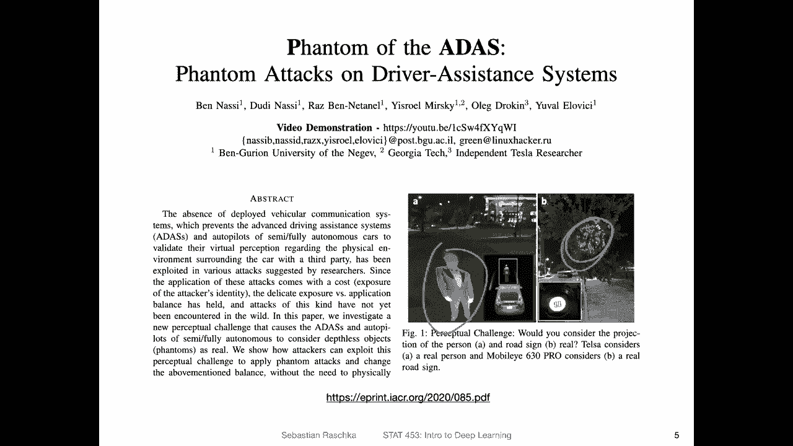
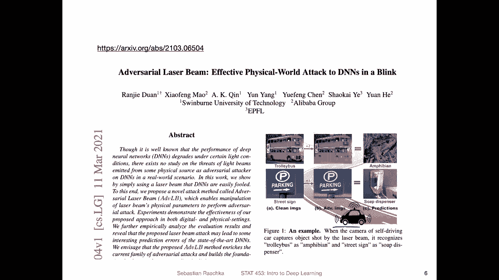
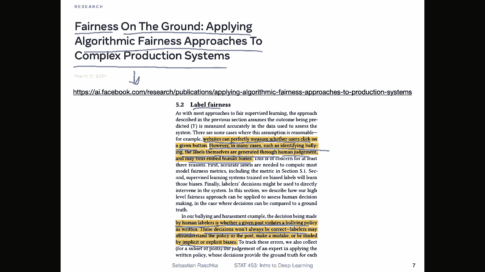
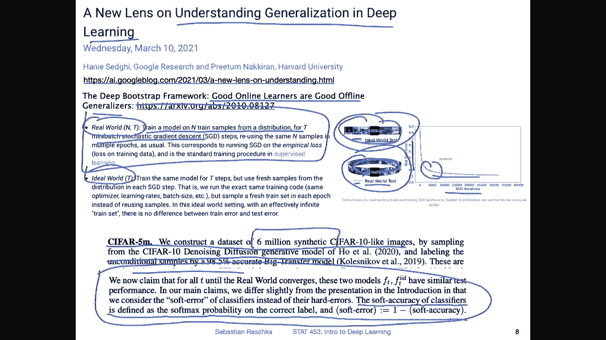

# 【双语字幕+资料下载】威斯康星 STAT453 ｜ 深度学习和生成模型导论(2021最新·完整版) - P89：深度学习新闻 #7 2021年3月13日 - ShowMeAI - BV1ub4y127jj

Yeah， hi everyone。 again， lots of exciting things to talk about today。

 So you may have noticed in the past that I have been covering a lot of these big projects from companies like Facebook AI research and Google AI research。

 I wanted to emphasize I'm not affiliated with any of these companies or projects。

 It's just like these are big projects and are very catchy and also that makes them sometimes very interesting。

 which is why I kind of try to keep up with what other people are doing。

 and these are usually the ones that kind of stick out。

 but I will also try in the upcoming weeks to be more selective or also let's say more diverse in terms of covering both little and big projects that are interesting。

 So today I don't have a particular theme I just selected some things that came to mind that I stumbled upon。

 So little projects， big projects a little bit of both。

 So because there are lots of things to talk about today。

 let me not waste too much time on this introduction and get started。Yes。

 so the first project I want to talk about today is this text box G I saw on GitHub this week as far as I am concerned and as far as the author is concerned。

 this is also the first application of a G to generating new text boxes so here are oops here are some examples of how they might look like so why are we interested in that Well maybe you can use that to design a new poster or something like that。

 but essentially I think it's just like a nice and simple application of a G for generating some new data。

So later in this course， we will also be talking about， yeah， Gs in more detail。

 So here it's just like an example of how a G might look like。 And also。

 the S repository contains a really nice description of how this works。 And it's really， yeah。

 just a nice example project here。 So what is going on here。

 Maybe just to briefly walk you through this。So again。

 usually consists of two parts there as a generator and a discriminator。

 So the generator is essentially trying to generate new data。

That mimics the data in the training set。 and the discriinator is the task of the discriinator is to tell apart whether the generator yeah generated fake data。

 like data that is different from the training set distribution or data that is similar to the training set distribution。

 So essentially， the generator will learn or tries to learn to fool the discriinator such that the discriinator cannot distinguish between。

Genrated and real images。 And in that sense， you can think of the generator as learning the training dataset set distribution。

So。Here， there is like a slight modification。 I mean， a again is usually a little bit simpler。

 So here， in addition to that。 So there are two things going on。

 a normal G usually gets some noises input。 So the noise gets encode is basically an a vector that goes into the network and the network then generates the new data。

 So why the noise， it's such that otherwise， I mean， you need the noise otherwise。

 the generator will always produce the same output， right， If you think of it as a function。

 So that way， the noise is such that it will create different outputs。And here， in addition to that。

 there is also the word encoder， which takes as input a word。

 So this word will be then included in this output image。So， and yeah。

 to ensure that this word is indeed included in this output image， there is also this O CR module。

 which will judge whether， yeah， this text here resembles the text that was put in。So， yeah。

 this is also why you can't use this module here for generating。

 let's say image capchas because then like these capchas that I used for verifying whether you are human when you log into a website。

 I mean， here， this wouldn't be useful because I would say it's too easy to solve because the OR is able to tell which word it is right。

 So in that way， you can simply design a robot to full but to fool this capturecha and generator。

 But yeah， anyways。This is actually a quite yeah useful technique to just add an additional constraint here。

 For instance， a couple of years ago， we also yeah worked on face privacy。

 where we wanted to hide certain phase attributes。 And we also an a project called。Privacy。

Pririv scene。Pivacy。Net we also designed again that yeah hides face information while still maintaining face matching accuracy or the same face matching accuracy So that generated images are still useful in practice。

 But then so the goal was essentially to having face images still being useful for let's say passport verification purposes。

 but then if someone captures images on a security camera。

 it should the person shouldn't be able to do some data mining on let's say the gender of the person and so forth。

 So here then we use face matching in a similar manner。 Anyways， so here。

 then the discriminator judges whether yeah， the generated images fake or not。

 and essentially this whole network will then learn how to generate new text boxes。

Yeah， so here's a slightly larger project。 I already wanted to cover it like one week ago。

 but the episode was already too long。 So I moved it into this week's episode。

 But I think that is something worth talking about on。So this is like a large， really large model。

 It's called M6， a Chinese multimodal pretrainer。 And this was a collaboration between Alibaba and the Jinhua University。

 So here what they did is they trained， I think they used the megaron from NviDdia， They trained 1。

9 ters of images or they trained on 1。9ter of images and。292 GB of text。

 So it's a really large effort here。 And what's yeah。

 essentially new and interesting here is that it is in Chinese and not English。

 So it's kind of interesting to see that these language models also perform pretty well on other languages that are not English languages because in Chinese here。

 also you probably know this better than I do， but you have all these different types of characters。

 So English texts， I would say much simpler because you only have 24 characters here。

 That's a little bit more challenging。 So it's kind of an interesting case study as well， I think。

So they trained actually two models at 10。Billion and a 100 billion parametermeter transformer。

And so this was done with yeah self-supvised pretrain and then the pretrain model can actually be used for many different tasks downstream。

 For instance， the model can be used for generating descriptions。

 doing image search for Q and A or poem generation， and yeah， many， many different things。

So Justin and Natcha， I don't want to go into too much detail， but how did they accomplish that。

 How can they use the model on so many different downstream tasks。

 So essentially how they achieve that is by masking。 So they have the same model。

 They call it here unified encodeta decoder。 I'm not an expert in these large language models。

 but I think this is based on Nvidia megatron I've seen something similar before。 in any case。

 so here they have like these different masking strategies。So for instance。

 when they want to use the model for text denoizing， they would mask out all the gray parts here。

 which is the I P。 they call it I P and D T。Mostly， so but they maintain some duties。 So what is。IP。

 E， T， and D T。 So I P are image patches， E， T， I encoder tokens and。The DTR decoder tokens。

 So encodeder is， can think of it as the input tokens。

 Let's say text input tokens and decoder are more like the output tokens。So for text denoising。

 the model gets yeah decoder and encodeder tokens and let's say for language modeling。

 there's only the decoder tokens and for image captioning they use， of course。

 the image patches together with the decoder tokens and so forth。

 So in this way based on the task they use different types of input so they have like this masking strategy。

 So with that they are able to train one single model essentially。

Yet， totally unrelated to the previous project。 I saw a very interesting project on archive this week。

 So this project essentially highlights how fragile deep learning can still be in practice and that we have to be a little bit careful about certain things when we are using it。

😊，So the project I'm talking about is actually not the project on this slide， but on the next slide。

 but it reminded me of this one that I saw about approximately almost a year ago。So here。

 just to describe you what's going on here。 So here the authors try to fool Tesla's autopilot system。

 So if you haven't heard of Tesla's autopilot， it's essentially a self driving car program inside the Tesla car。

 which can。To some extent， automatically control the Tesla car like steering it on the highway。

 I don't have a Tesla。 I only vaguely familiar with it， but based on what I hear from people。

 it's it's somewhat okay， but it's， of course， not something that you want to blindly rely on。

 And this paper also highlights some of the issues of that system。

 I'm not sure if this is already fixed， but。In any case， So what's going on here is that the authors。

 yeah， they try to fool the autopilot system。 So what they did is they projected， let's say。

 street signs into trees。 and that yeah was essentially fooling the system thinking that this is actually a real street sign。

 And you can think if， I mean， of a real world application if there's some malicious actor。

 they could maybe essentially project certain things and then cause crashes and stuff like that。

 or here， for instance， they projected a silhouette of Elon Musk onto the street。

And the car was then thinking there's a person on the street and was breaking pretty hard and things like that。

So， yeah， what I saw in an archive was essentially an update of that。

 or I think these are different authors， right。

Yeah， but it was essentially a pretty interesting project where they did something similar with laser beams。

 So here they essentially。Projected laser beams into the image。 And by that。

 they could also fool the cars essentially。 So I think。

This one here definitely takes more effort。 if you， let's say， a malicious actor and。Yeah。

 you want to， for some reason， fool the car。 I think having something that can project a street sign。

 you need a projector。 essentially， it's a little bit more effort to do that。

 but something like a laser beam having something like that。 that might be more concerning because。

 yeah， these laser beams they are more， I would say， easier to carry around and things like that。

 So yeah， that essentially highlights are still a long way to go for making self drivingiv cars safe。

Yeah， related to the topic of safety， there's also another important topic， fairness。

 So how do we design fair machine learning and deep learning systems？ Yeah。

 Facebook had a blog post on that topic this week called on the ground applying algorithmgic fairness approaches to complex production systems。

 and yeah in this blog post， there was also a link to a research paper。

 it's a very a relatively long paper， but yeah a recommended read I think it's an important topic。

 So in this paper they outline yeah， the challenges and approaches they take to making machine learning and deep learning fair。

So it's actually a pretty tricky problem that they have there。 So I'm not an expert in this area。

 but it seems like it's yeah it's not so easy to solve。 but yeah。

 one thing I wanted to highlight from that is regarding label fairness because in practice we usually assume that the labels that we have for a given data that they are correct or that they are the definite ground truth labels。

 but yeah in a real world， it's not always so obvious or not always so clear whether these labels are correct or whether we should take them literally or whether we should take them with a grain of salt。

So for instance， as they say here， things like when you have。

Websites so you can perfectly measure whether users click on a given button。

 So if you want to measure or predict website clicks。

 website clicks themselves are labels that are yeah pretty yeah I mean。

 pretty confident or you are pretty sure if someone clicks on that you can measure this pretty confidently a click or not but other things。

 for instance， if you deal with topics like identifying bullying。

 So the labels that you may use for that。They are usually， for instance。

 generated by a human who is labeling certain posts， whether they are related to bullying or not。

 And because that's based on human judgment， it may also embed human biases。 So in certain cases。

 yeah， whether a label is correct or not。 it's， it's really， it's more， I would say subtle。 it's。

 that's also a grey zone and things like that so。Also， like they say here。

 there's usually a policy written down to identify bullying and it's also important like to have a good policy for the label us to apply And then but different people。

 yeah apply the policy maybe differently and there are like these implicit and explicit biases that label us have。

 So that way in certain in certain contexts it's actually not so simple。

 we cannot always believe that these labels are the definite ground truth so that kind of make certain topics。

Application for machine learning and deep learning a little more challenging than others。

But yeah related to that what I wanted to mention for your class project。

 what might be also an interesting thing to do is to take a sample of your dataset。

 So if you are working on a classification problem。

 let's say you have a data set of 100 images or let's say， let's say 100000 images， sorry， take。

 let's say 100 images and then look at these 100 images and。Without looking at the labels。

 try to predict what class table it is， and then you count the numbers of times you were correct and then divide that number by 100 and then you get a feeling for what the human accuracy is on that dataset or how the human predictions relate to the labels that are actually the ones contained in your dataset it gives you a feeling of the difficulty of the task too So for instance if you have the Mnes data。

 take maybe 100 Mnes digits and try to predict which number is is and let's see whether you get 100% accuracy or not。

So it gives you also yeah an idea of whether the labels are even correct in the data。

 but also how difficult the task is。

Yes， since we talked about improving generalization performance this week and we will continue to talk about this topic this week。

 there was an interesting research article on the understanding generalization in deep learning from the perspective of online and offline learning。

 So the title of the article is good online learners are good offline generalizers。

So here they had two scenarios， a real world scenario。

 So the real world scenario is essentially what we have also always considered in class。

 So we have given training set and we train a model on end training samples from that yeah。Data set。

 where we have mini batch stochastic gradient descent。And we run that for multiple epochs。

 So essentially， this thing is just describing what we are doing when we are working with a training set where we have。

 yeah， where we do stochastic gradient incent with mini batches and we repeat that for multiple epochs。

But then they have another scenario they call that the ideal world。

 So here instead of yeah doing mini batch gradient in descent on the training set。

 instead of having a fixed sized training set they have infinite data so they are drawing every time a new mini batchch from the distribution of new data so they have an infinite pool of new data and they don't have epochs because yeah the data never repeats。

 they always draw new data。And here what they are doing is they are comparing how the real world compares to the ideal world。

 So here this is essentially illustrating that we once we complete one epoch， we start from scratch。

 I mean， we do another round in another round。 So we reuse the same training set for training in an ideal world。

 we always move forward and have new samples。 What they found was pretty interesting， actually。

 that there is actually no difference whether we have the ideal world or the real world case in terms of the generalization performance。

 So both the。Ideal world and a real world setting result in models that have the same performance on the test set。

 So they have a test set where they measure the performance then。 And here。

 this is the number of iterations。So it's hard to see， but you can see there are two lines here。

 a red line and a blue line， and blue corresponds to the real world scenario and red to the ideal world and you can see there's virtually no difference。

So there's one caveat， though， with that study。 So one is how they generate or generated the new data for the ideal world scenario。

 So here they used the model to do that。 So they used。A model that。

Draw or constructed 6 million synthetic Cypher 10 like images by sampling from a certain generative model。

 And how did they then get the labels for that， They used another model that was used then to label these images here。

 they had an model with 98。5% accuracy。 So yeah， I mean， this is an okay approach Because yeah， well。

 where should you get all the data from otherwise， right， But yeah。

 this is also a little caveat because these are not real images。

 They are generated images that look like real images using a generative model。In case。

 it's still an interesting study Yeah， and another or another little thing I want to mention is it's actually not the test set error。

 it's something called test soft error， so it's not a test accuracy but the soft error。

 I wasn't bit confused by that。 I haven't seen that before， so they had a paragraph on that。

So here it's essentially what they call a soft accuracy of classifiers defined as a softm probability on the correct label。

 So instead of using the arc max on the softm。Where in the softmax recall we have pro class membership probabilities。

 they use the highest probability score in computer near the accuracy that way as a soft accuracy。

 Honestly， I'm not exactly sure why they are doing that。

 why they are not reporting the regular tests at accuracy。 but yeah。

 that's that's an interesting point here。

Yeah， and to ensure that this observation was not just an artifact。

 particular to this resonnet model that they used， they also tried it with different models and saw the same effect。

Yeah， one more visualization from that paper。 so here they also looked at pre training。

 so what they did is here。They had a model for the ideal and real world scenario and with and without pretrain。

 So the one without pretrain， this is like the random weight initialtization and pretrain is essentially pretrain here。

 the model on imagenet and then using the weights and training it further on that Cypher 10 dataset set。

 So what they found here is。If you look at， so the dotted line is ideal world。

 in the real world is the solid line。 And in red， that is the random。

 It's a little bit hard to read this graph， to be honest， or not hard。

 but you have to think a little bit about it。 So this is the random。In it， and the blue ones are。

Pre training。And then。What you can see here is the dotted one is， again， the ideal。

And the solid one is the real world。 And you can see for the random initialization like we've seen before。

 theres no difference really whether we use the real world or ideal world scenario and the same is true for the pretrain model there is also no but not。

 not much difference。However what is interesting here though is yeah of course that pretraining really helps so this is the again test soft error and you can see that the pretrain model has an error that goes down much。

 much， much quicker than the one for the random tested so it highlights that pre-training a model on a larger data set first instead of doing a random weight initialertization its actually really good for getting good performance faster Also what's also interesting is that final performance is also a huge gap so it's not only training faster but it also results in a better model here。

Yeah， and related to pretraining。 So there was another interesting project called SER Well CR stands for self-svised。

 So pretraining is essentially very similar to self-servised learning So self-svised learning is a form of pretraining in that sense。

 So on the previous slide I showed you that they pretrained a model on imagenet。

 but there they just used the labels that were contained in imagenet Sesupervised learning is basically yeah。

 it's like pretraining， but you use the data set that is unlabeled and then you generate the labels for that based on some information on the data。

 for example， you can mask certain things in an image or you can cluster the images and things like that。

So we talked a little bit about selfsvised learning before。

 It's a little bit beyond the scope of this class。 So I mentioned for， yeah。

 some class project feedbacks that it might be something interesting for you to look into。

 but you don't have to， of course， because it would be more something more advanced。 but in any case。

 this was an interesting project。 So what they did here is they trained a billion parametermeter model using self supervised learning。

And they used enabled data from Instagram。So doing that。

 they were able to reach a new state of the art performance for self supervis learning， getting 84。

2% top1 accuracy on INe。How did they do that， Yeah， they used。Online clustering algorithm。

 which is actually a pretty efficient one。 It's called Swf。

 And this one doesn't rely on pairwise image comparisons。 But yeah， again。

 since this is a already very long blog post， not blog post story video。

 I don't want to go into too much detail。 I will probably end this。Weeks stuff in the news section。

 There's only one more thing I wanted to mention in connection to this project here。

 There is another interesting。

A library or module I would call it library that came out。

 It's for yeah selfsvised learning benchmarks。 So it's a library for for state of the art。

 selfsvised learning， supporting Pythtor and it's essentially a library that provides benchmarks and pretrained models that you can compare with let's say your models。

 So it's essentially a benchmark library that provides pretrained selfsvised models。

 it's I think a nice thing if you are interested in selfsvised learning。

 let's say for your class project an interesting thing to check out。

