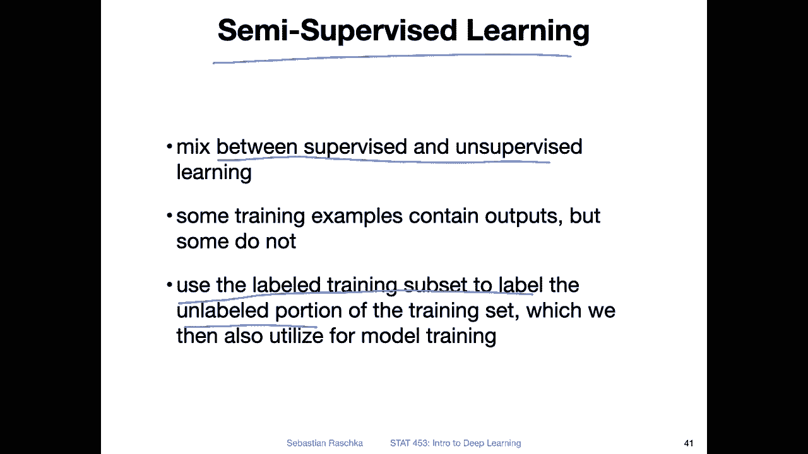
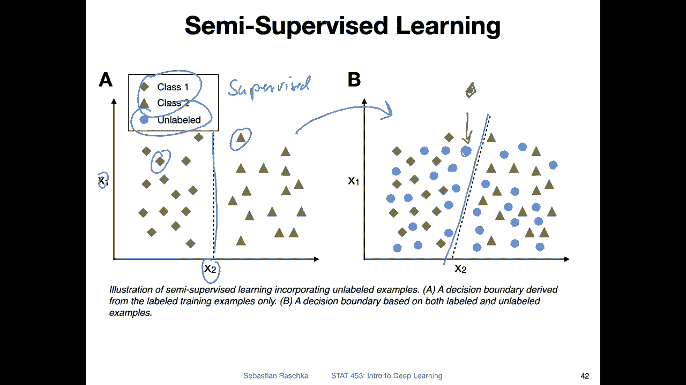
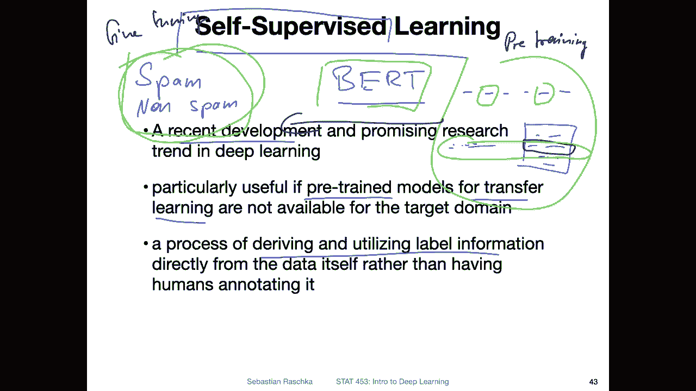
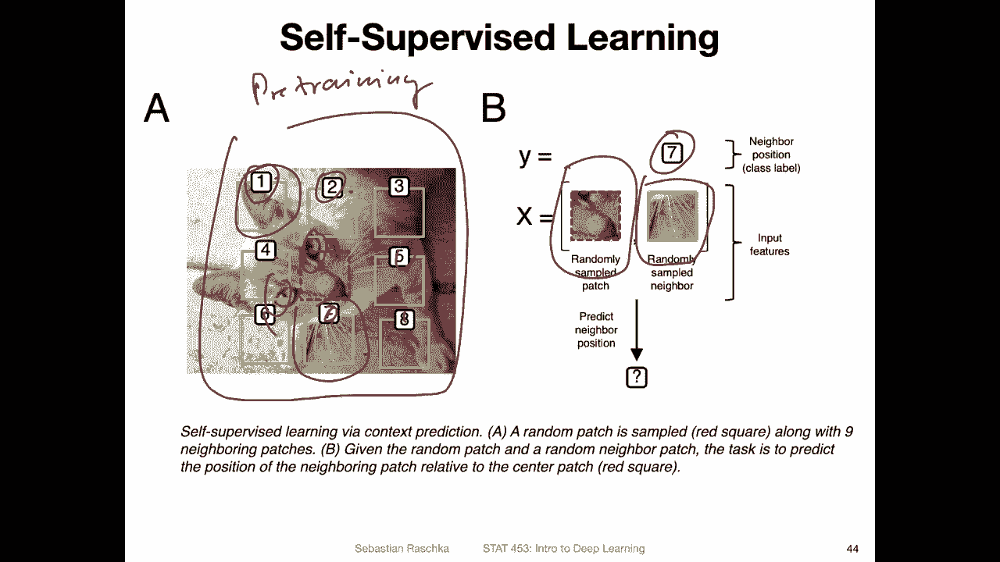
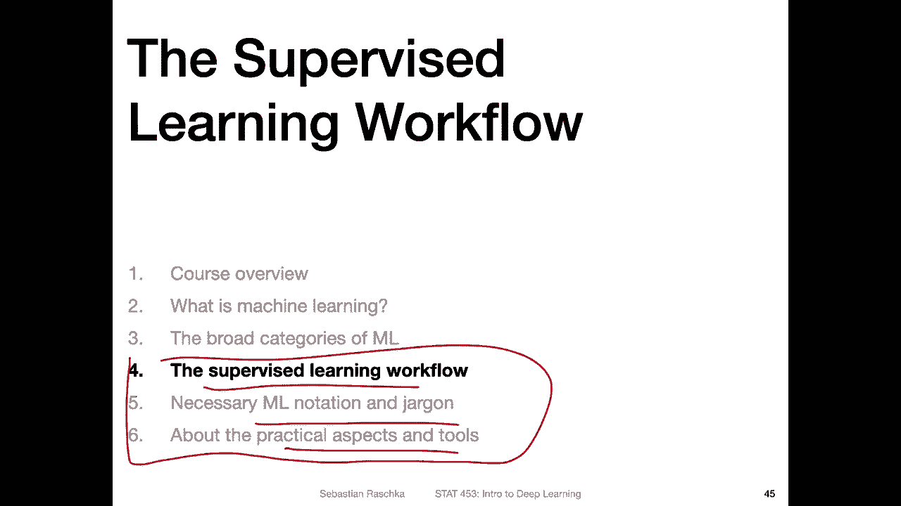

# 【双语字幕+资料下载】威斯康星 STAT453 ｜ 深度学习和生成模型导论(2021最新·完整版) - P8：L1.3.4- ML 的广泛类别第 4 部分：监督学习的特殊案例 - ShowMeAI - BV1ub4y127jj

Yeah， if you remember I mentioned there are three broad categories of machine learning and if you counted with me we already covered those three。

 they are supervised learning， unsupervised learning and reinforcement learning。So yeah。

 why is there another video on the three categories of deep learning。

 So there are actually two special cases of supervised learning that I just wanted to briefly cover because they are super interesting。

 So one is called semi supervised learning， which is kind of like a mix between supervised and unsupervised learning。

So in that scenario， we have some labels for some training examples， but not labels for others so。

Now semi supervised learning is about using the labeled training subsets to label the unlabeled portion of the training set。

 for which we don't have labels， and then we can use them to make a better decision boundary。

 So here's a sketch that I made like a very simple example on the left hand side。

 We have a supervised data set。 So this is strictly。

Supervised where we only have two classes， the class one here and the class2。

 So these are our two classes here。 and we made the arrive for decision boundary like that。 So again。

 this is a two feature problem and our decision boundary might be just like here in the center between the two。

Now， consider a case where we have more data， but the data is unlabeled。

 So consider this unlabeled data。 I edit it here on the right hand side。

 So these blue dots are the unlabeled data points。And if I consider these unlabeled data points。

 a semisupervised learning system may derive a slightly different decision boundary。

 So going from here to here， I have not changed the position of the class1 and class two examples however I added these blue dots here and the machine learning system may use them to put the decision boundary more like this diagonally of course it assumes or makes the assumption that this data point is actually one of the diamonds。

 the class1 ones， it doesn't have to be correctly without now because we don't have labeled information it's just an assumption but yeah we can actually still use this data to make assumptions and this can potentially improve the system So in this case the decision boundary might be slightly different and this might be a slightly better decision boundary。

Yeah， this is a special case of supervised learning。

 other case super of supervised learning is self supervised learning。

 and this is a very popular area of research right now in deep learning。So it's， yeah。

 it's a very recent development and very hot topic。 And it's particularly useful also for yeah。

 training large models that need a lot of data and where we don't have access to， yeah。

 these large amounts of data so。It's usually about pre training a model。On a larger dataset。

 and then yeah fine tuning it on a smaller dataset。

 So this is sometimes also called transfer learning because we are transferring the model from one task to another task。

 and yeah here why is it called self supervised learning It's because we are deriving or utilizing label information directly from the data itself rather than having humans annotating it。

 So's yeah let me think of an example So you have probably heard of bird the language model it's a very large model a billions of parameters it's very hard to train。

 you need a lot of data for that。 However， you don't have really millions of documents that are labeled with some classification task。

So， think of。Building a spam。Classification system。 you want to build a very good system。

 but you have a lot of parameters in this model。So but you only have。

 let's say 100000 labeled images labeled emails which are not enough for the system。

 So what you can do is you can pretrain it on all the text on the internet and here how do you get the labels for that you make up some labeling task that is kind of contained in the data set itself。

 So in the case of Bt this birdt model what the researchers do is they mask。

 I think it's 15% of the words， So they give it the text。

 some text on the internet and they remove 15% of the words and they let the system predict these words。

 So for that so you are kind of removing or withholding the labels。

 but youre using the data itself as the as label information。 So you are。You have， let's say。

 a sentence。And then you remove， let's say these parts of the sentence and you have the model predict these parts of the sentence。

 but you you know what the correct labels are。 so in that way you can teach the machine。

Or another second self supervised task within the bird system is predicting whether a certain sentence is contained in the document。

 for example， if you have a document with multiple sentences， you remove。

One of these sentences or you just take it out and you make up a new sentence。

 a second sentence it's not in the same document， you just maybe make it up or take it from a different document。

 and then you let the system predict which of the two sentences is actually in the real document。

 so you you kind of make up these classification tasks by yourself。

 you create them from the data without needing a human to label it because yeah。

 in that way you teach the model to understand the sentences。However。

 it still cannot predict spam or non spam it can only predict now missing words or these sentences。

 but it kind of helps the model to deal with language so after you completed the training of the bird system with cell supervision you can take this pre-train system and then fit it on the smaller spam and non- spam data set to yeah have a prediction task now that is a little bit different but yeah during this task it learned how to understand language and then you can apply it to the classification task to train it on that one so this is called here on this one on the right one it's called pre。

Training， and then。You have the transfer learning and then the fine tuning on the real dataset set you care about。

 So this would be an example of self subvised learning。

Another case of supervised learning is from the image domain from computer vision where， for example。

 you want to train a classifier to classify cats and dogs。

 but you don't have many cats and dogs in your data's very small dataset set so you want to use unlabeled images for example。

 to have it learned。 So here you don't know what's in the image because you don't have the labels for that。

 but you can actually use the image still So what you can do is you can divide the image into smaller images here。

 what I've shown you as an example is by dividing the images in8 or actually nine parts and。

Then you take out one part and you predict whether another part is in label on a neighbor or not。

 and you know the answer for that because you know this image and you divide it it yourself。

 you can write a Python algorithm for that， you know all the labels here， the 1，2，8， the 1，2，3 for。5。

6，7，8， and you withhold this ninth part。 and then you ask basically which as you。

 you have extracted this part， you present it to the。

Deep learning system or the convolutional network。 And then you present it with another one of these。

 So you have。7 other of these image chunks。 So here I have it next to it。

 And then you have it predict what label is it。 Is it the 7 position 7。

 position 5 position 3 and so forth。 So you know the answer because you were the one dividing this image with。

 let's say， a Python algorithm and you have the machine then or you teach the machine to predict the right position。

 So why is that useful if you want to build a cat versus dog classifier is really like helping the system to learn。

To understand what's in the image， what's an object。

 because it kind of has to understand a little bit about cats here to put them in the right order。

 because here you have the ear。 there's an eye here or part of an eye。 There's part of an eye here。

 So it has to kind of somewhat learn the structure of a cat to put these pieces into the right order。

 and。You have maybe also other objects there， like dogs and cats and other animals。

 So it kind of learns the structure of an animal。 And it's like the。P。

Training task again And then after this pretraining you can take your network and fit it onto a smaller target data set that is let's say concerned with animal classification but again self-supervised learning it's like a very recent very hot topic We will maybe briefly revisit this in the context of transform us at the very end of this course but yeah I just wanted to mention it for completenessness。

 It's more like an I would say a little bit of an advanced topic for this introductory course So I just want to introduce it that it exists you might find that interesting。

 you can maybe play around with that in your class project it might be something to explore。

 there are many different types of self-supervised learning approaches but yeah that would be another special case of supervised learning。

So okay， now I covered all the broad categories of machine learning。

In the next in the remaining three parts of lecture1。

 they will be probably hopefully a little bit shorter I will briefly talk about the supervised learning workflow like going into a little bit more detail of how we get train a supervised learning system the different steps and then I will introduce some of the notation and jargon like some mathematical notation like how we use symbols to theote a training set and loss function and things like that and then I will talk a little bit about the tools pythtor that we will be using just introducing it and we will cover that also more detail in a later lecture but yeah this is also just the introduction so if there are some detail that I introduced here that are maybe too much detail and it's confusing don't worry about it I just wanted to give you a brief picture overview and we will cover the important details really much more。

Yeah， slowly later in this class al right， so that's it for now and the next video will be on the supervised learning workflow。

