# P92：L12.2- PyTorch 中的学习率调度器 - ShowMeAI - BV1ub4y127jj

Yes， in the previous video we discussed what learning rate decay is and why it might be useful。

 Let's now see how we can do this in practice in Pytorch。

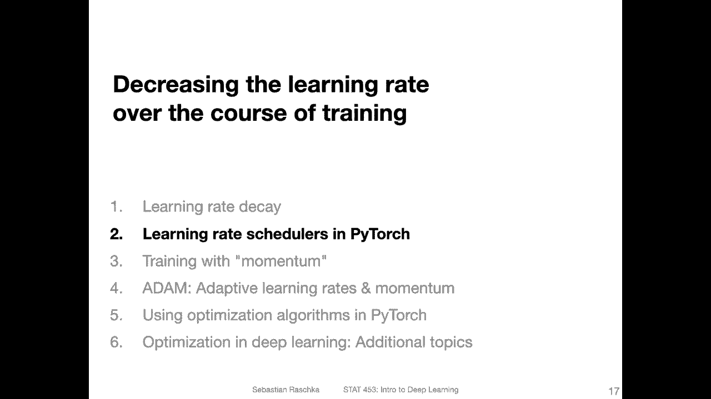

So first， the manual way， the tedious way， we can define our own function to do learning rate decay in pyr。

 So here I defined a function called adjust learning rate。

 and this is implementing the exponential decay that we talked about in the last video So what it is doing is it's every 10th epoch So this line may read a little bit counter intuitivetuitively because。

This modulus operator is essentially doing a division and then returning the remainder of that division so。

If I have a number that is not divisible by 10， it will return the remainder。

And here it's essentially saying if there' is no remainder， then do this。

 So it's essentially doing something every 10 epochs。So if the number is divisible by 10， do this。

 And what I'm doing here is I'm essentially implementing together。Exponential decay。

 And I'm applying it to the learning rate， so。I implemented this in a way here that looks a little bit complicated。

 that is because there are different optimizers and some optimizers have yet different learning rates for different parameter groups and so forth。

 so this will essentially take care of updating all the learning rates that are relevant。Alright。

 so this would be the tedious way。 And then you can call this function after every epoch。

 So if you have a follow so far epoch。In。Ringe。Apoch or something like that。And then for each。

 I'm not writing it all， but for each mini batch， essentially。

Then you do your training and you would have this function。For each epoch， but not for each mini。

 So would you would put it。Essentially， here， like come adjust。Learning rate and so forth。

 I can't write down here because I have my color bar here。

 but you would put essentially the the function here adjust learning rate with the optimizers input。

 the epoch number， the initial learning rate and the decay rate and then it will update every 10th epoch。

 However， this is just the the manual way。 So you can see how you could implement it yourself。

 if you have an idea for a new learning rate。 But in practice， if you want to just use an existing。

Common way of doing learning grade decay。 You can use one of the build in functions in Pythtorch。

 So for that， I recommend going to this website。 They have a selection of different。

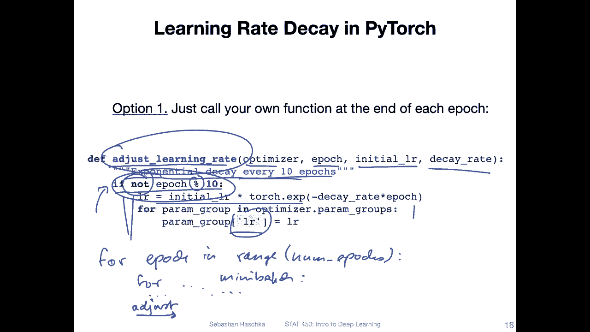

Learning rate schedulers here' is just an example。 that is a very generic one。

 So here I chose a screenshot of this particular example because it came with a practical example。

 so I didn't have to retype it。So how this works is essentially that you initialize the scheduler。

 So here it's this a Lada learning rate scheduler。 you give it the optimizer and then these values。

And then you iterate over the epochs and then for each epoch you call this dot step essentially。

 and then you have your train function and radiation function that we usually use in this class too。

 So essentially you there are two steps only one step is initializing it。

 and the second step is yeah essentially using it and that's it。

And you can do that with any type of scheduler they have on that website。

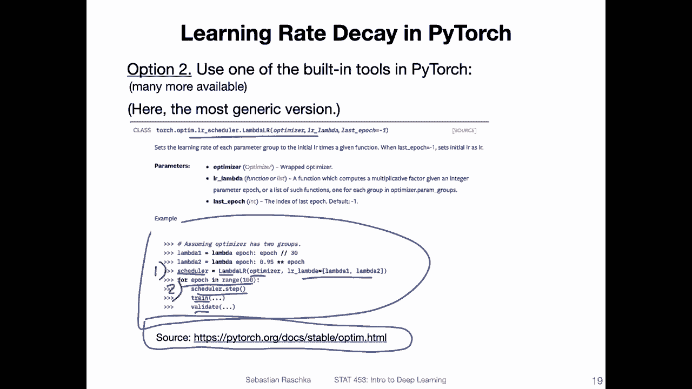

So here I'm showing you now how that works with the exponential learning grade schedule。

So here I have first an initialization of a model。Then I initialize my optimizer here。

 I'm using a stochastic gradient decent optimizer， and then I'm initializing my scheduler。 So here。

 notice I'm giving it。The optimizer as input。

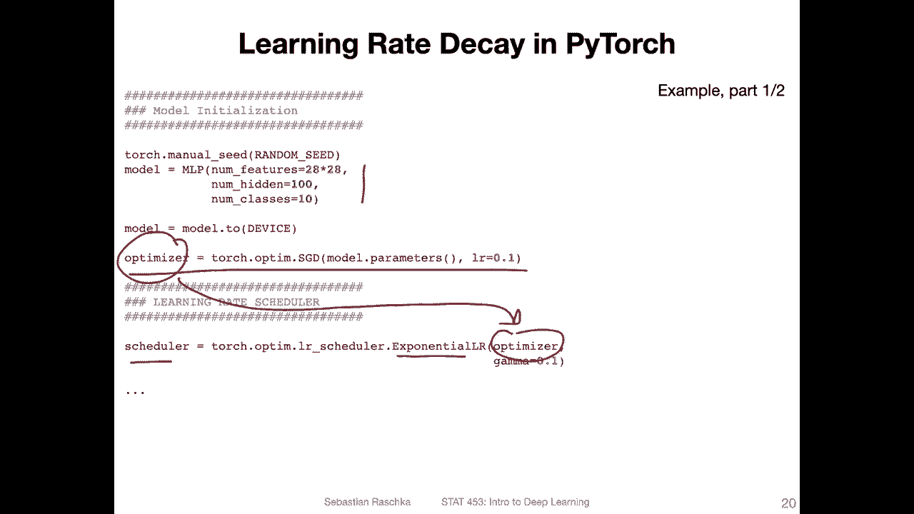

And then I have my main training loop。 So 5 epochs set my model into training mode。

 and then I iterate over the mini batches。 And this is our。Typlicical model training， so。

We call the model， compute the loss， set the gradients to 0， do back propagation。

Yeah do the gradient So here this is the applying the gradient。 So backward。

 we'll compute the gradients here we are doing the gradient update。 Here's some logging。

 And then notice after the epoch that's where we call the scheduler step。

 but you can also actually put it up here if you want to。 so it doesn't really matter。

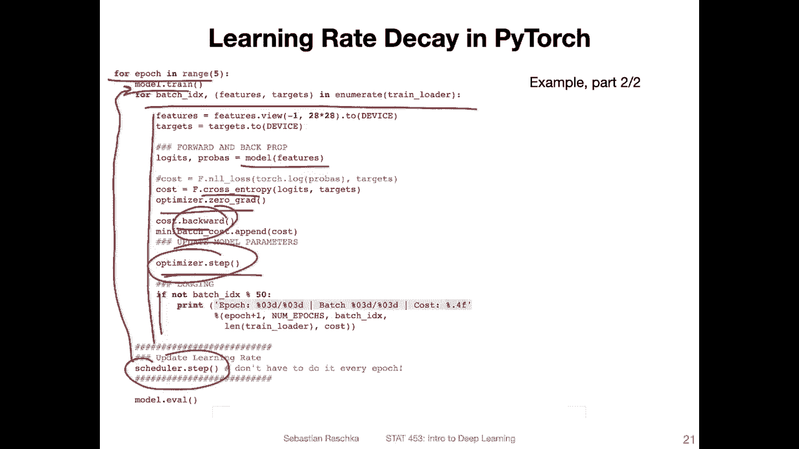

Alright， let's now talk about my favorite way of learning rate decay so I'm not using learning rate decay that often because I usually find that Adam an optimizer that we will be discussing later works pretty well out of the box but yeah sometimes I compare it to SGD and learning rate decay and I find it actually yeah this method works actually best compared to other methods I've tried and yeah I got this from a paper in 2016 on deep residual learning which is the paper that originally proposed the Renet which we will be talking about also yeah next week it's among the most popular convolutional in your networks here。

But yeah here I'm not sure if they proposed this learning rate decay method for the first time。

 but yeah that's at least I got the inspiration for that So what they do is they use regular SGD with a mini batch size of 256 and then they start with a learning rate of 0。

1 which is actually quite large for SGD but yeah they start with 0。

1 and then divide by 10 every time then when the error plateaus so essentially if they do the training and notice that the loss doesn't further go down I mean of course there's some wiggle room so。

If it stays， let's say， within a certain margin， then they divide the learning rate by 10。So yeah。

 that's the whole trick。 And they also actually use。Weight decay of 0。0001。

 So weight decay we discussed this in the previous lecture that's essentially L2 regularization and they use a momentum of 0。

9 and momentum I will explain in the next video。

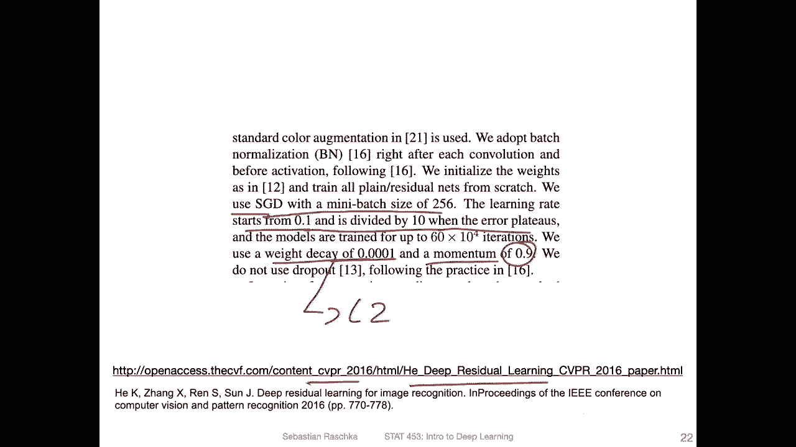

But let me show you how this works in practice in Pythtorch， so I prepared a code example。

 so I put it here as scheduler I as an iyth or Jupiter notebook and I will share that on the repository like always so I will include a link。

Another video。 And yeah， so what I'm doing here is I'm initializing the multi layer perception from last week where we used batch norm and dropout and I'm now using a S GD with a learning rate of 0。

1。 And here this is the。Learning rate scheduler from Pyrage that can be used similar to what they proposed on in the previous slide。

 where they have basically the。

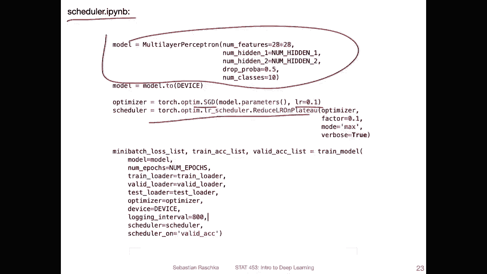

Monitoring of the plateauing error and the divide by 10 every time the error plateauus。

 So this is essentially this learning rate scheduler here， so。

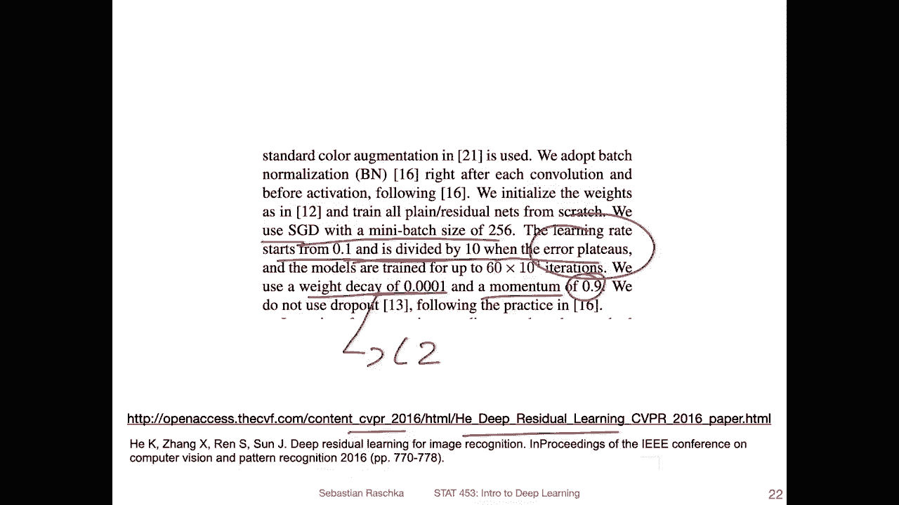

I am providing it with the optimizer and the factor is essentially by how much we divide it， so 0。

1 means times 0。1 and times 0。1 is essentially dividing by 10 like they described in the paper。

 but yeah you can of course change that it's another hyperparmeter。Then theres a mode。

 So the mode it really depends on where or what you apply this to。

 So you can apply this to anything you like during training， so。

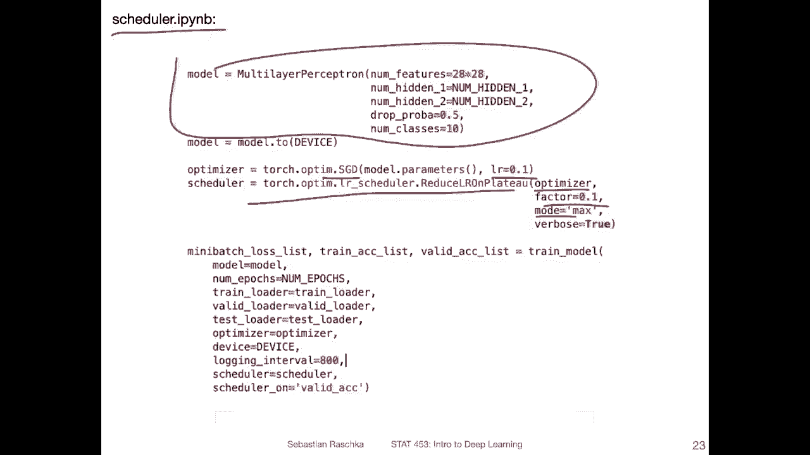

Here， they say。Eror， it's not quite clear what they mean by error。

 It could be either the loss or the classification error。 personallyally， I tried different things。

 and I find it usually works best if I do this on the error on the validation set or accuracy on the validation set。

 so I usually like to work with accuracy instead of error because I don't know it's more positive。

 It sounds better like having a high accuracy sounds better than having a low error for some reason I don't know I like accuracy。

 It's maybe also because in the context of psychic learn。

 everything is an accuracy and I really like psychic learn。

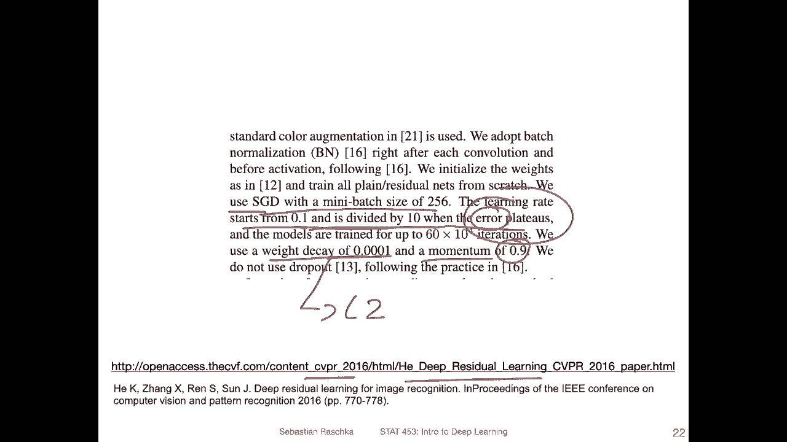

It's for those who haven't taken 451， it's a package for traditional machine learning。

 which has a very nice API anyways so。Here I have a modified version of my train model function that we used in previous lectures。

 I will show you the relevant parts in the next slide。And。😔，I'm applying this reduce L or。

L R on plateau method scheduler to the validation set accuracy and。Essentially。

 I'm saying I want to maximize the validation at accuracy。 So every time it plateaus。

 I want to divide the learning rate by 10。 So I'm， I'm saying max， because for accuracy。

 the higher the better。 if I use the mini batchche laws， I would put。Min here。Right， so。Essentially。

I tried it with many different things。Training set loss， that training set accuracy。

 the validation set accuracy， the validation set loss。

 and from all my experience I find that using it with a validation accuracy happens for me at least to work best。

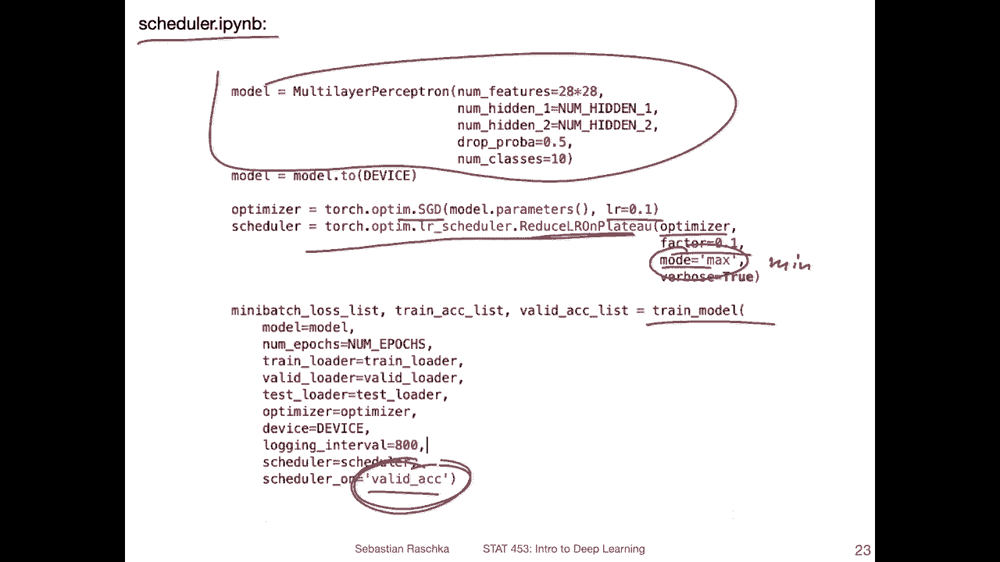

Alright， so and here are the relevant parts from this。

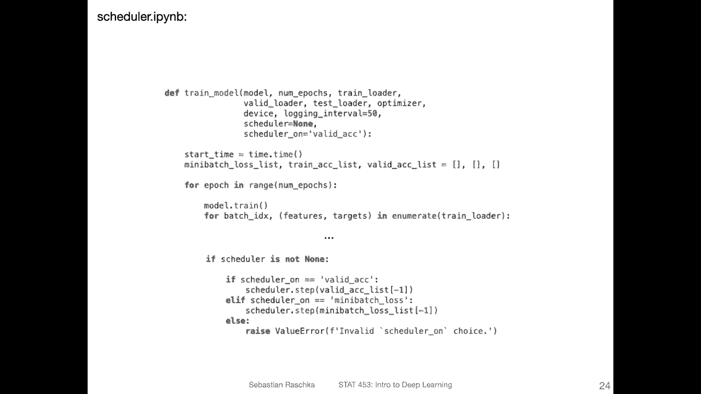

Oh。

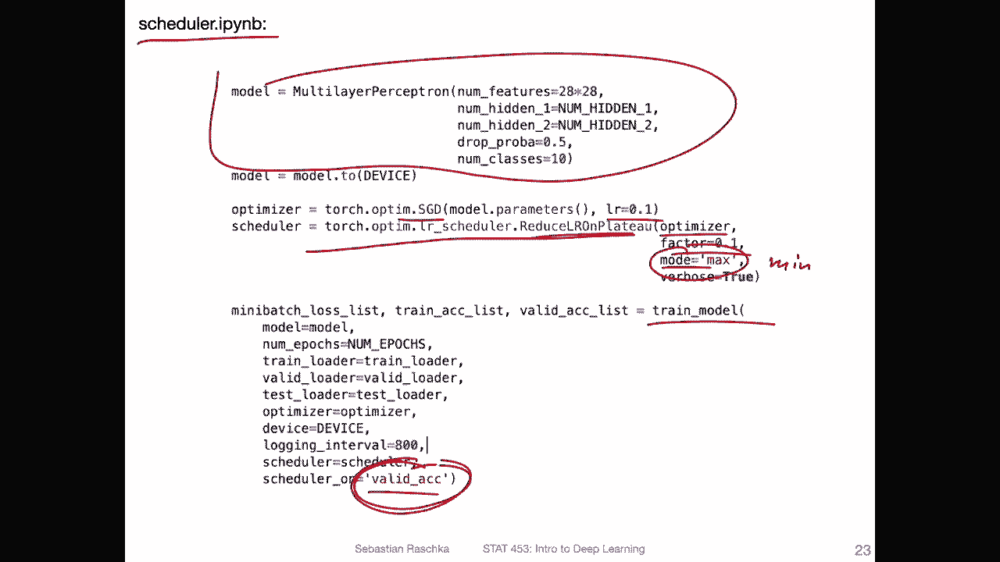

Train model function。 So here I zoomed in。 again， you can find it next to this notebook in the Github repository。

 I will include the link at the bottom。And。Yeah， essentially， we have。The loop over the epoox。

 then the loop over the mini batches here I。Just left out all the code because it would be too long otherwise。

 And then I'm just saying if we use it schedule so this can is by default none。 but we can。

 of course， like I showed on the previous slide。Pviide here the。Scheduller。

 So if we have a scheduler and it's set to validation accuracy。

 it will essentially just do this step based on。The validation accuracy which we collect during training so I have a validation accuracy I keep track of during training I do this for logging purposes so I can do a plot later on and so here I do it on the latest validations set accuracy if it hasn't improved substantially compared to the previous iterations so I think it's for over three iterations then it will divide the learning rate by a factor of 10 but you can also set。

A number。To include， like， how often does， does it have to stagnate before you divide by 10。

 So there are a lot of options that you may also want to choose。

 But I found just this works well for me。

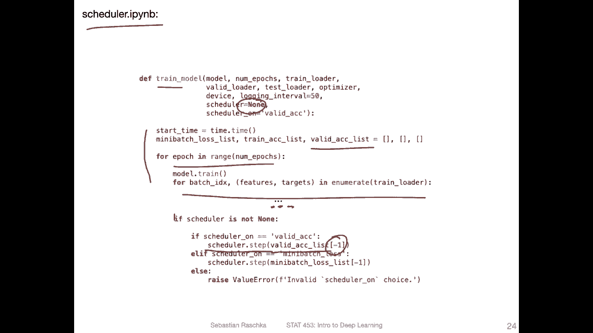

Yeah， related to learning rate schedulers and optimize us。

 I also wanted to say something about saving models in Pytch。

 We haven't talked about saving models in Pytch yet。 but yeah。

 it's kind of an important topic right So if you train a model。

 let's say for a certain number of iterations and you want to use it another day for making predictions it's of course yeah important to save that model so you don't have to retrain it from scratch every time right but also sometimes you just want to train it longer。

 let's say you train it for 100 epochs and you find the loss has not quite converged yet let me train it longer So instead of just rerunning the training from scratch you can in that case then just let's say lot your model from let's say a previous round and then continue running it。

So saving a model in Pytrch is actually quite simple， so there are two ways of doing it。

 but I will only show you the recommended way of doing it。

 so the recommended way is using TorchSa on the model state dictionary。

 so the model state dictionary contains all the model settings and also all the model parameters。

However then also if you use an optimizer that has a state， for example。

 if you use SGD and change the learning rate， the learning rate would be a state essentially。

 so you can also save that so here you can do optimizer do state di and then it will also save that it will all be saved as I think they are actually pickle files but I'm actually not sure I think they could be Yal files I honestly forgot I just call them do P files pytorch files。

And yeah， these contain the settings for your model， essentially。

And then if you want to load your model， you can use。Also you have to do into steps。

 you have to first initialize your model。Because here really you are only。

 youre only saving the parameters of the model， like the weights and everything and。

Here you can or here you， for instance， initialize your model。

 It has to be the same model that you saved。 And then what you do is you。

Have like this load state dict。 So it's easy to remember because this is called state dict here。

 And this is essentially just load state di。 And then， but you have to do an inner torch load here。

 which is loading this pytorrch file。 So if you do that， it will load the model。And。😔。

It will essentially load the weights。 So in this static the weights。

 it will load the weights into that model here。And that's all there is to it， essentially。

If you have an optimizer， though， that you saved and you want to reuse。

 you do the same thing here for the optimizer。 For instance， you just initialize a blank optimizer。

 Let's say S GD optimizer with a model parameters and then。You load the state tick。

 so if you had used a learning rate scheduler that changed the learning rate。

 it will then update the learning rate so you don't have to remember or check manually。

And then yeah also for the scheduler， if you use the exponential。Schedulular， it will， of course。

 yeah change over time， right， So in that way。You can also， then。Yet。

 Lordless scheduler with its parameterss。Alright， so and that is essentially how you save and load models in Pythtorch。

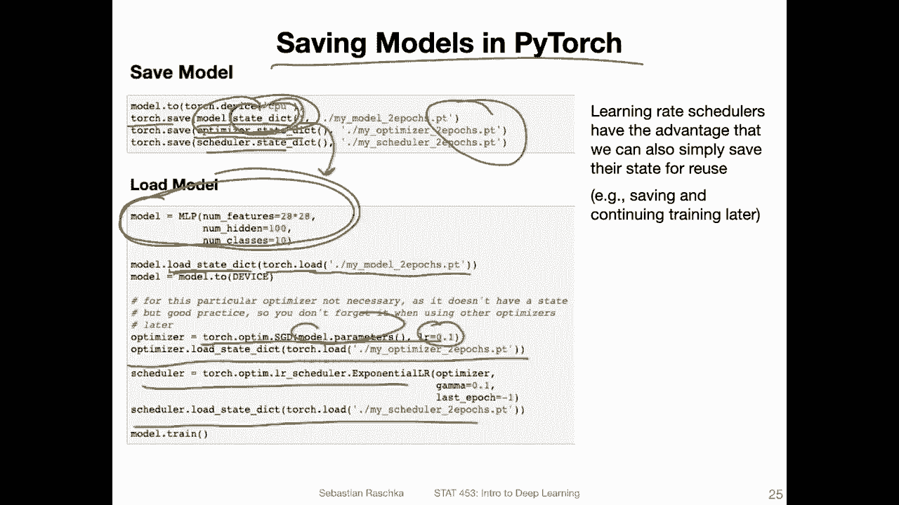