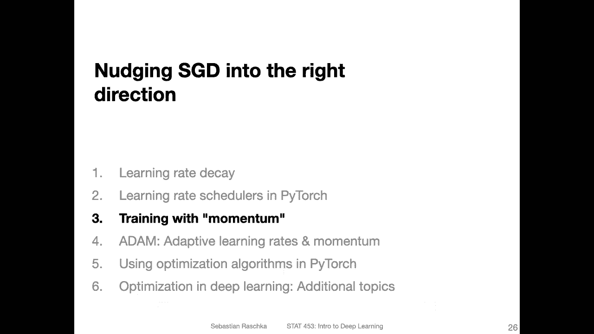
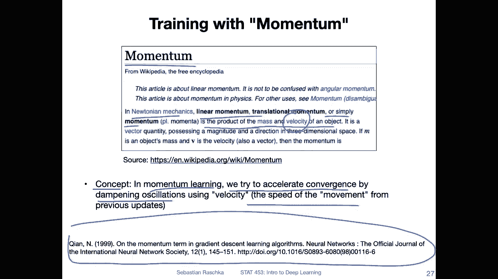
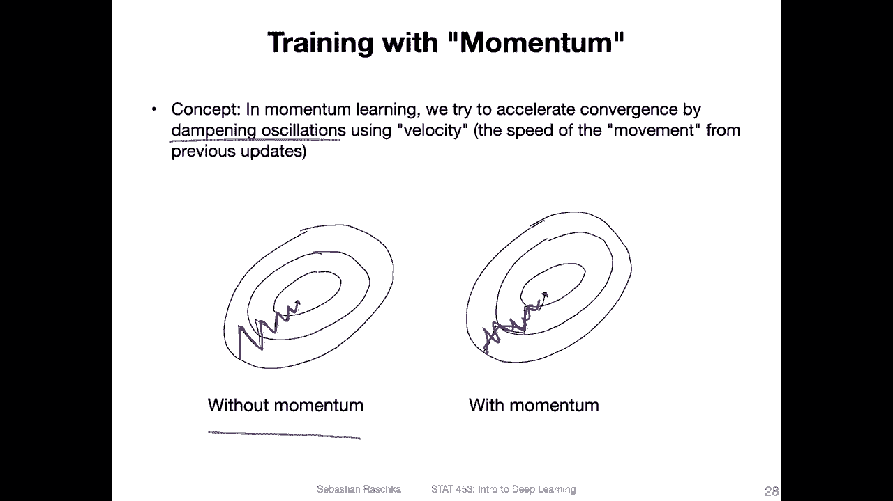
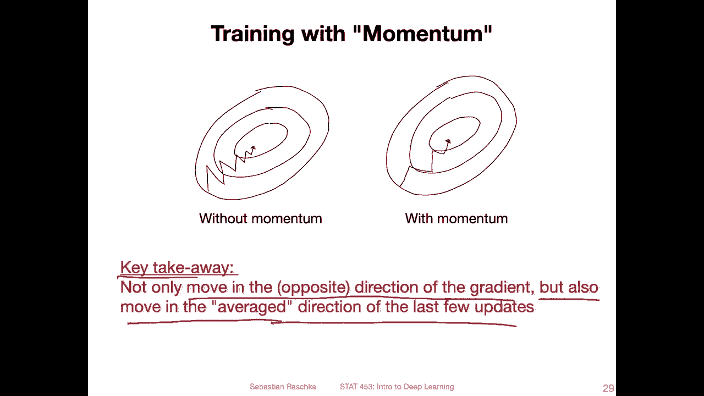
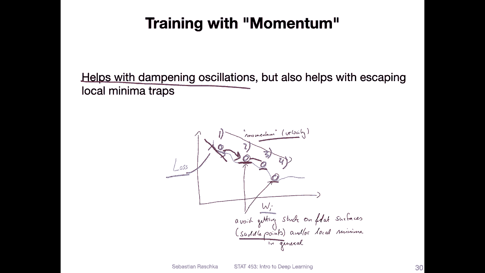
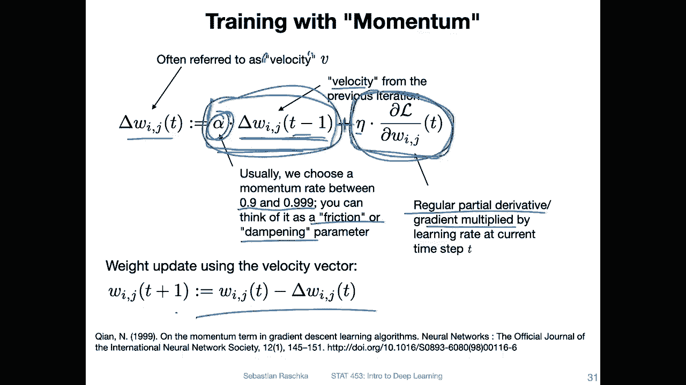
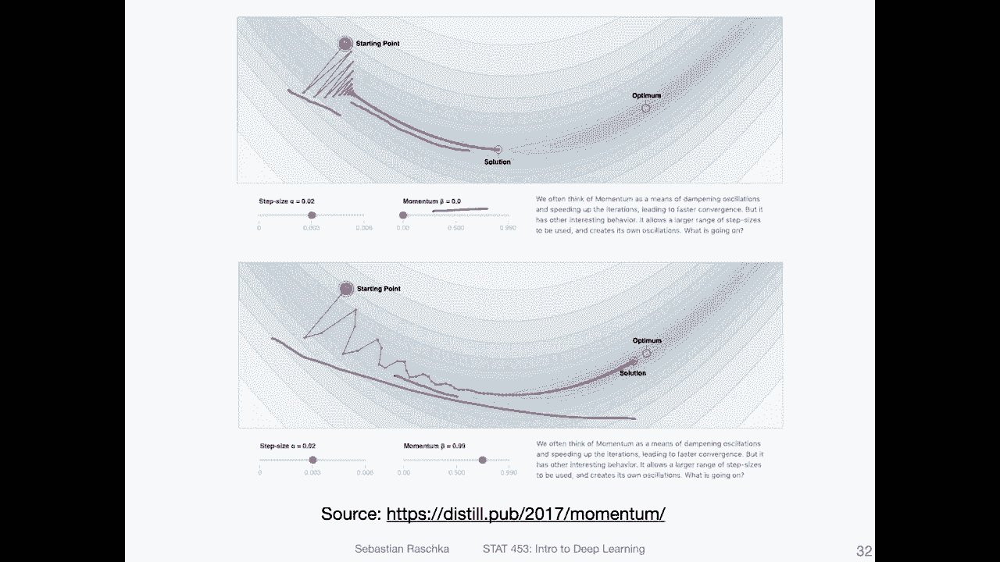
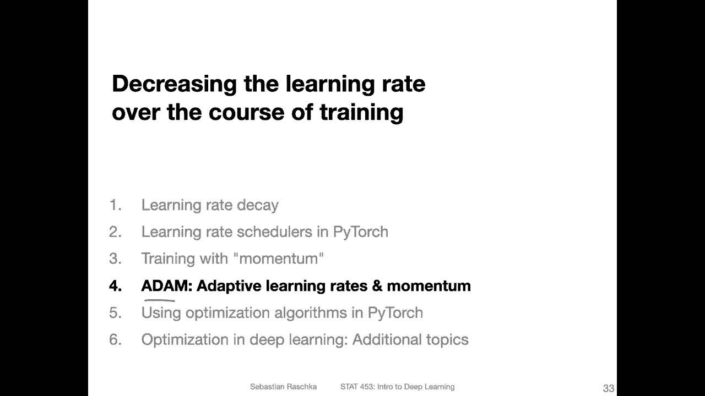

# 【双语字幕+资料下载】威斯康星 STAT453 ｜ 深度学习和生成模型导论(2021最新·完整版) - P93：L12.3- 具有动量的新元 - ShowMeAI - BV1ub4y127jj

Alright， let's not talk about momentum learning， momentum is a term that we can add to SGD such that it takes into account the previous updates and stabilizing stochastic gradient in descent。

Ma essentially making it less noisy。 So here's a definition of momentum from physics and from Wikipedia here。

 So in Newtonian mechanics， linear momentum or translational momentum。

 or simply just momentum is the product of the mass and velocity of an object。Of course。

 when we talk about stochastic gradientding descent and weight updates， we don't have a mass。

 but we can consider a velocity of the updates like near the speed of the updates essentially。So。

What we are trying to do in momentum learning here is essentially is we are trying to accelerate the convergence by dampening oscillations using this velocity。

 which is the speed of the movement from previous updates。 so by。

Take a kind of taking into consideration how yeah the updates have progressed over the course of the times。

 we can use that to yeah to dampen these oscillations essentially。

 and this goes back to a paper from 1999， but it's still a very popular technique and deep learning。

 especially in combination with learning way decay。

So here's an illustration of how this looks like， how we can dampen oil。

How these oscillations are dampened。 So on the left hand side is just a sketch of how。

 yeah mini batch learning with S GD might look like where we have due to the noise。

 this little zigzag。 But you can see on average， I mean， there is some， some。

 force going into this direction， and we kind of can use this velocity。

To yeah to add this velocity to the updates to dampen out this oscillation such that the oscillations here weakened。

 so it's not not like before like as noisy as before it's a little bit dampened。

Yes， so the key takeaway is essentially this in regular gradient descent。

 we usually move in the opposite direction of the gradient。 So it's like the usual update。

 but now with momentum we now also move in the average direction of the last few updates。

 So we look into the average direction from the last updates essentially that's our velocity。

So why does it help， I mean， it helps with dampening the oscillations。

 but it can also help us to yeah jump out of local minima because imagine this if you yeah if you do the updates there are maybe noisy but at some point you land on a flat surface。

 then the gradient will be zero right and how do you get out of this flat surface。

 so the velocity term， the additional velocity term can actually help pushing you out of this yeah of this flat surface。

So I was trying to illustrate this in this drawing here at the bottom。

 So here this is our loss for some weight W I。 So again， just a very simplified loss on curve and。

This red line here。 Yeah， the one here。 this is our loss。And these circles are。

 let's say the current locations and a current time step。 So let's say this time step 1， time step 2。

 time step 3， time step 4。And it may happen。 So you go down here。 So there's a certain。Slope， right。

 So this is fine。 And then the next update is this one。 But now you have this flat surface。

 So there's essentially no gradient right。 So there's no slope。 it's flat。

 So regular gradient descent would stop at this point because here adds a flat surface by this velocity。

Because it's taking the average direction of the previous updates into account may give just the necessary push to fall further down。

 basically。So using these velocity terms that can help us basically escaping local minimal or saddle points where we we have flat gradients。

Yes， so how does this velocity based updating look like concretely， here。

 I was trying to sketch this out。 Let's walk through it， step by step， so。

Let's start at the bottom here。 So this is essentially if you just look at this without reading anything here on this slide。

 this is essentially our regular gradient descent update that we do in S GD。

So let's say we want to update weight W I J in the network。 So T is the time step。 So at the current。

 let's say T plus1 is the current time step or then。The weight that is used for the next iteration。

 So we consider the weight at the current time step， minus Dlta。

W I J T at the current time where this is here the partial derivative of the loss。

The loss with respect to that weight times the learning rate at。So this whole thing here。

 that's how much we change the weights essentially。Okay。

 let me delete that a notation because there will be lots of more notation on that slide。

 and It want to make it too cluttered。 But again， so this at the bottom is essentially how the regular gradient decent would look like now。

 instead of using。I actually up here instead stop using the regular partial derivative of the loss with respect to the weights multiplied by the learning rate Eta。

 we modify this。So we add an additional term here。 This is shown here。

 So we are adding it to this regular update。And this is the we call this whole thing。

 essentially the velocity。So instead of just using this。This part， which we usually used before。

 we now have this party here on the left hand side。 So what is this， So it is。

The Delta W term from the previous time step time t -1。

 That's the velocity of the previous time step。And the alpha here， this is the momentum rate。

 usually in practice， we use the momentum rate between 0。9 and 0。999。And you can think of it as a。

 yeah， as a friction or a dampening parametermeter， right？ So the larger we make this。

 the larger this term， the previous velocity term will become right？ So in that way， the。

 the larger this。This alpha is。The more。The normal。Update will be influenced by。The previous update。

 So this is essentially。Like a moving average， in a way。Yeah， and this is essentially it， right。

We are essentially。Just adding the previous update to it multiplied by a certain number。

 and essentially you can think of it as a moving average。Well， yeah， that can is a velocity term。

 a momentum term。And this one， then we call it the velocity， and we use it and。To update the weights。

 And this is essentially how momentum works。 How does momentum look like in up like in practice without my yeah scribbled the sketches that I showed you before。

 So here' is actually a real simulation of momentum。 So here they call that alpha term beta。

 But yeah， we call it alpha same thing。

And here I'm showing you this for two momentum values。 Here is zero momentum。

 So that's just like the regular gradient inscent。 And again。

 this is like for a very nice lost surface here in real world scenarios for deep learning。

 you won't have such a nice loss surface。But this is just a simplification， of course。

So here you can see it's very noisy， very oscillating。 And with momentum， yeah。

 it oscillates less essentially。 So it's a bit more stable because。Considering the average direction。

 you can also see there are probably fewer updates。 Yeah。

 definitely fewer updates because you can see these points are very close to each other。

 whereas these are more spaced out。Yeah， this is essentially how momentum works and looks like。

In the next video， I will talk about adaptive learning rates。

First there's also an algorithm called RMS Pro， and then we will combine these adaptive learning rate concepts with momentum which will yield atom。

 which is probably the most widely used SGD based optimized and learning。

