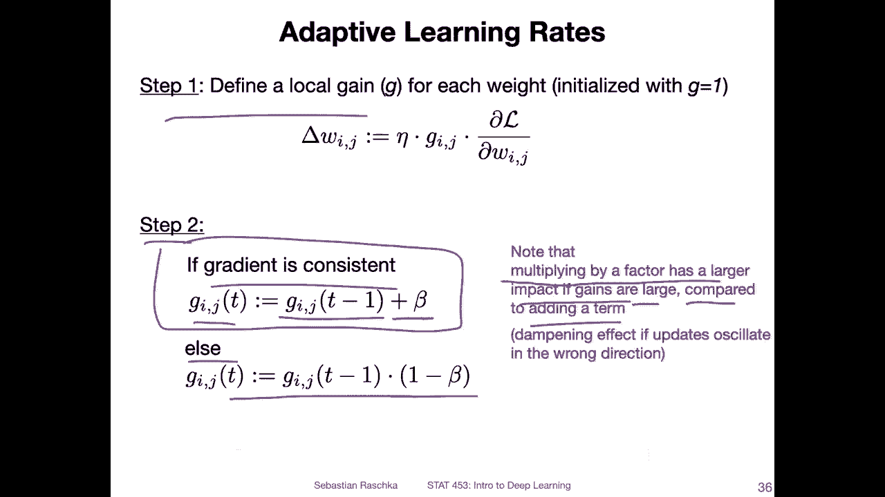
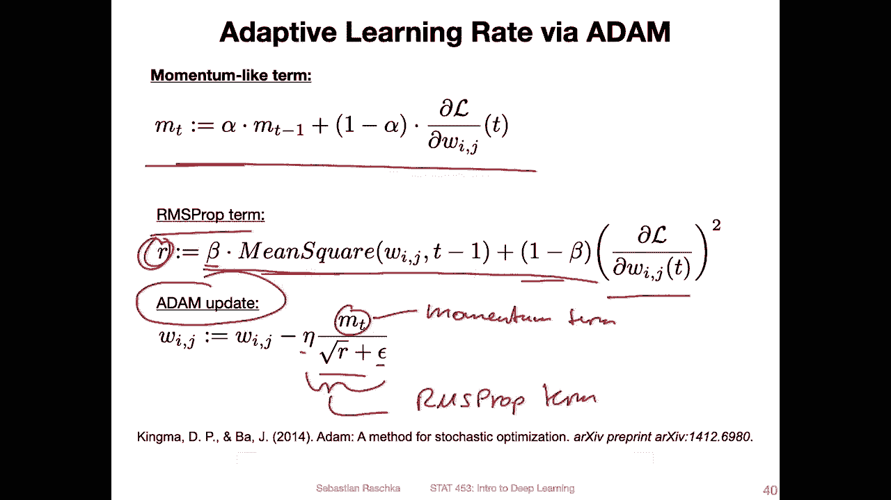
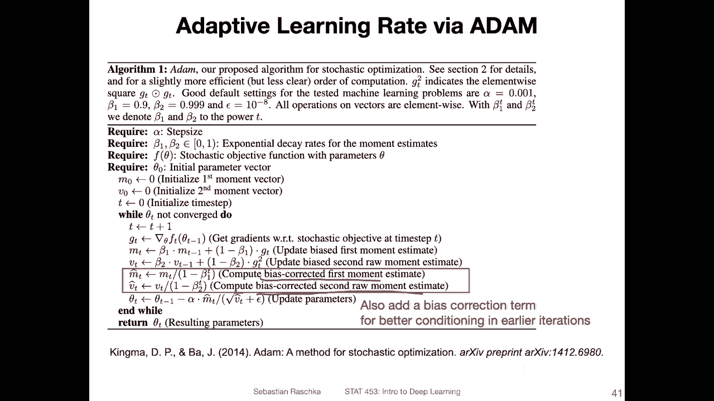
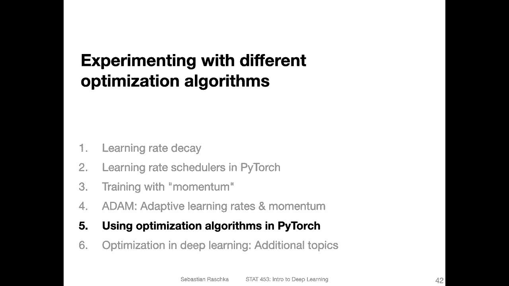

# 【双语字幕+资料下载】威斯康星 STAT453 ｜ 深度学习和生成模型导论(2021最新·完整版) - P94：L12.4- Adam：结合自适应学习率和动量 - ShowMeAI - BV1ub4y127jj

Yes， so in the previous video we talked about adding this momentum term。

 which is essentially a velocity term that helps dampening the oscillations in stochastic gradient descent。

 but it also can help with overcoming like flat regions on the loss surface， for instance。

 saddle points or local minima。So in addition to this momentum term we learn now about a slightly related also slightly different concept called adaptive learning rates。

 so adaptive learning rates are essentially about accelerating and deaccerating the learning rate at the right moment。

 so speeding the learning up when we are going into the right direction and slowing it down when we change directions。

And then we will see how we can combine this with momentum learning and the combination of both there's an algorithm that does that it's called Adam。

 so Adam is essentially a combination of adaptive learning and momentum learning。

Yeah there are many different flavors of adaptive learning rates out there and discussing them all would be a little bit of out of the scope of this course。

 however yeah just to go over the main concepts I will show you a simple example and yeah the key takeaway like I said in the previous slide is that we decrease the learning rate if the gradient changes the direction and we increase the learning rate if the gradient stays consistent。

So， for instance， if we。Do these updates。 and they are all going to the same， roughly same direction。

 Then we accelerate because， yeah， in this way， it's probably likely the correct direction。

 So in that way， we can just speed it up and converge faster。However。

 if we have something where we change the direction， for example。

 So let's say we have an update like that and there's another change。

 then it will slow down the update so that it is， if it's a wrong direction。

 there's maybe some noise so that it is not heading too much into this wrong direction， for example。

 So if every time there's a change in direction， it will essentially slow down。

Yeah， so how does it work， How can we use an adaptive learning rate There are essentially two main steps for doing that。

 so step one would be initializing a so called local gain for each weight and if you look at this。

Here， when we compute the Dlta WI J term and。If you only， if you。Remove this one。

 This would essentially look like the regular。Delta term that we compute。

 So this is essentially our gradient。Of the loss with respect to that weight that we want to update times the learning rate。

 So this is the learning rate。But the difference now is that we add this gain and the ske。

As you can see it's also index IJ， so it's the gain associated with that particular weight and in that way you can think of this one as a learning rate just for this particular weight so you can have unique learning rates for different weights or different directions in that way。

So now after initializing this local gain。We have a second step。

 so this is what we then do during learning。 we are modifying the gain。

 so similar to modifying the weights， we modify the scan。

 so we either increase it if it's consistent or otherwise if it's inconsistent so if we change the direction。

 then we decrease or yeah we yeah we change the dampen the gain essentially。So like I'm saying here。

 multiplying by a factor has a larger impact if the gains are large compared to adding a term addition to in contrast to this edition。

And。That means。 so how this is set up， it means that if we are going into the right direction。

 we are slowly。Accelerating。 So， so this is if we are consistent and we are adding this beta term。

 and we make it a。Bigger by a small value here by beta， let's say beta is 0。9。 We increase by 0。9。

In each。Round， essentially。But if we change the direction， we slow down faster by multiplying。

By this term here， for instance。 So here， for instance， we will multiply a beta is 。9。

 We will multiply this by 0。1。 And this can have a yes a stronger dampening effect when we change the directions。

 This is kind of intuitive， because， yeah。If we， let's say drive a car and we see the road is clear ahead。

 we start to accelerate， but we don't go crazy and stomp on the gas。

 we start accelerating in a reasonable manner。And let's say we want to make a turn or something like that。

 or we are in the turn， usually we accelerate a lot before a turn。

 we don't slowly accelerate in most cases， at least I mean， if it's a very sudden turn。

 if we have to avoid an obstacle or something like that。

 we have to push the brakes pretty hard to turn left or right to avoid the obstacle。

Alright， so there is a particular implementation of an adaptive learning rate that was very popular for yeah。

 for a time。 it is called RMS Pro。 And there I think it's from a cost Jo H taught。

 you can find references to that on the Internet， but there is no official paper of that or corresponding to that。

 It's something Jo Hinton。Who was one of the persons popularizing and working on yeah neural networks throughout。

 yeah， the last 60 or so years， 50 years。Yeah， it has been mentioned in one of his talks and people started using that and it performed pretty well。

 it's essentially a modification of Rrop， which was published in 2000 around 2000。And yeah。

 it's also relatively similar to another concept called Ada Delta。

So the main idea behind this arm is prop by mentioning it because it will be relevant when we talk about the atom algorithm。

So the main concept is we divide the learning rate by an exponentially decreasing moving average of the squared gradients。

 So it's essentially a modified version of this adaptive learning rate that I showed you on the previous slide。

 So the previous slide was a very simple type of adaptive learning rate。

 This is a little bit more sophisticated。Because yeah。

 it takes also into account that gradients can vary widely in the magnitude。

 so some weights or gradients are larger than others。

And the arm S and arm S Pro stands for root means squared，ca it's， yeah related to these。

Squared gradients。And it also has an effect， this dampening effect。

 in addition to the adaptive learning。 it also has this a dampening effect of the。

A momentum on the oscillations。But in practice， yeah。

 people thought it might work better than using momentum， so this arm S prop。

People found works better than just momentum。 but yeah， nowadays。

 people use the combination of atom or people use atom。

 which is a combination of arm S prop and momentum。

Okay， but let's talk about this arm S prop first before we go into the Adamom algorithm。

So there is now a mean square term here。 That is the moving average of the squared gradient of each weight。

 It's kind of in a way， similar to momentum。 But we have now。

 instead of just considering the moving average， we have the moving average。

Of these squared gradients。There's a bitter term。So T is， again， the time step。For instance。

 the iteration。And WI J is the weight we want to update。So we have the mean squared gradient。

Of that weight at a given time step。 And this is computed by multiplying a beta with。

The mean square value from the previous iteration。So， and then on top of that。

 we add these squared gradients for the current iteration。 So this is。The mean term here。Right。

 so this is something we keep from the previous rounds。

 And this is only for the current round for time step T。

 So it's essentially the gradient of the loss or partial derivativeertive of the loss with respect to the weight should be a。

Pel here。And。We square those essentially， so they are always positive values。Yeah。

 and then this is how we compute the mean square value。

 and then we use that mean square value to scale。The gradients at that update。

 So here we are just computing。 This means square term。 And here we are applying it。

 How do we apply this， So if you look at this again， this is like the。Regular。Great incent update。

 right， We take a。Step into the direction， the negative direction of the gradient。

 So we subtract the gradient times the learning rate。But now， in addition to doing that。

 we scale by this mean square term。And we take the square root。

 so it has the same unit as the weights。So and this is essentially it it's very similar to what I showed you before the adaptive learning rate where we have a gain that we modify except that this is a certain type of gain that is working a little bit differently。

And yet， we have the small epsilon to avoid division by zero  errorss。 In a way。

 it's also somewhat similar to the momentum term。 So when we look at atom。

 we will see there are two things， the momentum term in this term。

 and they are actually also themselves very similar。Except this is like a scaling factor in a way。

 and the momentum is something that we add。

On top。So that's then now talk about this Adam because I mentioned it so many times it stands for adaptive moment estimation Yeah and it's probably the most widely used optimization algorithm in deep learning as of today。

 I use it a lot because I find it just works very well out of the box and I always find I get almost always the same or even better performance as with SGD plus momentum and learning rate schedulers but I need way less tuning。

I mean， here， I mean tuning of the learning rate and the strength of the scheduler。So like I said。

 it's a combination of momentum and RMS S prop and to yeah， to make this a little bit easier to read。

I was so also should say if you want to read the original paper， which contains way more detail。

 this is the paper where it was proposed from 2014。 So here you can find also more information。

 So here I'm rewriting this slightly to make this a little bit。

 I would say easier to see how it is related to momentum。So， here。On on top。

 this is the original definition of the momentum that we defined in。TheLast video。

And I'm just replacing this delta W by this m T。 So I'm just using a different notation here。

 I'm just changing the notation， I'm not changing any concept。 I'm just saying， okay。

 let's call this one now at time step T so the momentum term M for a momentum at time step T and here the this is the current time step and this is the time step for the next round essentially。

So here this is the rewritten version of that。But you can see it's slightly different now。

 because we have。This modified version， where we have。Alpha。

 but instead of using the learning rate here， we use  one minus alpha。

 So it's not exactly like the same like the original momentum term。 it's slightly different。

 So we have this one minus alpha。Instead of the atta and the original momentum。

 But you can see how similar it is， right， So we have both on alpha times M， which we have here。

 and we have plus。Here we have the gradient， the same thing， except again。

 the only difference here we have the learning rate and here we have one minus alpha。

Okay， so here I was just rewriting the momentum term from the previous slide exactly the same thing。

 just carrying it over and now we have this arm S prop term that I showed you a few slides ago。

 so here we had the better term for multiplying it with a mean square I'm just abbreviating here as R。

And then we have1 minus better times the squared gradients。

 So this is essentially the same I also showed you before。 Now， I'm just using R。 So it's shorter。

 And then for atom， we combine both。 we have momentum。

So we have the learning rate times the momentum term。 It's essentially a velocity。

 and we scale that momentum term by this。R S prop term。 So squared with R plus this epsilon。

And this is essentially how Adamom works。 So we have。The momentum。Term and here。Y。😔，As。Ch。

Okay on。There is a slight。I would say modification of that in the paper。

 So here that's the original paper。 how it is defined in the paper。

 And what I haven't contained or included in the slides for simplicity was this bias corrected first moment estimate。

 and the bias corrected second raw moment estimate。 So here the difference is essentially that。

I should also say， I'm calling it alpha and beta。

So here they have be 1 and be 2。 So if we go back， I call that alpha just because I was。

 I don't know。 I found it simpler， but this is essentially better  one。And here， this is。Better too。

In the paper， I just found it somehow inin intuitivetu to say alpha and better because wehausa used alpha before when we talked about momentum。

So yeah， they just correct this term by having。Another scaling by so they scale the momentum to by dividing by1 minus beta to the power of t。

 where t is the time step essentially， and they do the same thing for this V term。

Yeah， and this is essentially it， so in the next video I will show you how we can use these optimization algorithms in Pytorch。

😊。

