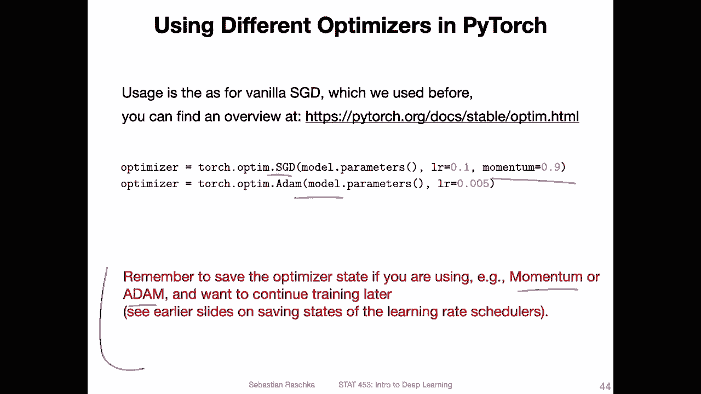

# 【双语字幕+资料下载】威斯康星 STAT453 ｜ 深度学习和生成模型导论(2021最新·完整版) - P95：L12.5- 在 PyTorch 中选择不同的优化器 - ShowMeAI - BV1ub4y127jj

嗯。Alright， let's now talk about how we can use these optimization algorithms in Python。

 and I can promise you this is going to be a very short video because it's super simple to do in Pythtorch。

So the most common optimization algorithms are still SGD， the regular SGD with momentum。And Adam。

 there are， of course， other optimization algorithms。

 and I will mention some of them in the next video。 But yeah。

 these two are usually the ones that most people use in practice。

And if you are also interested in using other types and exploring them。

 you can also find them here under this website and there's also a more detailed description of the parameters that we can use。

 So how we used them here we have or used Opim SGD before in previous code examples and in the homework。

I think so right now the only difference is really that here I added the momentum term to it。

 Usually I find that using a learning rate of 0。01 or 。001 works well， but you have of course。

 to experiment with it。 It really depends on the data set and weight initialization and。

Data normalization， batch norm and so forth。 There are many。

 many things that affect finding a good learning rate So it's something you have to try out in practice。

 When I use SGD， I usually also use a learning rate scheduler。

 I will show you or give you the code for reference later in the slides。

And if I use a learning rate scheduler， I usually also use a learning rate of01。For。Adam。

 I usually don't do anything。 I use usually a learning rate of 0。001 or 0。

005 These usually work well for me but again it depends on the problem I recommend also exploring some different learning rates。

 but most of the time something like 0。005 works well for me and it's sometimes also easier to find a good learning rate with Adam compared to S GD with SGDF have to yeah try out many more things to get it to work with whereases with Adam。

Usually， multiple learning rates can work well in practice。

So if you are using any of these like the momentum or atom versions also the momentum version of SD or Adamom。

 then yeah and you want to save your model for continuing training later on you also have to save and load the optimizer because yeah there is now a given state So there's a state for the momentum and also for the adaptive learning rate component。

 the RMS component。 But yeah I talked about。Saving and loading optimizes in an earlier videos。

 I think it was like two or three videos ago。 So if you work with yeah。

 the momentum version or the Adam and you want to continue training at the latest time point。

 make sure you know how to save and load the optimizer states too。

So just a little bit more about Adam。 So in the previous video。

 I showed you that there are two parameters。So the alpha parameter for the momentum term and the beta parameter for the R S Pro term。

 yeah， they are also available to modify in the atom optimizer。

 So here they are both called betas like in the paper。 So this would be beta 1。

And this one would be beta 1，2。And this one would be then beta 2 and beta 2。

 So just so you know what they mean。 So the first value is for the momentum beta and the second value is for the R S prop beta。

 Personal， I never change these。 It usually works well for me just keeping them as they are by default and also in many papers when you read deep learning papers。

Almost no one changes these parameters， they always。Say they use the default parameters because yeah。

 they usually work pretty well in practice。

Here are two examples。 so of using these different optimization algorithms。 So here I was using。

An S GD with a learning rate scheduler havinglving the learning rate when it plateaus and also a momentum term of 0。

9。 So the momentum term here was 0。9， the learning rate。It was 0。1， and it was hved。

Every time the validation accuracy was plateauing when it was not improving so it was fluctuating and then I was having the learning rate to stabilize the training so that it's then more like the fine tuning stage and you can see in the beginning it's rather noisy and then probably after this havinglving it stabilizes more because there's no improvement anymore so we can halfal the learning rate and then remove that oscillation so that's what I was doing here and with this setup I reached accuracy of test accuracy of 97。

34% on the right hand side I was just using atom with default parameters I think I used the learning rate of 0。

005 here。And I got yeah also essentially the identical performance。

 but yeah you can see because we are not we are not using the learning scheduler here。

 probably we see it's a little bit noisier here around that region， but to be honest。

 both work perfectly fine in practice。 and I find usually Adam works a little bit better for me。

 but I'm also a very impatient person I think if I would。Toy around with the S GD more。

 I could probably also get a similar good performance or even odd performance。But yeah。

 Adam is something， if you are lazy like me， it usually always works pretty well and I kind of like it for that reason。

So in the next video I want to just briefly go over some。

 I would say more advanced concepts regarding optimization algorithms I won to talk about them in detail。

 I just want to mention them like giving you references for future study if you're interested。

