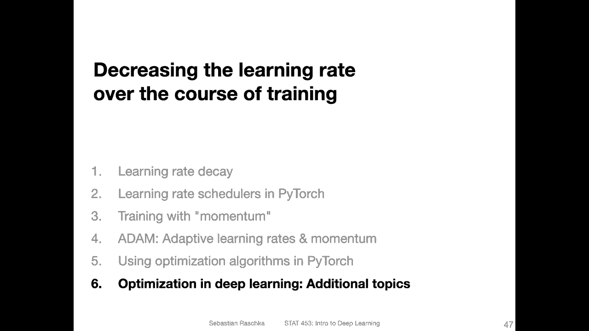
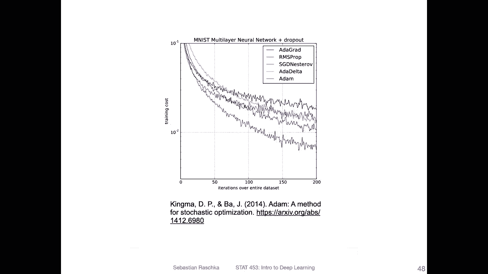
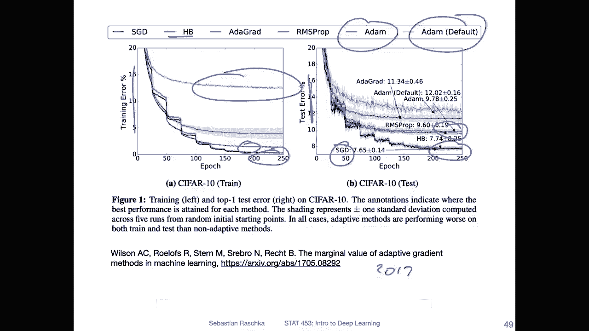
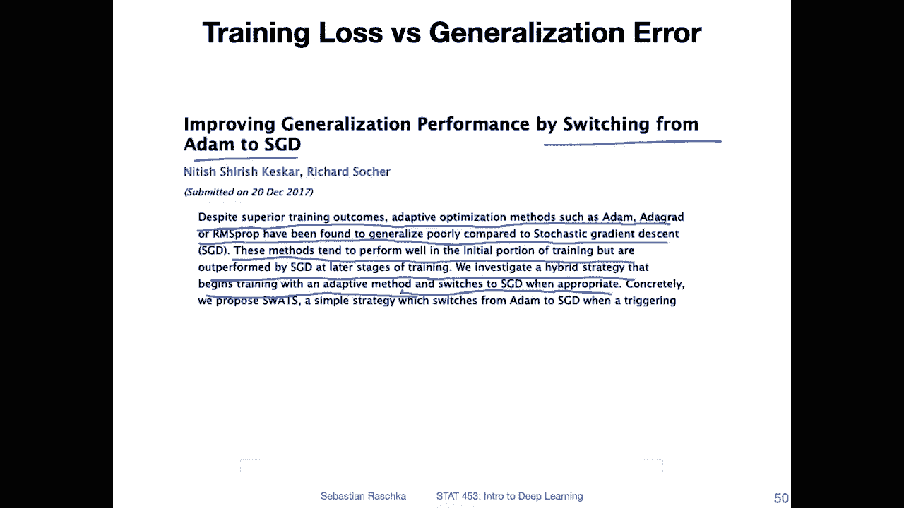
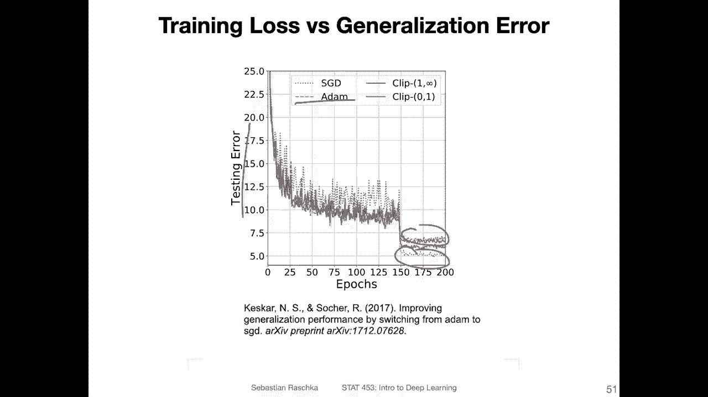
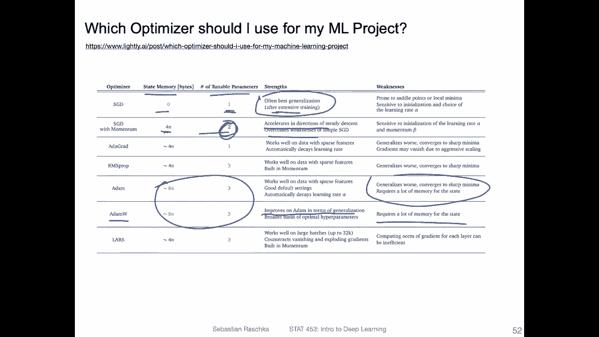
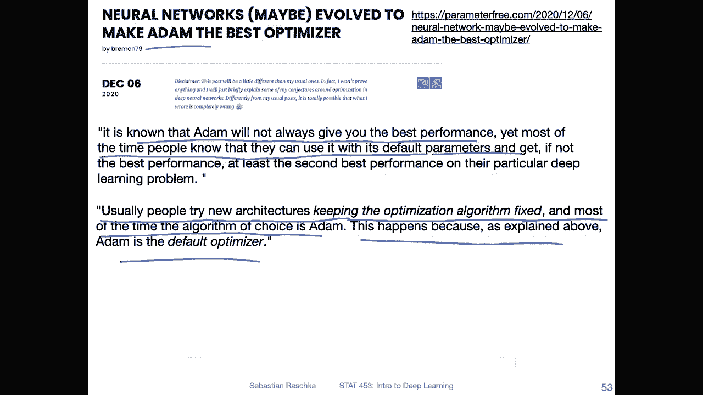
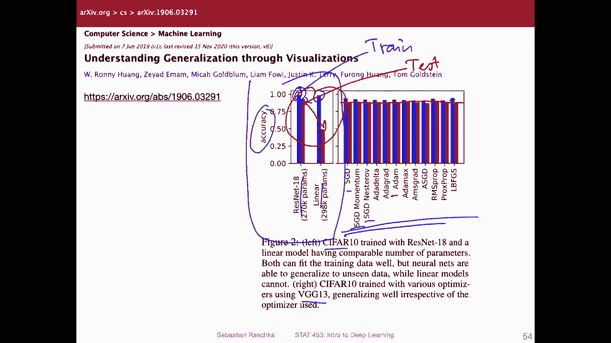
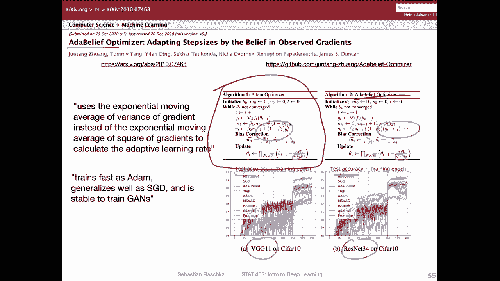

# 【双语字幕+资料下载】威斯康星 STAT453 ｜ 深度学习和生成模型导论(2021最新·完整版) - P96：L12.6- 关于优化算法的附加主题和研究 - ShowMeAI - BV1ub4y127jj

Yeah， I wanted to end this lecture with some additional topics because yeah over the years I bookedmarked so many interesting articles。

 I didn't even have a chance to read them all there are hundreds of interesting articles related to optimization but yeah if you're interested I have a small selection of things here that you may find interesting So let's start with Adam So going back to the original paper。

 the Adam paper from 2014。

So you can see there are several other methods that they looked at and this is from 2014 nowadays there are maybe at least five times more methods out there that people suggest to use compared to regular SGD。

So one thing for example that we also didn't talk about is SGD Nessterof which is a modified version of SGD with momentum。

 It's like this Nessterov momentum in theory it may work better than the regular momentum I also wanted to cover it in this lecture actually I made the slides for that but then I removed them because I noticed otherwise the lecture will be just too long and most people in practice use the regular momentum again anyways so SGd with the regular momentum is also among the best algorithms even though it's the simplest one and I will explain to you in a few slides why so Adam like I said is cool because it doesn't require as much tuning but also SGD is also in terms of generalization performance really good。

So。To make this point， so this plot， this is looking at the training cost or training loss。

 and you can see in this paper they find that Adam really performs best compared to other methods when it comes to the training cost or loss。

However， a training low training cost doesn't imply that yeah final model generalizes well to new data。

 maybe it's just overfitting So what I mean is of course we want to achieve a low training cost but that alone is not enough we can end up with a low training cost but then if we have a high degree of overfitting then the resulting model still isn't so good。

 for example， compared to a model that has a higher training loss but lower overfitting and may have a better generalization performance。

So to explain you more in detail what I mean， here's a visualization from a paper from I actually don't know which year I think it was 2017 I should have included it here but。

Here they also looked at the different optimization algorithms。

 They looked at the trainingarrow here。And the test error。

 So what is interesting is that they find theyve Adam the。

What optimized one like hyperpar tuning and the default one。 Most people I said use the default one。

 but in this case， the default one performs really bad。 the tuned one performs better here。 But yeah。

 in contrast to the previous slide that I can't explain in contrast to the previous slide。

 they find that on the training set S GD performs better than Adam。 So HB is heavy ball method。

 it's another method。 But this is like a little bit different from what I've shown you in the previous slide。

Nonetheless， the takeaway here is more like what's happening on the test set。

 so on the test set that is usually what we care about here they also find that regular SGD performs better than Adamom。

And this is not unique to this single paper， this is something that has been observed by other peoples as well that SGD。

 if it's tuned well， it has usually the best generalization performance one possible explanation for that is that SGD is just noisier and because of this noise it's maybe easier to avoid certain sharp minima or it's easier to it's say first of all wiggle out of some local minima but then also maybe to don't find such a good loss so if you find a loss that is very low you may end up overfitting in that case maybe having a higher training loss is maybe sometimes not as bad。

Okay， so that is one point why people still sometimes prefer S GD compared to more fancy algorithm algorithms like here listed here。

嗯。Yeah， there was also a fun paper where they。Essentially suggest switching from atom to S GD over the course of training。

 so they say despite superior training outcomes， adaptive optimization methods such as Adam Edgrad or R SPp have been found to generalize poorly compared to S GD。

 So it's essentially what I said in the previous slide that regular S GD can usually yield better generalization performance。

Then they say these methods tend to perform well in the initial portion of the training。

 but are all performed by S GD in the later stages of training。

 We investigate a hybrid strategy that begins with training an adaptive method。

 So using Adam and then switching to S GD when appropriate。

So here they have essentially compared S GD and at。 So using SGD first。 and then sorry。

 using at first and then switching to S GD。

So yeah here is also again， a plot showing the test error showing that with S GD。

 you can end up with a lower test error or a better generalization performance compared to the orange here to atom。

Here's a block article。Also listing all the strengths and weaknesses of these different algorithms like taking an objective view so here they didn't develop a particular method because usually when you read a paper where people propose a new method。

 the new method is of course better than the previous methods but here this is someone just summarizing these different methods and coming up with some takeaways so yeah in terms of the state memory。

 how many memory。That requires an addition on your GPU because you have additional parameters。

 but then also the hyperparmeter that you need to tune。So of course， SGD is the simplest one。

 when we add an additional number of parameters here。And also tunable parameters。

 I don't know where the second one comes from。 Yeah， one is the learning rate and the other one is。

 of course， the momentum term。 but the better。 But yeah， I was just wondering， okay， anyways。

 so yeah， so here they also say that it's the best for。

Generalization but requires extensive training， so requires more tuning for the learning rate。

 but also more epochs。And then this one accelerates and overcomes weaknesses。So on forth， and。Here。

 with Adam， they also say it generalizes worse。Then， SGD。So yeah， this is。

Interesting other algorithm atom W。 So it improves atom in terms of generalization。

And but requires more state memory it's the same as this one。

 So it's in that way not much worse than regular Adam。

 but Adam W is also something I've recently seen people using It's a little bit better than the regular atom。

 But yeah， if you're interested， you can read this article for more details for more detailed comparison of different methods。

So here was what an interesting take on。Adam again。

 so people often use Adam and say Adam performs just well across many different architectures and here this person argues this may be because architectures evolved to make Adam the best optimizer。

So here， the person says that it is known that Adam will not always give you the best performance yet most of the time people know that they can use it without。

It's default。With it yeah so you don't need to change the default parameters and usually you can get good performance on your problem just out of the box so that is also what I observed in practice but here the argument is maybe it's not because Adam worked so well it's because Adam yeah worked so well in the past and now with these new architectures people just keep using Adam and the new architectures that evolved expect that people use Adam so Adam is essentially a good fit for these architectures because these architectures were evolved with Adam in mind so there's like this evolution kind of bias here。

So here， the person also says usually people try new architectures。

 keeping the optimization algorithm fixed。 And most of the time the algorithm of choice is Adamom。

 This happens because as explained above Adam is the default optimizer。

 It's like a chicken egg problem in a way。

So yeah， and recently and that was saw that a couple of weeks ago actually in a talk this figure。

 So there was also some additional independent evaluation of these different optimization algorithms and here essentially the argument is really it does not matter what type of optimization algorithm you use。

So on the left hand side， this is a Resnet 18 a residual network。

 which we will talk about yeah this in next week， so it's a type of convolutional network and here this is a multilay perceptionceptron。

And they train this on Cypher 10。 So both methods。 And here， this is the accuracy on the test set。

And。Sorry， the blue one is the test training set and the red one is a test set。

 Let me write this down。Traam。😔，Test and you can see the training set accuracy for both convolutional networks。

And fully connected networks multilay perceptrons here are essentially the same the training set acricacies。

 However， the test at accuracy here， that's a huge difference， so。

Archiecture make can make a huge difference in terms of the generalization performance。

 even though let's say the training accuracy remains the same。

 So architecture choice is very important。 However， in contrast to the architecture choice。

 so here they trained。VG G 13， which is a different convolution network。 So for this training here。

 they used different。Optimization algorithms， for example， S GD， S GD with momentum。

 S GD with nest of momentum or atom here and you can see that while the training performance is slightly different。

 maybe the test performance is almost identical you can see that there's almost virtually no difference in the test performance maybe one or two percent points and yeah here really what we can see is that。

Honestly， the type of optimization algorithm that we use doesn't matter that much as we might think。

 It's really， if you want to， let's say， get better performance。

 it's probably better to look at different architectures rather than different optimization algorithms。

That being said， there was recently also a new optimizer that was pretty popular or became very popular very quick let's say I saw that in several discussion forums。

 so there's this atbel optimizer which is essentially a modification of Adamom so。

Here on the left hand side is the regular atom。Optimizer and on the right hand side is this addbel optimizer and in blue。

Also， I can also use blue here in the blue font， you can。See the little changes to it。

 I don't want to discuss this in too much detail because I want to wrap up this lecture。

 It was long enough。 But yeah， this is another interesting new optimizer。 And of course。

 you can see it performs better than the other ones。 And blue here。

 That's the other belief optimizer。 and it outperforms。

 Yeah other optimizers using VG G11 and Renet 34， which are both conversion networks that we will talk about。

 And we will also start using Cy 10 then。

