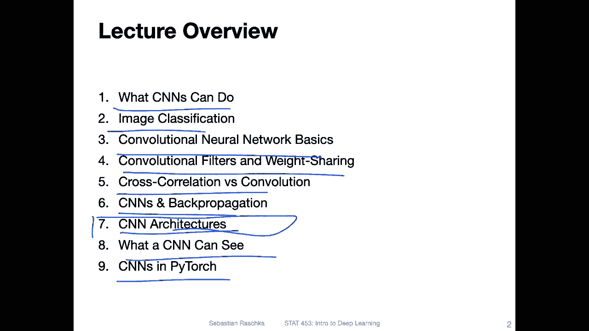
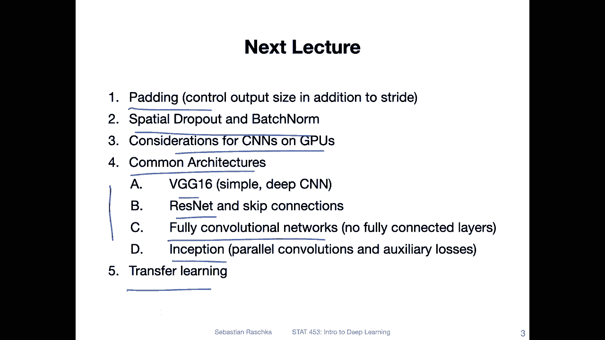
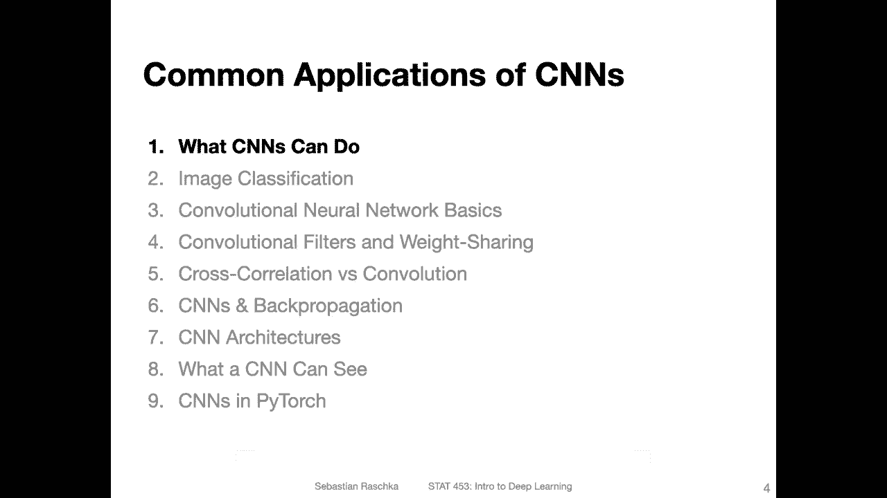

# 【双语字幕+资料下载】威斯康星 STAT453 ｜ 深度学习和生成模型导论(2021最新·完整版) - P97：L13.0- 卷积网络简介【课程概述】 - ShowMeAI - BV1ub4y127jj

Yeah， hi everyone。 So we finally put behind us all the stuff about yeah making neural networks learn better and train better。

 So what would be more exciting than introducing a new neural network architecture So today I want to talk about convolutional neural networks which are especially good for image data。

 convolutional neural networks that's a big topics。

 So actually I have enough slides to talk about it like for at least three or four weeks。

 but I'm trying to keep it focused So I reduced my slides a little bit to two lectures So in the first lecture today I want to talk about the basic concept behind convolutional networks and what you can do with them and how they work on the big picture level and then in the next lecture I will go more into these different types of convolutional neural network architectures because yeah there are lots of neural network architectures that have been developed in the last couple of years like residual neural networks VGG networks and inception networks and so forth。

 So in the next lecture。😊，I will talk more about these in detail。 Where in this lecture。

 I will give you a big overview of how convol neural networks work。Yeah。

 so here are the topics I have in mind for today。 I know it looks like a lot。

 but most of them will be very shorter videos。 I just try to make more subsections to keep things more organized。

 and I think based on what I heard based on the feedback you like shorter videos。

 so in that way I will try to keep them shorter and have more more short videos rather than having fewer long videos。

 So first I want to talk briefly about applications of Cns。 So what we can do with Cns。

 and then we will talk about image classification in particular because image classification is one broad aspect or one popular application area of CNns and it helps us also studying Cns better when we use a simple application first。

Then I will go over yeah the basics of convolution networks like the main aspects behind them and then focusing on convolutional filters and weight sharing that's one aspect that is part of the convolution architecture so we will learn a little bit about that then I will do some little nitpic here so discussing briefly the difference between cross correlation and convolution it's not particularly important but maybe one day you will get an interview question about that and then you know the answer。

Then we will talk about just very briefly about back propagation in convolutional networks that will be a very short video because I don't want to go into the mathematical details。

 it will take too much time and it's not super important because you know we can use auto gridd and yeah studying maybe the back propagation in more detail for convolutional networks and deriving it by hand that would be something for a more advanced course maybe。

Then I will just briefly outline what types of convolutional neural network architectures are out there but this will be mainly a topic for next week。

 and then we'll briefly see what CNNs can see so looking a little bit behind the curtain and see what what information the CN in an image looks at and how it processes this information。

And then lastly， we will finally then see how we can use convol networks in Pythtorch。

 and this is actually not too complicated。 So also there don't worry it will be a rather short video。

So next lecture just to give you an outlook next lecture we will then talk about some more advanced concepts。

 so for instance， if you are already roughly familiar with convolution networks from some other resources and you wonder why we don't discuss certain things today that's because I move them up to the next lecture next week otherwise today's lecture would be really too long so next week we will talk about petting then special versions of dropout and batch norm that work with convolutional networks。

Then some considerations for training scene ends on GPus。

 and then these common architectures like the G G16， residual networks。

 fully convolutional networks and inception。 they， of course maybe 50 more architectures that we can't cover here。

 but I would say these are still the main ones。 There are some other ones that are also popular。

 but again， we can't talk about everything here。 So these will be the main ones。

 And then I will also show you how transfer learning works。

 So I recommended to transfer learning to some。Students in the context of your class projects。

 so when I was reviewing your class projects I said sometimes it might be good to use transfer learning and here in the next week lecture I will then also explain what it is Essential it is training the network on a large data set。

And then fine tu， fine tuning it on a smaller dataset。

 because I noticed many students only have small dataset sets like 500 images and something like that。

 And usually it's tricky to get good performance on a small data set。So in that way。

 it's sometimes helpful to pretrain the network on a larger data set before fine tuning it to your targeted data。

 But yeah， again， we will discuss that next lecture。 So today， we will then start with。

First topic， what C ends can do。