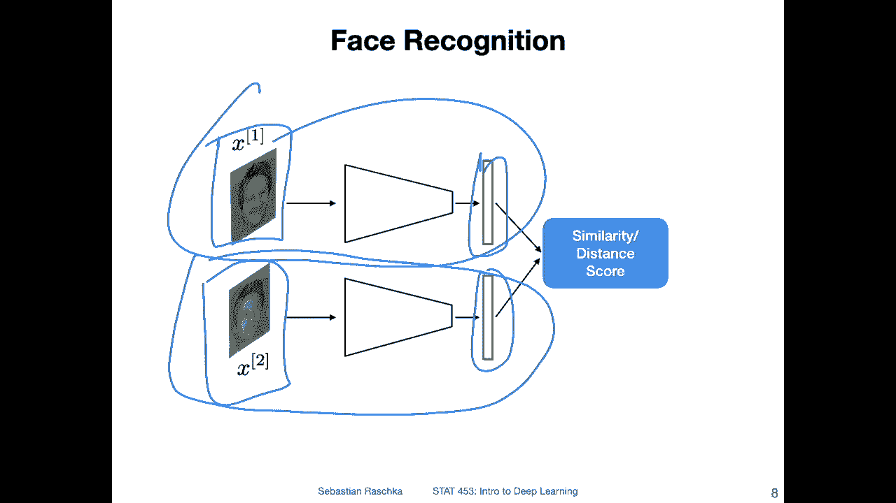

# 【双语字幕+资料下载】威斯康星 STAT453 ｜ 深度学习和生成模型导论(2021最新·完整版) - P98：L13.1- CNN 的常见应用 - ShowMeAI - BV1ub4y127jj

Yeah， let's start this lecture by talking about common applications of convolutional neural networks。

 And instead of saying convolutional neural networks all the time。

 which is pretty hard for me with my German accent， I will just abbreviate them as C and N。

 So C an N， that's a common abbreviation， Another common one is saying con。 So either one is fine。

 Both are commonly used in the literature。 All right， so what can C and Ns do。

The simplest application of C N would be image classification。

 So here have an example of binary classification， its similar。To what we discussed before。

Logistic regression。Except now， of course， we have。Images as input instead of simple。

 let's say flower classes。 So here that's the binary classification problem with。Cats versus。

Doockgs and yeah， the input image is put into the network。 They are convolutional errors。

 in the end they are usually fully connected layers。 they are not shown here。

 We will see another type of architecture later that shows the fully connected layer more explicitly。

 but then yeah， it produces a probability score that this image。

Is a CA and now you can also extend that of course。

 to multiclass classification using a soft next layer that we also discussed before。

 so essentially it's the same thing as we did with multilayer perceptions except that we have convolution layers which we will discuss in more detail in this lecture。

Another common application of CNs next to regular classification is object detection。

 So here this is like you can think of it as a mix between classification and object detection because usually you yeah you predict a bounding box but you also predict a class label corresponding to the bounding box so yeah you have essentially two tasks so one is essentially identifying objects。

 for instance here a car another car but then also assigning the class label to it so the network essentially learns how to draw these boxes。

So you can think of it as a type of regression task where you can learn these two coordinates here and these other coordinates。

 you can derive them from the other two coordinates。So here youre essentially， yeah learning。

Learning。The bounding box construction。 But then also assigning the label。

 One common example of that is Yolo。 you only look once， but there are， of course， yeah。

 multiple different methods for that。 also。 So this is like the original yolo paper。

 I just reference it here because it might be the， I would say。

 easiest starting point if you' are interested in that topic。

 So we won't be talking about this in this class because yeah。

 there are so many other topics to talk about， it is a slightly out of the scope of this class。

 But if you are interested， this is a good paper to start with。So related to object detection。

 there is also the task of object segmentation。 It's relatively similar。 but in addition， yeah。

 to identifying or instead of identifying just the box。

 So here for reference the boxes are also shown what the task here is to yeah to kind of have an exact mask for that object。

 So if this is a person instead of having just the bounding box around the person。

 you can see it's also yeah， extracting this mask here。 So it's in that way。

 a little bit more of a precise version of object detection。 So here again is a。Paper a mask， aan。

 that's。The mask RCN is like the I would say one of the most traditional methods for this again that's a good starting point if you are interested in that topic there were a few students who were yeah quite benefit from object segmentation in their class projects and I also shared some editorials for how to do that in pytorch with those students but again this is I would say slightly out of the scope of this class it's more like an advanced topic so in this class we won't be talking about this in too much detail I just wanted to mention that this also exists。

Yeah， another task that is something that I have worked on pretty extensively in the past that's related to face recognition。

 so face recognition it's an another task it's somewhat related to classification but not quite so here it's really more about pairwise comparisons I mean you can phrase image recognition or face recognition sorry face recognition as an image classification task so if the task is to identify a person you can have it as a classification task where。

I'd say there are 10000 potential people and you want to know who that is in that picture compared to a database of 10000 images。

 but then it would be image classification class task with 10000 classes which would be relatively expensive computationally and also because you don't have many examples per class。

 it would be really tedious to train such a system。

 So usually how people approach face recognition is by yeah something called a pairwise or triplet loss So in that way。

 what you learn as you learn a certain type of similarity score。

 So if you have two input images of the same person。It should give you a high similarity。 And if the。

Pictures depict different people。 It give should give you a low similarity score。

 and then you can set a threshold and say if the similarity score is above a certain threshold。

 then it's the same person。 Otherwise it's a different person。 And for that， I mean。

 there are also many， many different methods。 One traditional method would be， for example。

 using Siamese networks where you basically have。2 convolutional networks。 And they produce。

Andbeddings like feature representations of that image。 And then based on the feature representation。

 you compute similarity if they are similar to each other。It could be， for example。

 low two distance or yeah a small cosine angle。 Then these are the same person。

 and otherwise they are different people。 But yeah， again。

 this is another topic that might be out of the scope of this class。 In this class。

 we will be mainly focusing on convolutional networks for classification。

Except there is one more topic we will use later on in this class with convolutional networks。

 and that is generative adversarial networks So we can also use convolutional networks for image synthesis in the context of a so called generative。

Adversarial。Network and generative adversary networks。Essentially networks that can generate data。

 So I will explain that in more detail in a dedicated lecture dedicated to generative adversary networks。

 But yeah， it's just the pick a big picture outline。

 So here how that works is you have a generator and a discriminator and the generator。

Takes in some noise。 So usually you sample from a random distribution。From a normal distribution。

 a random vector， and then you put it through a convolution network that constructs an image。

From this noise vector。 So in that sense， it's more like an inverted convolution network。

 So it will output。Genrated image。And then the discriminator has to say whether this image is real or generated。

 so you train the generator so that it fools the discriminator into thinking that this generated image actually comes from the training set。

And then。The discriminator tries to distinguish between generated and real images better。

 So you train the discriminator to become better at distinguishing those and you train the generator to become better at fooling the discriminator and you do that。

 it's basically like a game and minm game and you do that until the generator is able to produce realistic looking images。

 But these are images that are， for instance， not contained in the training set。

 They are more like interpolated or they are synthesized。

 So they might look similar to the training set images。

 But they are usually images that are not one of the training set images。 So why is that useful yeah。

 you can do a lot of fun things with that and also I， for example， seen recently。

 people started using that to make synthetic training examples。 So， for example。

Produce larger training sets， but you can also do that for image manipulation。

 We also used or used that for a project called privacy net where we were removing sensitive or not so sensitive but private information from images or images that yeah for face images where people for instance。

 could use that information for profiling and we yeah used GNs to kind of alter the images such that they still look like images of real people。

 but where the sensitive information is hidden。 And yeah， there are lots of applications of GNs。

 and that is also some topic that we will discuss in more detail later。 So yeah。

 this video hopefully gave you a big picture overview of all the different things you can do with CNs。

 So in this lecture we are now focusing specifically on image classification。

Because yeah， this is still an introductory lecture， so we can't do everything at once。

 Let's start with the simplest task。

