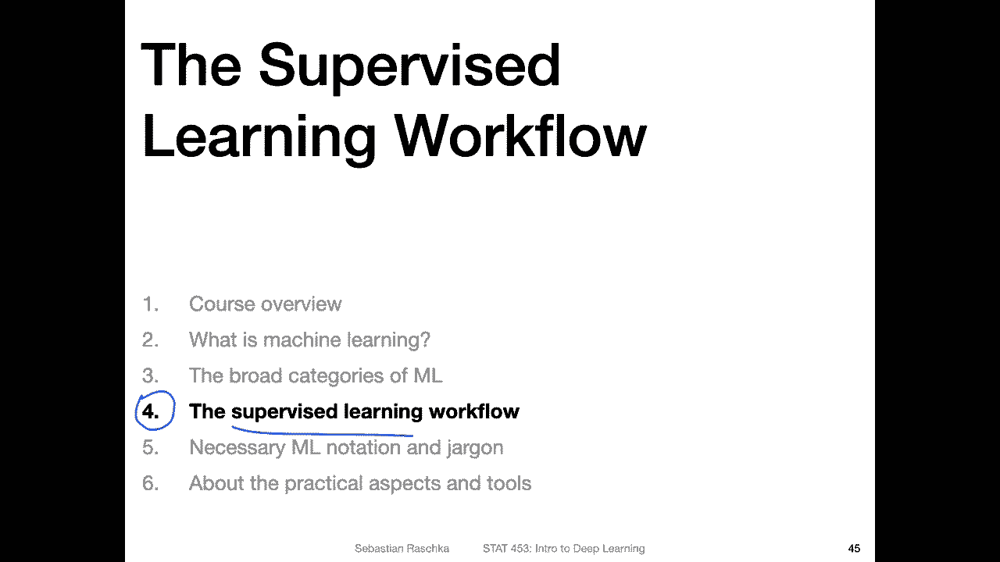
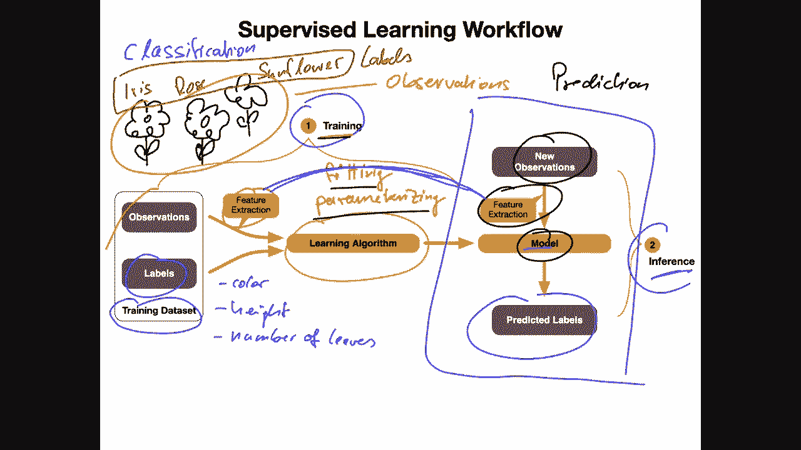
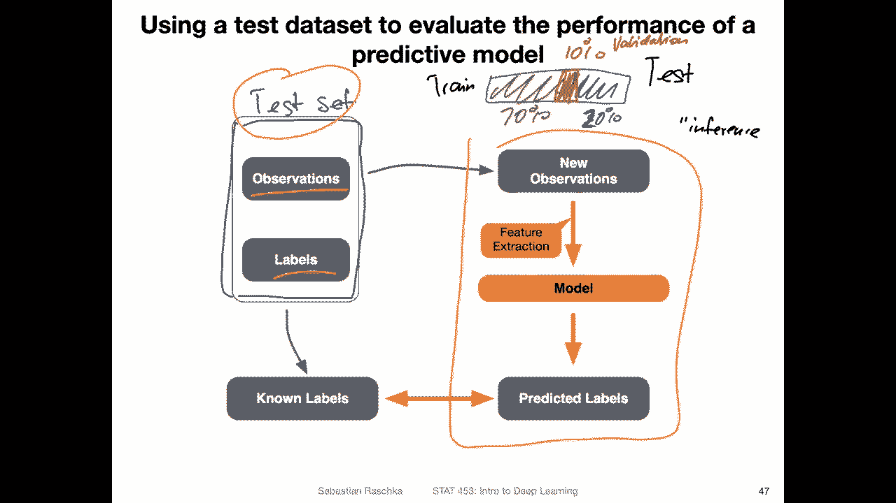
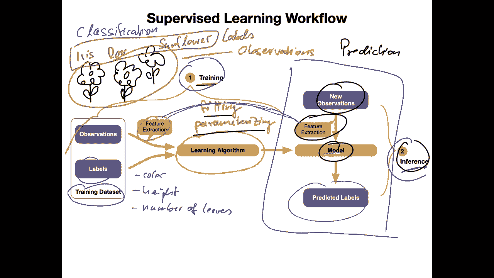
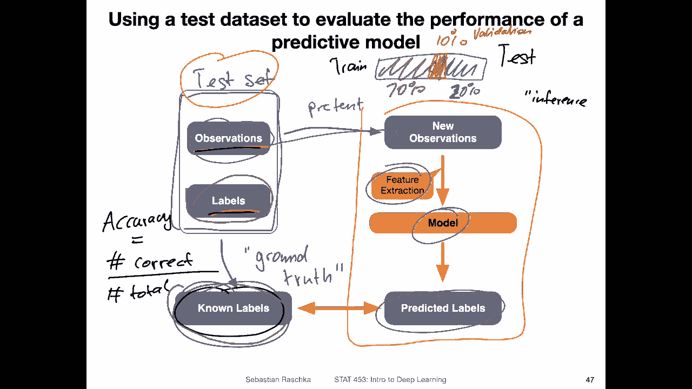
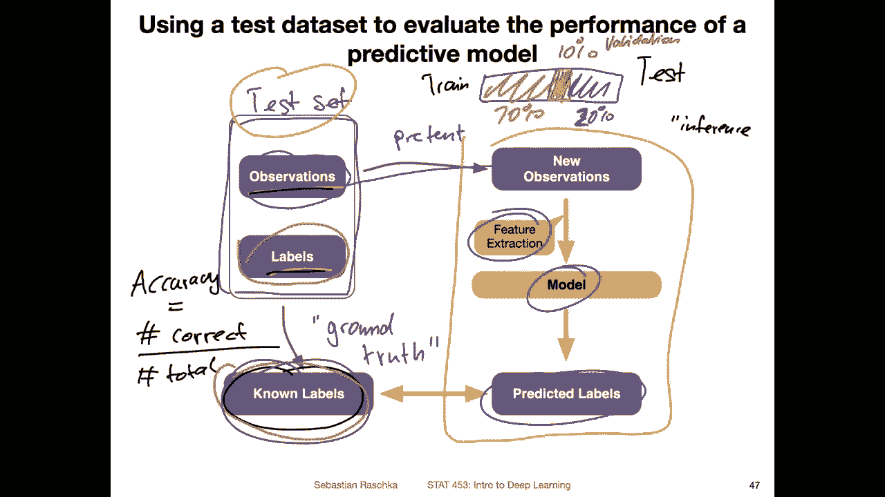
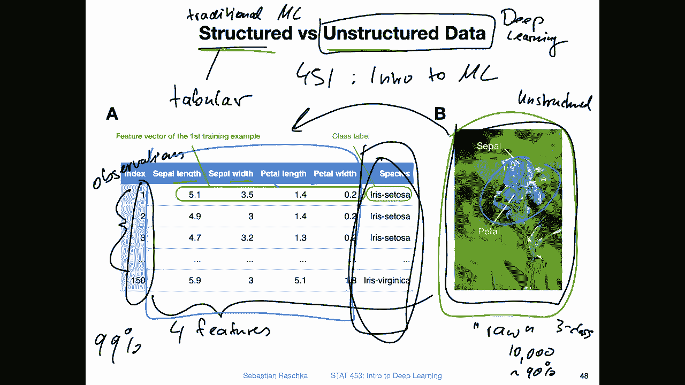
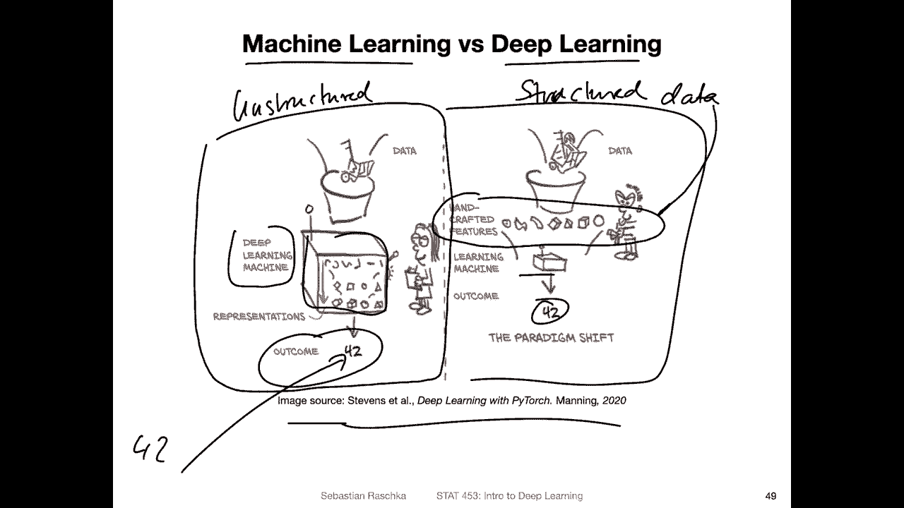

# 【双语字幕+资料下载】威斯康星 STAT453 ｜ 深度学习和生成模型导论(2021最新·完整版) - P9：L1.4- 监督学习工作流程 - ShowMeAI - BV1ub4y127jj

Yeah， hi and welcome back， everyone。 I hope it a nice first lecture day。 Yeah。

 and remember when I mentioned that snow is awesome。 if you look outside。

 there's a whole lot of new snow outside。 But anyway。

 so today I'm going to talk about the supervised learning workflow in a little bit more detail。

 Last lecture day I talked about machine learning and the three categories of machine learning。

 Now I want to provide some more details about the supervised learning workflow。

 and then I will also cover some of the necessary notation and jargon regarding machine learning that we will be needing for the remainder of this course。

 So just laying some groundwork， how we define a training set and what mathematical symbols we use and some terms that we will be using。

However， I'm trying to keep things a little bit short this time because yeah。

 as you've seen in the previous lecture day， there are lots of topics I want to cover the semester。

 So I don't want to go into too much technical details that are not very interesting for each topics。

 I try to keep things a little short。 and then with that。

 I hope we will be able to tackle all the projects that we are topics that I have in mind for this cause。

 So with that without wasting too much more time。 let me get started with the supervised dining workflow。

Alright， now let me talk a little bit more about the supervised learning workflow and yeah we will be using supervised learning a lot in the next couple of weeks。

 so just to briefly outline how supervised learning works。

So supervis learning is like you remember from the previous videos the process of regression or classification。

 so there are essentially two steps， one is the training step so we train a machine learning model and the second step is the inference step but before we get to the inference step let me talk about the training step first So imagine you have a training data set and your task is in this case。

 let's say classification you want to。Classify something。

 Lets maybe pick a simple example of classifying different flowers。 So let's say you have。嗯。

Different。Flowers。And there might be different flower species， maybe some flowers more like this。

And so forth and you are interested here in classifying how what type of flower it is based on an image。

 So you collected multiple flower images that's your training data set， and you also have an expert。

 you consulted an expert to provide you with the labels so it could be， for example。

Let me think that's， let's say this is an iris flower。 This is a rose。 And yeah。

 the third one would be， let's say a sunflower or something like that。嗯。So you have these labels。

 These are your。Labels that you want to predict and the flowers， the pictures。

 the pictures of the flowers。 These are your。Observations。

So you're collected maybe thousands of those。 This is your training data set。

And in traditional machine learning， what you would do is you would extract some features。

 So usually traditional machine learning algorithms don't work very well on image data。

 So you would yeah extract some features in here again。You would need a domain expert。

And having someone， someone's opinion， like what could be a good feature， you can think about it。

 But also， usually it's good to consult an expert who knows a lot about for us。

 And it also helps like understanding the data set a little bit。 So one might think， okay， yeah。

 what could be a potential feature。 It could be maybe。

Maybe the color of the flower and maybe the height。Of the flower and yeah， other aspects。The number。

Of leaves。And so forth， so there might be different features you have to think about what could be a good feature and also what would be a feature that you can obtain from。

 let's say， the image data easily。So if you have that。

 if you have these features and also the labels， you can then train an algorithm。

 a machine learning algorithm to make predictions。 So after yeah training the model。 So in this step。

So we say training， we can also say。Fitting。😔，The model or parameter raising。

The model depends on what a model we are talking about。 Some models are non parametric models。

 so we don't really yeah update weight parameters in the model。 So in that case。

 parameterizing would be not a good fit。But yeah， these terms。Training。

 fitting and priorizing are kind of synonymous in the context of the deep learning。Now。

 let's say we have our model that is our model that was learned from the data or parameterized based on the training data set。

 then yeah the goal is to make predictions on new flow because yeah the whole goal about developing the model is to use it in some prediction tasks So for example。

 if let's say you have a website you have developed the website where people can upload pictures of flowers and then your pipeline can predict what type of flow it is so。

You would have new flowers， new images that would be a feature extraction step for these flowers。

 So here the feature extraction step is exactly the same as during training because your model has learned to work yeah with this data that it has seen during training so you have to have the same feature extraction steps here。

Then yeah， you have your model， and then you can use it to yeah predict new labels。

 And this is nowadays called。Inference， as shown here。 So yeah， inference。

 why inference is's a little bit different from， yeah， statistical inference。 It's。

 it just happens to be called inference。 But yeah， it's really like you can think of it as。

As prediction。On new data or something like that。All right。

So this is the typical superve learning workflow training a model and then using it。 however。

 somewhere in this process we also want to evaluate how good our model is before we employ in the real world so how do we evaluate the performance of a model。

 So this is relatively similar to the inference step I have shown you in the previous slide。

 However we use a test set for that。

So， the test sent。Here it looks like the training set。

 but it is usually independent from the training set。 So if you have a large data set。

So let's say you have a large data set。 What you usually do is you shuffle the data and then randomly divide it into a large portion for training。

 let's say， 70% and a smaller portion。For testing， let's say 30%， usually theres a thought split。

Let me write this down。 So this is training。 but this is also only an approximate number。

A 30% for testing。 you can maybe also， it depends really on the data set size。

 We will talk more about that， but you can also just。This's a little bit smaller， let's say， 20%。

And then make this， maybe， I don't know。 Let's say， let's keep it at 70%。 And then there could be。

Third data set here。That's 10%。And that is the validation set。That we use for tuning a model。

But yeah， we will talk more about that later when we also see our first code examples。

 So for now consider this test set and this test set yeah looks very similar to the training set。

 We have observations and labels。And now what we do though is。So we have this step here。

 which is like the inference step。I showed you in the previous slide。So what's going on here？

It's the same as I have here on the right side， the inference step， the same same step。

But yeah， what we do now is we have。These known labels。

 So we separate from the tested observations and labels。 We keep them separately， so we。

Use our labels。Here， we withhold them from the model because there is no training right now。

 And then we use the observations as we treat them as new observations。 We pretend they are new。

 so we。Pretend these unused labels， then we do our feature extraction step。

Give the data to the model。 and the model makes the predictions。 So we have now， yeah。

 two sets of labels。 One are the known labels。 We know them because， yeah。

 we had them in the test set。 They are sometimes also called。On ground。Truth data。

 So that is also sometimes they are called ground truth data。

 And we compare these known labels to the predicted labels。 And then we can。

 yeah count the number of times how often our model makes a correct prediction。 And then we can。

 for example， compute the accuracy。 if we count the number of。Correct predictions over the number of。

Total。Data points in the tester that gives us the。Ecrey。On similarly。

 we can compute the error by one minus the accuracy。

 So it's like the basic yeah workflow of a supervised。Learning model。

Yeah， regarding the data regarding the flowers so。I also wanted to briefly discuss the difference between。

Structured and unstructured data， so。Students who have taken statistics 451， the introduction。

To machine learning。In this class we mainly worked with structured data。

 so in this class we won't be working with structured data except for some basic examples。

 so a structured data set is you can think of it as a tabular。Data set or a data set that。 yeah。

 it looks like a table essentially。 and this is something where yeah you have the data organized。

As follows by the。Columns are your features。And。The rose eye you are。Observations。

So let me go back a step。 So this is a table you may get。

During this feature extraction step， so this is something a human has to do or you can also automate it in certain points。

 but imagine the original data would look like an image so the original data is the flower so you can observe it either in the real world or you can take a picture of the flower and then as a human you can yeah use a ruler and then make the measurements about these petal and zipal。

Leves， so Cal and pital are these leaves here。And then you can measure how yeah。

 how long they are and how wide they are。So here I have a table of the Sepal length， Sepal width。

 petal length and petal width， either， yeah from an image， I mean。

 from image would be a little bit hard because it's not three dimensional。

 Well let's say an observation in the real world。 So this could be then。Your tabular data set here。

 These would be your four features。 So you have。For features here on the right hand side。

 this is the the label that we want to predict included it here in the same table。

This would be an example of a structured dataset。In contrast。An unstructured data set would be， yeah。

 the raw data。 for example， this image here。 So this would be an unstructured data set。

 So let me write this down unstructured。Sometimes we also just call it the raw data。

So you can actually extract this structured data from the unstructured dataset。

 but yeah it's not always very simple because for example。

 sometimes you can automate it here it might be harder to automate it。

 you some have to have some human helping with that like maybe even taking the flower taking a ruler and making measurements。

Strucd data is something where we use。Traditional。Machine learning and unstructured data is something where we can use。

Deep learning。Because deep learning has internally a feature extraction step。

 it's implicitly doing feature extraction for us。The downside is of course we need much more data。

 for example， here， this IRS data only has 150 flower examples。

 and this is sufficient for regular machine learning algorithms for traditional machine learning algorithms such as random forests。

 you can easily get something like a 99% accuracy with a random forest on this data。

 If you want to get 99% performance with deep learning on a flower。Species prediction task。

 you would at least I would say there are some papers I can maybe link later。

 but I would say at least。10000 images of these lowest to get。 let's say， within the 90% accuracy。

 So this is a three class。Prediction problem。 so it would be requiring much more data and not in every scenario you have such a large data set。

So I'm currently also working on a collaboration where we analyze videos。

 So we classify different videos。 And yeah， one limitation is that we only have a thousand videos。

 So the videos are actually from YouTube。 But the problem is the labels。

 The labels is here but what's kind of costly because you would have to have a human。

Looking at these video videos to provide the labels。

 so it's not always possible to find people to watch long videos to provide these annotations that would be very intensive so sometimes you have to make the trade off okay I can use deep learning but I need a large dataset so if you have lot of labels available then it's feasible but sometimes you don't and then using a structured data is maybe not a bad idea。

Becauseuse it's simpler， in a sense。

Okay， so here's a nice also summary I found in this book。

 it's a nice cartoon illustrating the difference between the structured and unstructured workflow where you have traditional machine learning where there's deep learning so here on the left hand side。

This is the workflow for yeah for deep learning essentially where you have the data and then you throw it into the network。

 It's like a black box and then yeah the output is some prediction。

 So yeah if you get the reference here 42 if you know。The joke maybe post in piazza is's actually。

 I'm just curious how many people nowadays。now what the number 42 refers to it's kind of a insider joke。

 anyways。 So yeah on the right hand side， this is yeah the traditional workflow where you have a human extracting the feature from the data。

 so you have these handcrafted features that you then provide to the machine learning system and then do the prediction。

 So it's essentially highlighting the difference between the unstructured。And structured workflow。

OrDa sets。So the structure data would be this one here in the center where you have the handcrafted features。

Yeah， just to overlay it with the example， I've just shown you with the flowers。

 So on the left hand side for the deep learning context。

 you would just give the model the raw images。And the model will figure out， yeah。

 what features to use。 So it will learn certain feature extract us。

 We will talk more about this when we talk about convolutional。Neer networks later。

They would implicitly learn how to extract features and in contrast。

 the machine learning workflow with a handcrafted features here on the right hand side where you have these handcrafted features such as taking these measurements here。

Alright， so yeah that is just a brief overview of the supervised learning workflow and how machine learning is different from deep learning Next I want to introduce some of the necessary notation and jargon and then I will also show you a little bit how what type of tools we are using in this class。

